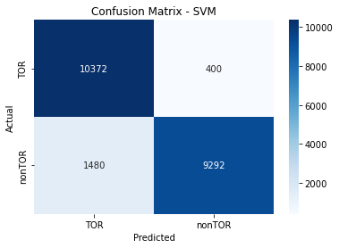

# Models-10s


```python
dataset_name = list(dataset_files)[0]
time_directory = dataset_files[dataset_name]

print("\n", '-'*120, "\n")
print(dataset_name)

# Update the dataset file path in the code
filepath = os.path.join('../../CICDataSet-TOR/CSV/Scenario-A/', dataset_name)

# Update the directory for storing trained models
time_directory_path = os.path.join(models_directory, time_directory)
if not os.path.exists(time_directory_path):
    os.makedirs(time_directory_path)

# DATASET LOADING        
df_data = load_csv_datafiles(filepath)

# SECTION-A
X_train, X_test, y_train, y_test, class_labels, X_train_selected, X_test_selected = secA(df_data, filter_warnings=True)
```

    
     ------------------------------------------------------------------------------------------------------------------------ 
    
    SelectedFeatures-10s-TOR-NonTOR.csv
    
    
    Data Distribution: ORIGINAL:
    nonTOR    59790
    TOR        8044
    Name: class1, dtype: int64
    Total: 67834
    
    
    Number of Negative Values in Independent Variables: 477
    Number of Inf Values: 10
    NaN Value Counts: 489
    Missing Value Counts: 489
    
    AFTER IMPUTATION:
    NaN Value Counts: 0
    Missing Value Counts: 0
    
    
    Data Distribution: AFTER Outlier Removal:
    nonTOR    53859
    TOR        7191
    Name: class1, dtype: int64
    Total: 61050
    
    
    Data Distribution: AFTER OVERSAMPLING:
    TOR       53859
    nonTOR    53859
    Name: class1, dtype: int64
    Total: 107718
    
    
    Data Distribution: AFTER ENCODING:
    Value: 0, Count: 53859
    Value: 1, Count: 53859
    Total: 107718
    
    
    
    


    

    


    
    No. of Total Features: 23
    No. of Reduced Features: 18
    


```python
# SECTION-B
secB(X_train, y_train, y_test, class_labels, X_train_selected, X_test_selected, time_directory_path, filter_warnings=True)
```

    
    
    
    Classifier: Random Forest
    
    Best parameters for Random Forest: {'n_estimators': 200, 'min_samples_split': 10, 'min_samples_leaf': 1, 'max_depth': None, 'bootstrap': False}
    Best cross-validation score for Random Forest: 0.9942209897457811
    
    Cross-validation results for Random Forest:
    [0.99402379 0.99355962 0.99303742 0.99355962 0.99419752]
    Mean accuracy: 0.9936755926604762
    
    Random Forest Evaluation:
    Accuracy: 0.9937801708132195
    Precision: 0.9937863156953093
    Recall: 0.9937801708132195
    F1 Score: 0.9937801514626244
    Confusion Matrix:
     [[10724    48]
     [   86 10686]]
    


    

    


    
    
    
    Classifier: Decision Tree
    
    Best parameters for Decision Tree: {'splitter': 'random', 'min_samples_split': 5, 'min_samples_leaf': 1, 'max_features': None, 'max_depth': None, 'criterion': 'entropy'}
    Best cross-validation score for Decision Tree: 0.986144319934293
    
    Cross-validation results for Decision Tree:
    [0.98735132 0.98578474 0.98688715 0.98764143 0.98578392]
    Mean accuracy: 0.9866897102862259
    
    Decision Tree Evaluation:
    Accuracy: 0.9862142591904939
    Precision: 0.9862365898046511
    Recall: 0.9862142591904939
    F1 Score: 0.986214100909731
    Confusion Matrix:
     [[10660   112]
     [  185 10587]]
    


    

    


    
    
    
    Classifier: SVM
    No hyperparameters specified for SVM. Using default settings.
    
    Cross-validation results for SVM:
    [0.91662315 0.91273571 0.91314186 0.9113432  0.9119183 ]
    Mean accuracy: 0.913152444656815
    
    SVM Evaluation:
    Accuracy: 0.9127367248421835
    Precision: 0.9169277047264314
    Recall: 0.9127367248421835
    F1 Score: 0.9125168785727005
    Confusion Matrix:
     [[10372   400]
     [ 1480  9292]]
    


    

    


    
    
    
    Classifier: KNN
    
    Best parameters for KNN: {'weights': 'distance', 'n_neighbors': 3, 'algorithm': 'ball_tree'}
    Best cross-validation score for KNN: 0.979193260540867
    
    Cross-validation results for KNN:
    [0.97911227 0.97893821 0.97812591 0.98062083 0.97731229]
    Mean accuracy: 0.9788219009259025
    
    KNN Evaluation:
    Accuracy: 0.9805514296323803
    Precision: 0.9809072279217269
    Recall: 0.9805514296323803
    F1 Score: 0.9805478317200407
    Confusion Matrix:
     [[10709    63]
     [  356 10416]]
    


    

    


    
    
    
    Classifier: XGBoost
    
    Best parameters for XGBoost: {'subsample': 1.0, 'reg_lambda': 1.0, 'reg_alpha': 0.5, 'n_estimators': 300, 'min_child_weight': 3, 'max_depth': 7, 'learning_rate': 0.3, 'gamma': 0.2, 'colsample_bytree': 1.0}
    Best cross-validation score for XGBoost: 0.994743193730665
    
    Cross-validation results for XGBoost:
    [0.99530026 0.99518422 0.99442994 0.99402379 0.99454567]
    Mean accuracy: 0.9946967745362988
    
    XGBoost Evaluation:
    Accuracy: 0.9951726698848867
    Precision: 0.9951760155539008
    Recall: 0.9951726698848867
    F1 Score: 0.995172661730879
    Confusion Matrix:
     [[10734    38]
     [   66 10706]]
    


    

    


    
    
    
    Classifier: Logistic Regression
    
    Best parameters for Logistic Regression: {'solver': 'newton-cg', 'penalty': 'none', 'max_iter': 10000, 'C': 1}
    Best cross-validation score for Logistic Regression: 0.9004108643094545
    
    Cross-validation results for Logistic Regression:
    [0.90176965 0.90043516 0.89788222 0.90223383 0.89950099]
    Mean accuracy: 0.9003643690279828
    
    Logistic Regression Evaluation:
    Accuracy: 0.9007148161901225
    Precision: 0.901243466875408
    Recall: 0.9007148161901225
    F1 Score: 0.9006821025892404
    Confusion Matrix:
     [[9898  874]
     [1265 9507]]
    


    

    


    
    
    
    Classifier: Gradient Boosting
    
    Best parameters for Gradient Boosting: {'subsample': 1.0, 'n_estimators': 300, 'min_samples_split': 10, 'min_samples_leaf': 1, 'max_features': 'log2', 'max_depth': 7, 'learning_rate': 0.1}
    Best cross-validation score for Gradient Boosting: 0.9930605496135229
    
    Cross-validation results for Gradient Boosting:
    [0.99286336 0.99309545 0.99315347 0.99326951 0.99309504]
    Mean accuracy: 0.9930953651876377
    
    Gradient Boosting Evaluation:
    Accuracy: 0.9932695878202747
    Precision: 0.9932843860138051
    Recall: 0.9932695878202747
    F1 Score: 0.9932695373429579
    Confusion Matrix:
     [[10729    43]
     [  102 10670]]
    


    

    


    
    
    
    Classifier: Gaussian Naive Bayes
    No hyperparameters specified for Gaussian Naive Bayes. Using default settings.
    
    Cross-validation results for Gaussian Naive Bayes:
    [0.79501015 0.79355962 0.79437192 0.79657673 0.79238714]
    Mean accuracy: 0.7943811127025435
    
    Gaussian Naive Bayes Evaluation:
    Accuracy: 0.7909858893427404
    Precision: 0.8417314049203269
    Recall: 0.7909858893427404
    F1 Score: 0.7829273198694416
    Confusion Matrix:
     [[10596   176]
     [ 4327  6445]]
    


    

    


    
    
    
    Classifier: AdaBoost
    
    Best parameters for AdaBoost: {'n_estimators': 200, 'learning_rate': 0.3, 'algorithm': 'SAMME.R'}
    Best cross-validation score for AdaBoost: 0.9297931854839673
    
    Cross-validation results for AdaBoost:
    [0.93228895 0.92927183 0.92886568 0.93223093 0.93042822]
    Mean accuracy: 0.9306171213022718
    
    AdaBoost Evaluation:
    Accuracy: 0.9316282955811362
    Precision: 0.9332007784852218
    Recall: 0.9316282955811362
    F1 Score: 0.931566193320239
    Confusion Matrix:
     [[10360   412]
     [ 1061  9711]]
    


    

    


    
    
    
    Classifier: Bagging Classifier
    
    Best parameters for Bagging Classifier: {'n_estimators': 50, 'max_samples': 1.0, 'max_features': 1.0, 'bootstrap_features': True, 'bootstrap': False}
    Best cross-validation score for Bagging Classifier: 0.9938844719650831
    
    Cross-validation results for Bagging Classifier:
    [0.99338555 0.99483609 0.99408181 0.99442994 0.99268887]
    Mean accuracy: 0.9938844524383039
    
    Bagging Classifier Evaluation:
    Accuracy: 0.9940586706275529
    Precision: 0.9940635926999435
    Recall: 0.9940586706275529
    F1 Score: 0.9940586558300013
    Confusion Matrix:
     [[10725    47]
     [   81 10691]]
    


    

    


    
    
    
    Classifier: Extra Trees
    
    Best parameters for Extra Trees: {'n_estimators': 200, 'min_samples_split': 2, 'min_samples_leaf': 2, 'max_features': 'sqrt', 'max_depth': None, 'bootstrap': False}
    Best cross-validation score for Extra Trees: 0.9907860791166516
    
    Cross-validation results for Extra Trees:
    [0.99129678 0.99071657 0.99193502 0.99036844 0.99007775]
    Mean accuracy: 0.9908789100986747
    
    Extra Trees Evaluation:
    Accuracy: 0.9913665057556629
    Precision: 0.9913949808867177
    Recall: 0.9913665057556629
    F1 Score: 0.9913663806814093
    Confusion Matrix:
     [[10720    52]
     [  134 10638]]
    


    

    


    
    
    
    
    


    

    


    Statistics for Learning Curve - Random Forest:
    Mean training score: 0.9996894389275855
    Mean validation score: 0.9907454717651356
    Training scores std deviation: 7.931743377164415e-05
    Validation scores std deviation: 0.0008770983792958066
    
    
    
    
    


    

    


    Statistics for Learning Curve - Decision Tree:
    Mean training score: 0.996461075866325
    Mean validation score: 0.9798431137752373
    Training scores std deviation: 0.0003283584271081818
    Validation scores std deviation: 0.001214083681323672
    
    
    
    
    


    

    


    Statistics for Learning Curve - SVM:
    Mean training score: 0.9106977792396673
    Mean validation score: 0.9092916631863549
    Training scores std deviation: 0.0006039150061978723
    Validation scores std deviation: 0.0007242755088421927
    
    
    
    
    


    

    


    Statistics for Learning Curve - KNN:
    Mean training score: 0.999993005083039
    Mean validation score: 0.9718708881274118
    Training scores std deviation: 2.9208626386717535e-06
    Validation scores std deviation: 0.0015294179676694846
    
    
    
    
    


    

    


    Statistics for Learning Curve - XGBoost:
    Mean training score: 0.9992359851947402
    Mean validation score: 0.9916448167729918
    Training scores std deviation: 0.00013723367216168743
    Validation scores std deviation: 0.000760852757490124
    
    
    
    
    


    

    


    Statistics for Learning Curve - Logistic Regression:
    Mean training score: 0.8998579991440303
    Mean validation score: 0.899533518575135
    Training scores std deviation: 0.001145735920462758
    Validation scores std deviation: 0.0016227907263599642
    
    
    
    
    


    

    


    Statistics for Learning Curve - Gradient Boosting:
    Mean training score: 0.9999420075215655
    Mean validation score: 0.9906259406731331
    Training scores std deviation: 2.0199351858630293e-05
    Validation scores std deviation: 0.0006934385770958893
    
    
    
    
    


    

    


    Statistics for Learning Curve - Gaussian Naive Bayes:
    Mean training score: 0.7947919319624617
    Mean validation score: 0.7945238478030303
    Training scores std deviation: 0.0014414688263403566
    Validation scores std deviation: 0.00325180092161905
    
    
    
    
    


    

    


    Statistics for Learning Curve - AdaBoost:
    Mean training score: 0.9350452412790412
    Mean validation score: 0.9343386709111151
    Training scores std deviation: 0.0015876101444413826
    Validation scores std deviation: 0.0014143542245654119
    
    
    
    
    


    

    


    Statistics for Learning Curve - Bagging Classifier:
    Mean training score: 0.999993005083039
    Mean validation score: 0.9906247778197603
    Training scores std deviation: 7.106252608177208e-07
    Validation scores std deviation: 0.0007118647676587729
    
    
    
    
    


    

    


    Statistics for Learning Curve - Extra Trees:
    Mean training score: 0.9974544954604075
    Mean validation score: 0.9856731636638015
    Training scores std deviation: 0.0002380228702008865
    Validation scores std deviation: 0.0009032191599522308
    
    
    
    
    


    

    


    
    
    


    

    


    
    Statistics for Normalized Total Feature Importance:
    Mean Normalized Total Importance: 0.1556149882096839
    Standard Deviation of Normalized Total Importance: 0.21882049160473951
    
    
    
    
    
    ROC Scores:
    Random Forest ROC AUC: 1.00
    Decision Tree ROC AUC: 0.99
    SVM ROC AUC: 0.97
    KNN ROC AUC: 0.99
    XGBoost ROC AUC: 1.00
    Logistic Regression ROC AUC: 0.95
    Gradient Boosting ROC AUC: 1.00
    Gaussian Naive Bayes ROC AUC: 0.92
    AdaBoost ROC AUC: 0.98
    Bagging Classifier ROC AUC: 1.00
    Extra Trees ROC AUC: 1.00
    


    

    


```python
# SECTION-C
secC(X_train, y_train, y_test, class_labels, X_train_selected, X_test_selected, time_directory_path)
```

    Fitting 5 folds for each of 5 candidates, totalling 25 fits
    [CV] END ...........batch_size=16, epochs=10, optimizer=adam; total time= 2.0min
    [CV] END ...........batch_size=16, epochs=10, optimizer=adam; total time= 2.1min
    [CV] END ...........batch_size=16, epochs=10, optimizer=adam; total time= 2.0min
    [CV] END ...........batch_size=16, epochs=10, optimizer=adam; total time= 2.0min
    [CV] END ...........batch_size=16, epochs=10, optimizer=adam; total time= 2.0min
    [CV] END ........batch_size=16, epochs=10, optimizer=rmsprop; total time= 1.7min
    [CV] END ........batch_size=16, epochs=10, optimizer=rmsprop; total time= 1.7min
    [CV] END ........batch_size=16, epochs=10, optimizer=rmsprop; total time= 1.7min
    [CV] END ........batch_size=16, epochs=10, optimizer=rmsprop; total time= 1.7min
    [CV] END ........batch_size=16, epochs=10, optimizer=rmsprop; total time= 1.7min
    [CV] END ...........batch_size=32, epochs=20, optimizer=adam; total time= 1.9min
    [CV] END ...........batch_size=32, epochs=20, optimizer=adam; total time= 2.0min
    [CV] END ...........batch_size=32, epochs=20, optimizer=adam; total time= 2.0min
    [CV] END ...........batch_size=32, epochs=20, optimizer=adam; total time= 1.9min
    [CV] END ...........batch_size=32, epochs=20, optimizer=adam; total time= 2.1min
    [CV] END ........batch_size=16, epochs=30, optimizer=rmsprop; total time= 5.0min
    [CV] END ........batch_size=16, epochs=30, optimizer=rmsprop; total time= 5.0min
    [CV] END ........batch_size=16, epochs=30, optimizer=rmsprop; total time= 5.1min
    [CV] END ........batch_size=16, epochs=30, optimizer=rmsprop; total time= 5.0min
    [CV] END ........batch_size=16, epochs=30, optimizer=rmsprop; total time= 5.0min
    [CV] END ........batch_size=16, epochs=20, optimizer=rmsprop; total time= 3.4min
    [CV] END ........batch_size=16, epochs=20, optimizer=rmsprop; total time= 3.3min
    [CV] END ........batch_size=16, epochs=20, optimizer=rmsprop; total time= 3.5min
    [CV] END ........batch_size=16, epochs=20, optimizer=rmsprop; total time= 3.7min
    [CV] END ........batch_size=16, epochs=20, optimizer=rmsprop; total time= 3.6min
    
    Best parameters for Deep Neural Network: {'optimizer': 'rmsprop', 'epochs': 30, 'batch_size': 16}
    Best cross-validation score for Deep Neural Network: 0.9597210330245307
    
    Fold 1 of 5:
    Accuracy: 0.9555555555555556
    Precision: 0.9559713468491543
    Recall: 0.9555546801183379
    F1 Score: 0.9555453608302409
    Confusion Matrix:
     [[8365  253]
     [ 513 8104]]
    
    Fold 2 of 5:
    Accuracy: 0.9477806788511749
    Precision: 0.9481817170968394
    Recall: 0.9477815472299935
    F1 Score: 0.9477690651279873
    Confusion Matrix:
     [[8039  579]
     [ 321 8296]]
    
    Fold 3 of 5:
    Accuracy: 0.9560777487670438
    Precision: 0.9564281639056992
    Recall: 0.9560785532104701
    F1 Score: 0.9560693715695419
    Confusion Matrix:
     [[8358  259]
     [ 498 8120]]
    
    Fold 4 of 5:
    Accuracy: 0.9586306933565419
    Precision: 0.9586409599526073
    Recall: 0.9586308312433934
    F1 Score: 0.9586304705243212
    Confusion Matrix:
     [[8281  336]
     [ 377 8241]]
    
    Fold 5 of 5:
    Accuracy: 0.9524776604386678
    Precision: 0.9532125951070168
    Recall: 0.9524776604386678
    F1 Score: 0.9524583869343519
    Confusion Matrix:
     [[8381  236]
     [ 583 8034]]
    
    Average Evaluation Metrics Across Folds:
    Average Accuracy: 0.9541044673937968
    Average Precision: 0.9544869565822633
    Average Recall: 0.9541046544481727
    Average F1 Score: 0.9540945309972887
    Average Confusion Matrix:
     [[8284.8  332.6]
     [ 458.4 8159. ]]
    
    
    Deep Neural Network Training Results:
    Epoch	Accuracy
    1	0.8758159279823303
    2	0.8925696015357971
    3	0.9026145935058594
    4	0.9226682782173157
    5	0.9321148991584778
    6	0.9345445036888123
    7	0.935723066329956
    8	0.9374274611473083
    9	0.9386604428291321
    10	0.9397664666175842
    11	0.94183349609375
    12	0.94183349609375
    13	0.9431570768356323
    14	0.9434834718704224
    15	0.9441543221473694
    16	0.9445713758468628
    17	0.9449883699417114
    18	0.9468922019004822
    19	0.9463301301002502
    20	0.9480889439582825
    21	0.9489048719406128
    22	0.9503735303878784
    23	0.9509174823760986
    24	0.950790524482727
    25	0.9531114101409912
    26	0.9523680210113525
    27	0.9527487754821777
    28	0.9537641406059265
    29	0.9536372423171997
    30	0.9541086554527283
    
    
    Deep Neural Network Evaluation:
    Accuracy: 0.9507519494987003
    Precision: 0.9517135245389295
    Recall: 0.9507519494987003
    F1 Score: 0.9507257266224571
    Confusion Matrix:
     [[10490   282]
     [  779  9993]]
    


    

    


    
    
    
    
    


    

    


    Statistical Information for Training and Validation Loss:
    -------------------------------------------------------
    Mean Training Loss: 0.17392243098006654
    Mean Validation Loss: 0.16639990392218948
    Minimum Training Loss: 0.13576750491492068
    Minimum Validation Loss: 0.1317329462547388
    Maximum Training Loss: 0.3288327538693923
    Maximum Validation Loss: 0.29060560650745265
    Standard Deviation of Training Loss: 0.04076941940707572
    Standard Deviation of Validation Loss: 0.03473051311820979
    
    
    
    
    


    

    


    
    Statistics for Normalized Feature Importance:
    Mean Normalized Importance of All Features: 0.3256836229791347
    Standard Deviation of Normalized Importance of All Features: 0.18104406350131566
    Mean Normalized Importance of Selected Features: 0.32974859240852056
    Standard Deviation of Normalized Importance of Selected Features: 0.20446430442575403
    
    
    
    
    


    

    


    ROC AUC score for Deep Neural Network: 0.95
    
