# Models-120s


```python
dataset_name = list(dataset_files)[3]
time_directory = dataset_files[dataset_name]

print("\n", '-'*120, "\n")
print(dataset_name)

# Update the dataset file path in the code
filepath = os.path.join('../../CICDataSet-TOR/CSV/Scenario-A/', dataset_name)

# Update the directory for storing trained models
time_directory_path = os.path.join(models_directory, time_directory)
if not os.path.exists(time_directory_path):
    os.makedirs(time_directory_path)

# DATASET LOADING        
df_data = load_arff_datafiles(filepath)

# SECTION-A
X_train, X_test, y_train, y_test, class_labels, X_train_selected, X_test_selected = secA(df_data, filter_warnings=True)
```

    
     ------------------------------------------------------------------------------------------------------------------------ 
    
    TimeBasedFeatures-120s-TOR-NonTOR.arff
    
    
    Data Distribution: ORIGINAL:
    NONTOR    10782
    TOR         470
    Name: class1, dtype: int64
    Total: 11252
    
    
    Number of Negative Values in Independent Variables: 33365
    Number of Inf Values: 0
    NaN Value Counts: 33365
    Missing Value Counts: 33365
    
    AFTER IMPUTATION:
    NaN Value Counts: 0
    Missing Value Counts: 0
    
    
    Data Distribution: AFTER Outlier Removal:
    NONTOR    9812
    TOR        317
    Name: class1, dtype: int64
    Total: 10129
    
    
    Data Distribution: AFTER OVERSAMPLING:
    NONTOR    9812
    TOR       9812
    Name: class1, dtype: int64
    Total: 19624
    
    
    Data Distribution: AFTER ENCODING:
    Value: 0, Count: 9812
    Value: 1, Count: 9812
    Total: 19624
    
    
    
    


    
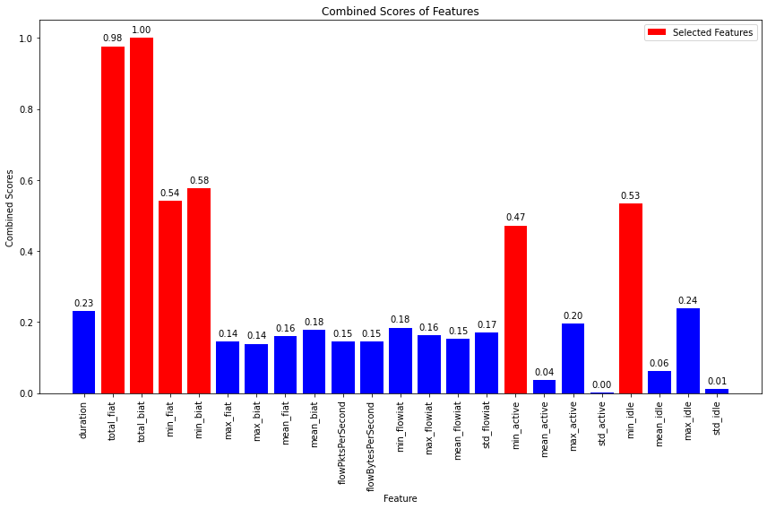
    


    
    No. of Total Features: 23
    No. of Reduced Features: 6
    


```python
# SECTION-B
secB(X_train, y_train, y_test, class_labels, X_train_selected, X_test_selected, time_directory_path, filter_warnings=True)
```

    
    
    
    Classifier: Random Forest
    
    Best parameters for Random Forest: {'n_estimators': 200, 'min_samples_split': 5, 'min_samples_leaf': 4, 'max_depth': None, 'bootstrap': False}
    Best cross-validation score for Random Forest: 1.0
    
    Cross-validation results for Random Forest:
    [1.         1.         1.         0.99936306 1.        ]
    Mean accuracy: 0.9998726114649681
    
    Random Forest Evaluation:
    Accuracy: 1.0
    Precision: 1.0
    Recall: 1.0
    F1 Score: 1.0
    Confusion Matrix:
     [[1963    0]
     [   0 1962]]
    


    
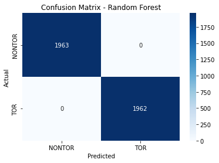
    


    
    
    
    Classifier: Decision Tree
    
    Best parameters for Decision Tree: {'splitter': 'random', 'min_samples_split': 2, 'min_samples_leaf': 1, 'max_features': 'sqrt', 'max_depth': 40, 'criterion': 'entropy'}
    Best cross-validation score for Decision Tree: 1.0
    
    Cross-validation results for Decision Tree:
    [0.99968153 1.         1.         0.99968153 0.99968143]
    Mean accuracy: 0.9998088969061915
    
    Decision Tree Evaluation:
    Accuracy: 1.0
    Precision: 1.0
    Recall: 1.0
    F1 Score: 1.0
    Confusion Matrix:
     [[1963    0]
     [   0 1962]]
    


    

    


    
    
    
    Classifier: SVM
    No hyperparameters specified for SVM. Using default settings.
    
    Cross-validation results for SVM:
    [0.99076433 0.99522293 0.99235669 0.99363057 0.99394712]
    Mean accuracy: 0.9931843278418417
    
    SVM Evaluation:
    Accuracy: 0.9933757961783439
    Precision: 0.9934623870779735
    Recall: 0.9933757961783439
    F1 Score: 0.9933754943138534
    Confusion Matrix:
     [[1963    0]
     [  26 1936]]
    


    
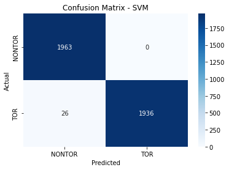
    


    
    
    
    Classifier: KNN
    
    Best parameters for KNN: {'weights': 'uniform', 'n_neighbors': 3, 'algorithm': 'auto'}
    Best cross-validation score for KNN: 1.0
    
    Cross-validation results for KNN:
    [1. 1. 1. 1. 1.]
    Mean accuracy: 1.0
    
    KNN Evaluation:
    Accuracy: 1.0
    Precision: 1.0
    Recall: 1.0
    F1 Score: 1.0
    Confusion Matrix:
     [[1963    0]
     [   0 1962]]
    


    
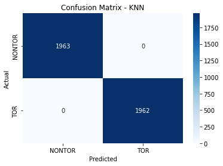
    


    
    
    
    Classifier: XGBoost
    
    Best parameters for XGBoost: {'subsample': 0.6, 'reg_lambda': 0.1, 'reg_alpha': 1, 'n_estimators': 200, 'min_child_weight': 3, 'max_depth': 3, 'learning_rate': 0.1, 'gamma': 0.1, 'colsample_bytree': 1.0}
    Best cross-validation score for XGBoost: 0.999936305732484
    
    Cross-validation results for XGBoost:
    [0.99936306 1.         0.99968153 1.         1.        ]
    Mean accuracy: 0.9998089171974522
    
    XGBoost Evaluation:
    Accuracy: 1.0
    Precision: 1.0
    Recall: 1.0
    F1 Score: 1.0
    Confusion Matrix:
     [[1963    0]
     [   0 1962]]
    


    

    


    
    
    
    Classifier: Logistic Regression
    
    Best parameters for Logistic Regression: {'solver': 'newton-cg', 'penalty': 'none', 'max_iter': 10000, 'C': 1}
    Best cross-validation score for Logistic Regression: 0.9998726114649681
    
    Cross-validation results for Logistic Regression:
    [1.         1.         1.         1.         0.99968143]
    Mean accuracy: 0.9999362854412233
    
    Logistic Regression Evaluation:
    Accuracy: 1.0
    Precision: 1.0
    Recall: 1.0
    F1 Score: 1.0
    Confusion Matrix:
     [[1963    0]
     [   0 1962]]
    


    
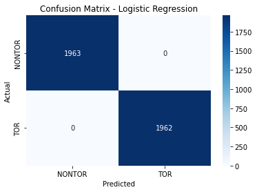
    


    
    
    
    Classifier: Gradient Boosting
    
    Best parameters for Gradient Boosting: {'subsample': 0.8, 'n_estimators': 300, 'min_samples_split': 2, 'min_samples_leaf': 2, 'max_features': 'sqrt', 'max_depth': 3, 'learning_rate': 0.1}
    Best cross-validation score for Gradient Boosting: 1.0
    
    Cross-validation results for Gradient Boosting:
    [1. 1. 1. 1. 1.]
    Mean accuracy: 1.0
    
    Gradient Boosting Evaluation:
    Accuracy: 1.0
    Precision: 1.0
    Recall: 1.0
    F1 Score: 1.0
    Confusion Matrix:
     [[1963    0]
     [   0 1962]]
    


    
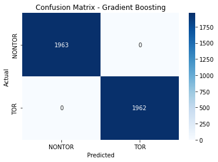
    


    
    
    
    Classifier: Gaussian Naive Bayes
    No hyperparameters specified for Gaussian Naive Bayes. Using default settings.
    
    Cross-validation results for Gaussian Naive Bayes:
    [0.99012739 0.98980892 0.9910828  0.99171975 0.98980567]
    Mean accuracy: 0.9905089048197832
    
    Gaussian Naive Bayes Evaluation:
    Accuracy: 0.9898089171974522
    Precision: 0.990012433578931
    Recall: 0.9898089171974522
    F1 Score: 0.989807832191184
    Confusion Matrix:
     [[1963    0]
     [  40 1922]]
    


    
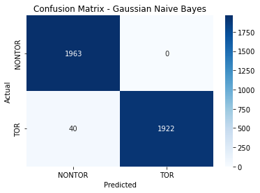
    


    
    
    
    Classifier: AdaBoost
    
    Best parameters for AdaBoost: {'n_estimators': 200, 'learning_rate': 0.1, 'algorithm': 'SAMME'}
    Best cross-validation score for AdaBoost: 0.999936305732484
    
    Cross-validation results for AdaBoost:
    [0.99936306 1.         1.         1.         1.        ]
    Mean accuracy: 0.9998726114649681
    
    AdaBoost Evaluation:
    Accuracy: 1.0
    Precision: 1.0
    Recall: 1.0
    F1 Score: 1.0
    Confusion Matrix:
     [[1963    0]
     [   0 1962]]
    


    

    


    
    
    
    Classifier: Bagging Classifier
    
    Best parameters for Bagging Classifier: {'n_estimators': 50, 'max_samples': 1.0, 'max_features': 0.5, 'bootstrap_features': False, 'bootstrap': False}
    Best cross-validation score for Bagging Classifier: 1.0
    
    Cross-validation results for Bagging Classifier:
    [1.         1.         0.99936306 1.         1.        ]
    Mean accuracy: 0.9998726114649681
    
    Bagging Classifier Evaluation:
    Accuracy: 1.0
    Precision: 1.0
    Recall: 1.0
    F1 Score: 1.0
    Confusion Matrix:
     [[1963    0]
     [   0 1962]]
    


    

    


    
    
    
    Classifier: Extra Trees
    
    Best parameters for Extra Trees: {'n_estimators': 100, 'min_samples_split': 2, 'min_samples_leaf': 2, 'max_features': 'auto', 'max_depth': None, 'bootstrap': True}
    Best cross-validation score for Extra Trees: 1.0
    
    Cross-validation results for Extra Trees:
    [1. 1. 1. 1. 1.]
    Mean accuracy: 1.0
    
    Extra Trees Evaluation:
    Accuracy: 1.0
    Precision: 1.0
    Recall: 1.0
    F1 Score: 1.0
    Confusion Matrix:
     [[1963    0]
     [   0 1962]]
    


    
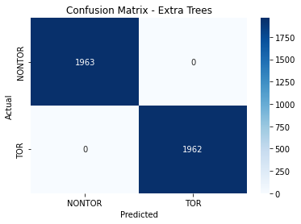
    


    
    
    
    
    


    
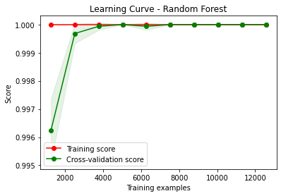
    


    Statistics for Learning Curve - Random Forest:
    Mean training score: 1.0
    Mean validation score: 0.9995795955140082
    Training scores std deviation: 0.0
    Validation scores std deviation: 0.00017322471691133147
    
    
    
    
    


    
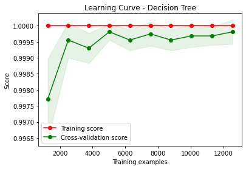
    


    Statistics for Learning Curve - Decision Tree:
    Mean training score: 1.0
    Mean validation score: 0.9994394498633383
    Training scores std deviation: 0.0
    Validation scores std deviation: 0.00045795706272317983
    
    
    
    
    


    
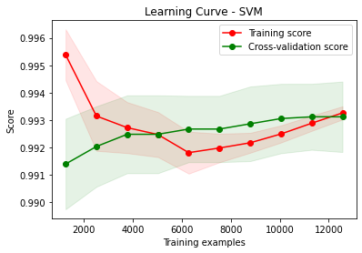
    


    Statistics for Learning Curve - SVM:
    Mean training score: 0.9928347332487395
    Mean validation score: 0.9925918798432702
    Training scores std deviation: 0.0006424930482209662
    Validation scores std deviation: 0.0013479048690216064
    
    
    
    
    


    
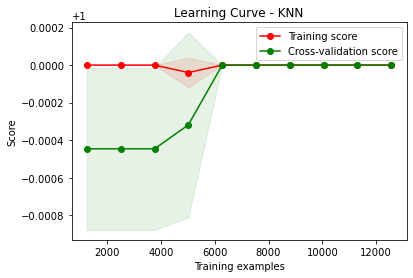
    


    Statistics for Learning Curve - KNN:
    Mean training score: 0.9999960183157477
    Mean validation score: 0.9998343949044586
    Training scores std deviation: 7.963368504877444e-06
    Validation scores std deviation: 0.0001789360295655425
    
    
    
    
    


    
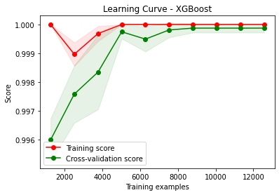
    


    Statistics for Learning Curve - XGBoost:
    Mean training score: 0.9998646000073792
    Mean validation score: 0.9990444885892094
    Training scores std deviation: 6.662343558469902e-05
    Validation scores std deviation: 0.0004588111114438102
    
    
    
    
    


    
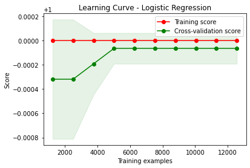
    


    Statistics for Learning Curve - Logistic Regression:
    Mean training score: 1.0
    Mean validation score: 0.9998726094358421
    Training scores std deviation: 0.0
    Validation scores std deviation: 0.00021332441663080536
    
    
    
    
    


    
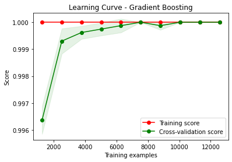
    


    Statistics for Learning Curve - Gradient Boosting:
    Mean training score: 1.0
    Mean validation score: 0.9994776785986044
    Training scores std deviation: 0.0
    Validation scores std deviation: 0.00018734045086106436
    
    
    
    
    


    
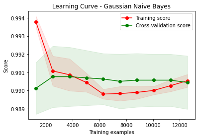
    


    Statistics for Learning Curve - Gaussian Naive Bayes:
    Mean training score: 0.9906531981986726
    Mean validation score: 0.9905661789323954
    Training scores std deviation: 0.00044755903140284835
    Validation scores std deviation: 0.0014963152355478594
    
    
    
    
    


    
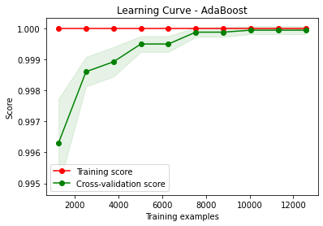
    


    Statistics for Learning Curve - AdaBoost:
    Mean training score: 1.0
    Mean validation score: 0.9992356282072873
    Training scores std deviation: 0.0
    Validation scores std deviation: 0.00035755185903870796
    
    
    
    
    


    
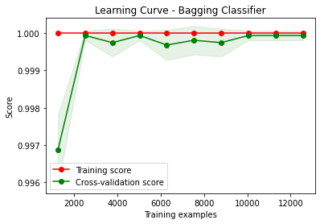
    


    Statistics for Learning Curve - Bagging Classifier:
    Mean training score: 1.0
    Mean validation score: 0.9995541157778757
    Training scores std deviation: 0.0
    Validation scores std deviation: 0.0003118045222417415
    
    
    
    
    


    
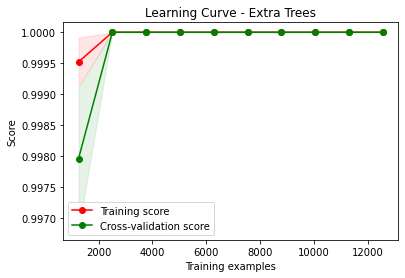
    


    Statistics for Learning Curve - Extra Trees:
    Mean training score: 0.9999521912350599
    Mean validation score: 0.9997961580526884
    Training scores std deviation: 3.903569311208357e-05
    Validation scores std deviation: 0.00011502322847590242
    
    
    
    
    


    
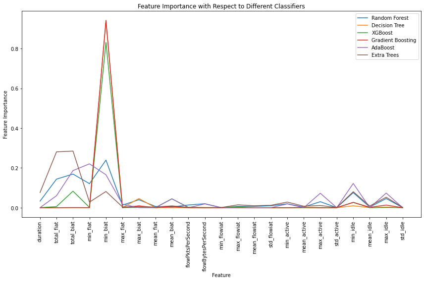
    


    
    
    


    
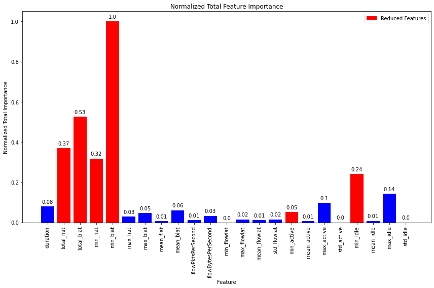
    


    
    Statistics for Normalized Total Feature Importance:
    Mean Normalized Total Importance: 0.13368076677867832
    Standard Deviation of Normalized Total Importance: 0.22946371373853738
    
    
    
    
    
    ROC Scores:
    Random Forest ROC AUC: 1.00
    Decision Tree ROC AUC: 1.00
    SVM ROC AUC: 1.00
    KNN ROC AUC: 1.00
    XGBoost ROC AUC: 1.00
    Logistic Regression ROC AUC: 1.00
    Gradient Boosting ROC AUC: 1.00
    Gaussian Naive Bayes ROC AUC: 1.00
    AdaBoost ROC AUC: 1.00
    Bagging Classifier ROC AUC: 1.00
    Extra Trees ROC AUC: 1.00
    


    
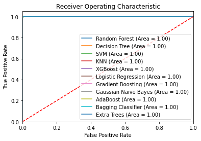
    


```python
# SECTION-C
secC(X_train, y_train, y_test, class_labels, X_train_selected, X_test_selected, time_directory_path)
```

    Fitting 5 folds for each of 5 candidates, totalling 25 fits
    [CV] END ...........batch_size=16, epochs=10, optimizer=adam; total time=  28.3s
    [CV] END ...........batch_size=16, epochs=10, optimizer=adam; total time=  27.8s
    [CV] END ...........batch_size=16, epochs=10, optimizer=adam; total time=  27.9s
    [CV] END ...........batch_size=16, epochs=10, optimizer=adam; total time=  28.0s
    [CV] END ...........batch_size=16, epochs=10, optimizer=adam; total time=  28.2s
    [CV] END ........batch_size=16, epochs=10, optimizer=rmsprop; total time=  23.7s
    [CV] END ........batch_size=16, epochs=10, optimizer=rmsprop; total time=  23.5s
    [CV] END ........batch_size=16, epochs=10, optimizer=rmsprop; total time=  23.5s
    [CV] END ........batch_size=16, epochs=10, optimizer=rmsprop; total time=  23.6s
    [CV] END ........batch_size=16, epochs=10, optimizer=rmsprop; total time=  23.7s
    [CV] END ...........batch_size=32, epochs=20, optimizer=adam; total time=  29.2s
    [CV] END ...........batch_size=32, epochs=20, optimizer=adam; total time=  28.7s
    [CV] END ...........batch_size=32, epochs=20, optimizer=adam; total time=  28.2s
    [CV] END ...........batch_size=32, epochs=20, optimizer=adam; total time=  28.4s
    [CV] END ...........batch_size=32, epochs=20, optimizer=adam; total time=  29.1s
    [CV] END ........batch_size=16, epochs=30, optimizer=rmsprop; total time= 1.2min
    [CV] END ........batch_size=16, epochs=30, optimizer=rmsprop; total time= 1.2min
    [CV] END ........batch_size=16, epochs=30, optimizer=rmsprop; total time= 1.2min
    [CV] END ........batch_size=16, epochs=30, optimizer=rmsprop; total time= 1.2min
    [CV] END ........batch_size=16, epochs=30, optimizer=rmsprop; total time= 1.2min
    [CV] END ........batch_size=16, epochs=20, optimizer=rmsprop; total time=  46.8s
    [CV] END ........batch_size=16, epochs=20, optimizer=rmsprop; total time=  46.1s
    [CV] END ........batch_size=16, epochs=20, optimizer=rmsprop; total time=  46.5s
    [CV] END ........batch_size=16, epochs=20, optimizer=rmsprop; total time=  46.0s
    [CV] END ........batch_size=16, epochs=20, optimizer=rmsprop; total time=  46.8s
    
    Best parameters for Deep Neural Network: {'optimizer': 'adam', 'epochs': 20, 'batch_size': 32}
    Best cross-validation score for Deep Neural Network: 0.9998725708824466
    
    Fold 1 of 5:
    Accuracy: 1.0
    Precision: 1.0
    Recall: 1.0
    F1 Score: 1.0
    Confusion Matrix:
     [[1570    0]
     [   0 1570]]
    
    Fold 2 of 5:
    Accuracy: 0.9990445859872611
    Precision: 0.9990464081373172
    Recall: 0.9990445859872612
    F1 Score: 0.9990445851151433
    Confusion Matrix:
     [[1567    3]
     [   0 1570]]
    
    Fold 3 of 5:
    Accuracy: 1.0
    Precision: 1.0
    Recall: 1.0
    F1 Score: 1.0
    Confusion Matrix:
     [[1570    0]
     [   0 1570]]
    
    Fold 4 of 5:
    Accuracy: 0.9996815286624203
    Precision: 0.9996817313812858
    Recall: 0.9996815286624203
    F1 Score: 0.9996815286301197
    Confusion Matrix:
     [[1569    1]
     [   0 1570]]
    
    Fold 5 of 5:
    Accuracy: 1.0
    Precision: 1.0
    Recall: 1.0
    F1 Score: 1.0
    Confusion Matrix:
     [[1569    0]
     [   0 1570]]
    
    Average Evaluation Metrics Across Folds:
    Average Accuracy: 0.9997452229299363
    Average Precision: 0.9997456279037206
    Average Recall: 0.9997452229299363
    Average F1 Score: 0.9997452227490526
    Average Confusion Matrix:
     [[1.569e+03 8.000e-01]
     [0.000e+00 1.570e+03]]
    
    
    Deep Neural Network Training Results:
    Epoch	Accuracy
    1	0.984574019908905
    2	0.9916401505470276
    3	0.9927348494529724
    4	0.9939291477203369
    5	0.9954219460487366
    6	0.9976114630699158
    7	0.9984076619148254
    8	0.9992038011550903
    9	0.9993033409118652
    10	0.999800980091095
    11	0.9996019005775452
    12	0.9999004602432251
    13	0.999800980091095
    14	0.9999004602432251
    15	0.999800980091095
    16	0.9996019005775452
    17	1.0
    18	1.0
    19	1.0
    20	1.0
    
    
    Deep Neural Network Evaluation:
    Accuracy: 1.0
    Precision: 1.0
    Recall: 1.0
    F1 Score: 1.0
    Confusion Matrix:
     [[1963    0]
     [   0 1962]]
    


    
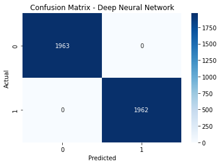
    


    
    
    
    
    


    
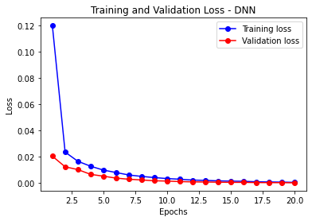
    


    Statistical Information for Training and Validation Loss:
    -------------------------------------------------------
    Mean Training Loss: 0.011278054916914007
    Mean Validation Loss: 0.0036993427623571258
    Minimum Training Loss: 0.0005684579318874567
    Minimum Validation Loss: 0.0002575071767513196
    Maximum Training Loss: 0.12013426057217275
    Maximum Validation Loss: 0.02055099245848929
    Standard Deviation of Training Loss: 0.025669829679475595
    Standard Deviation of Validation Loss: 0.005108265304494413
    
    
    
    
    


    
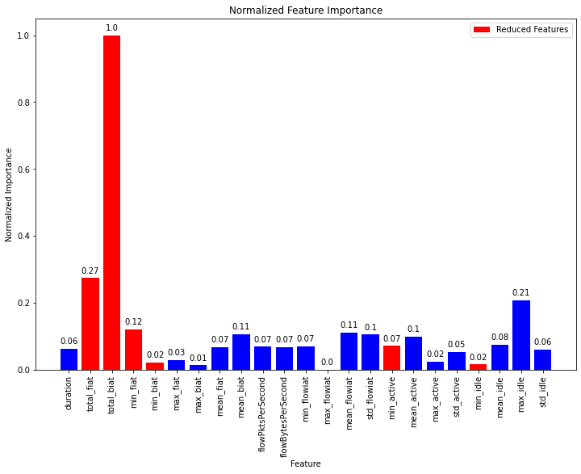
    


    
    Statistics for Normalized Feature Importance:
    Mean Normalized Importance of All Features: 0.11807477610701855
    Standard Deviation of Normalized Importance of All Features: 0.19749137198586922
    Mean Normalized Importance of Selected Features: 0.25015903723649924
    Standard Deviation of Normalized Importance of Selected Features: 0.3462819648119078
    
    
    
    
    


    
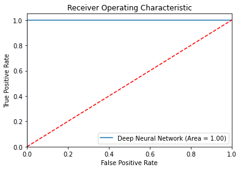
    


    ROC AUC score for Deep Neural Network: 1.00
    
