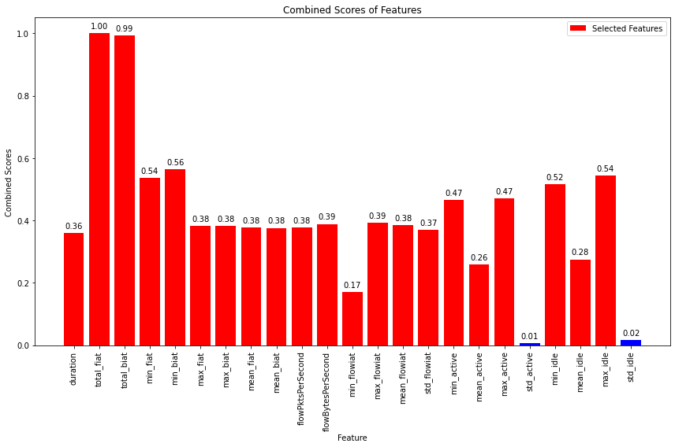

# Models-15s


```python
dataset_name = list(dataset_files)[0]
time_directory = dataset_files[dataset_name]

print("\n", '-'*120, "\n")
print(dataset_name)

# Update the dataset file path in the code
filepath = os.path.join('../../CICDataSet-TOR/CSV/Scenario-A/', dataset_name)

# Update the directory for storing trained models
time_directory_path = os.path.join(models_directory, time_directory)
if not os.path.exists(time_directory_path):
    os.makedirs(time_directory_path)

# DATASET LOADING        
df_data = load_arff_datafiles(filepath)

# SECTION-A
X_train, X_test, y_train, y_test, class_labels, X_train_selected, X_test_selected = secA(df_data, filter_warnings=True)
```

    
     ------------------------------------------------------------------------------------------------------------------------ 
    
    TimeBasedFeatures-15s-TOR-NonTOR.arff
    
    
    Data Distribution: ORIGINAL:
    NONTOR    18758
    TOR        3314
    Name: class1, dtype: int64
    Total: 22072
    
    
    Number of Negative Values in Independent Variables: 68603
    Number of Inf Values: 0
    NaN Value Counts: 68603
    Missing Value Counts: 68603
    
    AFTER IMPUTATION:
    NaN Value Counts: 0
    Missing Value Counts: 0
    
    
    Data Distribution: AFTER Outlier Removal:
    NONTOR    17020
    TOR        2844
    Name: class1, dtype: int64
    Total: 19864
    
    
    Data Distribution: AFTER OVERSAMPLING:
    NONTOR    17020
    TOR       17020
    Name: class1, dtype: int64
    Total: 34040
    
    
    Data Distribution: AFTER ENCODING:
    Value: 0, Count: 17020
    Value: 1, Count: 17020
    Total: 34040
    
    
    
    


    

    


    
    No. of Total Features: 23
    No. of Reduced Features: 21


```python
# SECTION-B
secB(X_train, y_train, y_test, class_labels, X_train_selected, X_test_selected, time_directory_path, filter_warnings=True)
```

    
    
    
    Classifier: Random Forest
    
    Best parameters for Random Forest: {'n_estimators': 200, 'min_samples_split': 5, 'min_samples_leaf': 4, 'max_depth': None, 'bootstrap': False}
    Best cross-validation score for Random Forest: 0.9999632757987513
    
    Cross-validation results for Random Forest:
    [1.         0.99963283 1.         1.         1.        ]
    Mean accuracy: 0.9999265650816962
    
    Random Forest Evaluation:
    Accuracy: 1.0
    Precision: 1.0
    Recall: 1.0
    F1 Score: 1.0
    Confusion Matrix:
     [[3404    0]
     [   0 3404]]
    


    

    


    
    
    
    Classifier: Decision Tree
    
    Best parameters for Decision Tree: {'splitter': 'best', 'min_samples_split': 2, 'min_samples_leaf': 1, 'max_features': None, 'max_depth': 50, 'criterion': 'entropy'}
    Best cross-validation score for Decision Tree: 0.9999265515975028
    
    Cross-validation results for Decision Tree:
    [1.         0.99981641 1.         0.99963276 1.        ]
    Mean accuracy: 0.9998898341383509
    
    Decision Tree Evaluation:
    Accuracy: 1.0
    Precision: 1.0
    Recall: 1.0
    F1 Score: 1.0
    Confusion Matrix:
     [[3404    0]
     [   0 3404]]
    


    

    


    
    
    
    Classifier: SVM
    No hyperparameters specified for SVM. Using default settings.
    
    Cross-validation results for SVM:
    [1.         1.         1.         0.99981638 1.        ]
    Mean accuracy: 0.9999632757987513
    
    SVM Evaluation:
    Accuracy: 1.0
    Precision: 1.0
    Recall: 1.0
    F1 Score: 1.0
    Confusion Matrix:
     [[3404    0]
     [   0 3404]]
    


    

    


    
    
    
    Classifier: KNN
    
    Best parameters for KNN: {'weights': 'uniform', 'n_neighbors': 3, 'algorithm': 'ball_tree'}
    Best cross-validation score for KNN: 1.0
    
    Cross-validation results for KNN:
    [1. 1. 1. 1. 1.]
    Mean accuracy: 1.0
    
    KNN Evaluation:
    Accuracy: 1.0
    Precision: 1.0
    Recall: 1.0
    F1 Score: 1.0
    Confusion Matrix:
     [[3404    0]
     [   0 3404]]
    


    

    


    
    
    
    Classifier: XGBoost
    
    Best parameters for XGBoost: {'subsample': 1.0, 'reg_lambda': 0.1, 'reg_alpha': 1, 'n_estimators': 100, 'min_child_weight': 5, 'max_depth': 3, 'learning_rate': 0.1, 'gamma': 0.2, 'colsample_bytree': 0.8}
    Best cross-validation score for XGBoost: 0.9999265650816962
    
    Cross-validation results for XGBoost:
    [1.         0.99963283 1.         1.         0.99981638]
    Mean accuracy: 0.9998898408804477
    
    XGBoost Evaluation:
    Accuracy: 1.0
    Precision: 1.0
    Recall: 1.0
    F1 Score: 1.0
    Confusion Matrix:
     [[3404    0]
     [   0 3404]]
    


    

    


    
    
    
    Classifier: Logistic Regression
    
    Best parameters for Logistic Regression: {'solver': 'newton-cg', 'penalty': 'none', 'max_iter': 10000, 'C': 1}
    Best cross-validation score for Logistic Regression: 1.0
    
    Cross-validation results for Logistic Regression:
    [1. 1. 1. 1. 1.]
    Mean accuracy: 1.0
    
    Logistic Regression Evaluation:
    Accuracy: 1.0
    Precision: 1.0
    Recall: 1.0
    F1 Score: 1.0
    Confusion Matrix:
     [[3404    0]
     [   0 3404]]
    


    

    


    
    
    
    Classifier: Gradient Boosting
    
    Best parameters for Gradient Boosting: {'subsample': 0.6, 'n_estimators': 200, 'min_samples_split': 10, 'min_samples_leaf': 2, 'max_features': 'log2', 'max_depth': 3, 'learning_rate': 0.3}
    Best cross-validation score for Gradient Boosting: 1.0
    
    Cross-validation results for Gradient Boosting:
    [1.         1.         0.99963276 1.         1.        ]
    Mean accuracy: 0.9999265515975028
    
    Gradient Boosting Evaluation:
    Accuracy: 1.0
    Precision: 1.0
    Recall: 1.0
    F1 Score: 1.0
    Confusion Matrix:
     [[3404    0]
     [   0 3404]]
    


    

    


    
    
    
    Classifier: Gaussian Naive Bayes
    No hyperparameters specified for Gaussian Naive Bayes. Using default settings.
    
    Cross-validation results for Gaussian Naive Bayes:
    [0.98237562 0.98274279 0.98402497 0.98237238 0.98347411]
    Mean accuracy: 0.9829979758202789
    
    Gaussian Naive Bayes Evaluation:
    Accuracy: 0.9835487661574618
    Precision: 0.9840728100113766
    Recall: 0.9835487661574618
    F1 Score: 0.9835443125392779
    Confusion Matrix:
     [[3404    0]
     [ 112 3292]]
    


    

    


    
    
    
    Classifier: AdaBoost
    
    Best parameters for AdaBoost: {'n_estimators': 200, 'learning_rate': 0.3, 'algorithm': 'SAMME.R'}
    Best cross-validation score for AdaBoost: 0.9999265515975028
    
    Cross-validation results for AdaBoost:
    [0.99981641 0.99981641 1.         1.         1.        ]
    Mean accuracy: 0.9999265650816962
    
    AdaBoost Evaluation:
    Accuracy: 1.0
    Precision: 1.0
    Recall: 1.0
    F1 Score: 1.0
    Confusion Matrix:
     [[3404    0]
     [   0 3404]]
    


    

    


    
    
    
    Classifier: Bagging Classifier
    
    Best parameters for Bagging Classifier: {'n_estimators': 200, 'max_samples': 1.0, 'max_features': 0.5, 'bootstrap_features': False, 'bootstrap': False}
    Best cross-validation score for Bagging Classifier: 1.0
    
    Cross-validation results for Bagging Classifier:
    [1.         1.         0.99963276 1.         1.        ]
    Mean accuracy: 0.9999265515975028
    
    Bagging Classifier Evaluation:
    Accuracy: 1.0
    Precision: 1.0
    Recall: 1.0
    F1 Score: 1.0
    Confusion Matrix:
     [[3404    0]
     [   0 3404]]
    


    

    


    
    
    
    Classifier: Extra Trees
    
    Best parameters for Extra Trees: {'n_estimators': 50, 'min_samples_split': 5, 'min_samples_leaf': 1, 'max_features': 'log2', 'max_depth': 20, 'bootstrap': True}
    Best cross-validation score for Extra Trees: 1.0
    
    Cross-validation results for Extra Trees:
    [1. 1. 1. 1. 1.]
    Mean accuracy: 1.0
    
    Extra Trees Evaluation:
    Accuracy: 1.0
    Precision: 1.0
    Recall: 1.0
    F1 Score: 1.0
    Confusion Matrix:
     [[3404    0]
     [   0 3404]]
    


    

    


    
    
    
    
    


    

    


    Statistics for Learning Curve - Random Forest:
    Mean training score: 0.9999990819371127
    Mean validation score: 0.9998971843722779
    Training scores std deviation: 1.8361257746146717e-06
    Validation scores std deviation: 0.00014402538930240112
    
    
    
    
    


    

    


    Statistics for Learning Curve - Decision Tree:
    Mean training score: 1.0
    Mean validation score: 0.9997796655798631
    Training scores std deviation: 0.0
    Validation scores std deviation: 0.0002215636566194315
    
    
    
    
    


    

    


    Statistics for Learning Curve - SVM:
    Mean training score: 0.9999717326509368
    Mean validation score: 0.9999339072251073
    Training scores std deviation: 2.2482996392773708e-05
    Validation scores std deviation: 0.00011749654361158782
    
    
    
    
    


    

    


    Statistics for Learning Curve - KNN:
    Mean training score: 1.0
    Mean validation score: 0.9999926551597502
    Training scores std deviation: 0.0
    Validation scores std deviation: 8.995555427041938e-06
    
    
    
    
    


    

    


    Statistics for Learning Curve - XGBoost:
    Mean training score: 0.9999986884385862
    Mean validation score: 0.9999045325835759
    Training scores std deviation: 2.623122827727364e-06
    Validation scores std deviation: 0.0001509056860973849
    
    
    
    
    


    

    


    Statistics for Learning Curve - Logistic Regression:
    Mean training score: 1.0
    Mean validation score: 1.0
    Training scores std deviation: 0.0
    Validation scores std deviation: 0.0
    
    
    
    
    


    

    


    Statistics for Learning Curve - Gradient Boosting:
    Mean training score: 1.0
    Mean validation score: 0.9999522625836349
    Training scores std deviation: 0.0
    Validation scores std deviation: 5.850672077125609e-05
    
    
    
    
    


    

    


    Statistics for Learning Curve - Gaussian Naive Bayes:
    Mean training score: 0.9835741805224829
    Mean validation score: 0.9830348287955764
    Training scores std deviation: 0.0004928269571468481
    Validation scores std deviation: 0.0020617494411146855
    
    
    
    
    


    

    


    Statistics for Learning Curve - AdaBoost:
    Mean training score: 1.0
    Mean validation score: 0.9997245752327322
    Training scores std deviation: 0.0
    Validation scores std deviation: 0.0003017000571218805
    
    
    
    
    


    

    


    Statistics for Learning Curve - Bagging Classifier:
    Mean training score: 1.0
    Mean validation score: 0.9998935079068951
    Training scores std deviation: 0.0
    Validation scores std deviation: 9.572110375543133e-05
    
    
    
    
    


    

    


    Statistics for Learning Curve - Extra Trees:
    Mean training score: 1.0
    Mean validation score: 0.9999485921861391
    Training scores std deviation: 0.0
    Validation scores std deviation: 6.679506886710017e-05
    
    
    
    
    


    

    


    
    
    


    

    


    
    Statistics for Normalized Total Feature Importance:
    Mean Normalized Total Importance: 0.13809367061622882
    Standard Deviation of Normalized Total Importance: 0.2238793436379356
    
    
    
    
    
    ROC Scores:
    Random Forest ROC AUC: 1.00
    Decision Tree ROC AUC: 1.00
    SVM ROC AUC: 1.00
    KNN ROC AUC: 1.00
    XGBoost ROC AUC: 1.00
    Logistic Regression ROC AUC: 1.00
    Gradient Boosting ROC AUC: 1.00
    Gaussian Naive Bayes ROC AUC: 0.99
    AdaBoost ROC AUC: 1.00
    Bagging Classifier ROC AUC: 1.00
    Extra Trees ROC AUC: 1.00
    


    

    


```python
# SECTION-C
secC(X_train, y_train, y_test, class_labels, X_train_selected, X_test_selected, time_directory_path)
```

    Fitting 5 folds for each of 5 candidates, totalling 25 fits
    [CV] END ...........batch_size=16, epochs=10, optimizer=adam; total time= 1.0min
    [CV] END ...........batch_size=16, epochs=10, optimizer=adam; total time=  57.8s
    [CV] END ...........batch_size=16, epochs=10, optimizer=adam; total time=  53.9s
    [CV] END ...........batch_size=16, epochs=10, optimizer=adam; total time=  48.5s
    [CV] END ...........batch_size=16, epochs=10, optimizer=adam; total time= 1.4min
    [CV] END ........batch_size=16, epochs=10, optimizer=rmsprop; total time= 1.3min
    [CV] END ........batch_size=16, epochs=10, optimizer=rmsprop; total time= 1.3min
    [CV] END ........batch_size=16, epochs=10, optimizer=rmsprop; total time= 1.3min
    [CV] END ........batch_size=16, epochs=10, optimizer=rmsprop; total time= 1.3min
    [CV] END ........batch_size=16, epochs=10, optimizer=rmsprop; total time= 1.3min
    [CV] END ...........batch_size=32, epochs=20, optimizer=adam; total time= 1.5min
    [CV] END ...........batch_size=32, epochs=20, optimizer=adam; total time= 1.4min
    [CV] END ...........batch_size=32, epochs=20, optimizer=adam; total time= 1.4min
    [CV] END ...........batch_size=32, epochs=20, optimizer=adam; total time= 1.4min
    [CV] END ...........batch_size=32, epochs=20, optimizer=adam; total time= 1.4min
    [CV] END ........batch_size=16, epochs=30, optimizer=rmsprop; total time= 3.7min
    [CV] END ........batch_size=16, epochs=30, optimizer=rmsprop; total time= 3.8min
    [CV] END ........batch_size=16, epochs=30, optimizer=rmsprop; total time= 3.8min
    [CV] END ........batch_size=16, epochs=30, optimizer=rmsprop; total time= 3.9min
    [CV] END ........batch_size=16, epochs=30, optimizer=rmsprop; total time= 4.0min
    [CV] END ........batch_size=16, epochs=20, optimizer=rmsprop; total time= 2.6min
    [CV] END ........batch_size=16, epochs=20, optimizer=rmsprop; total time= 2.7min
    [CV] END ........batch_size=16, epochs=20, optimizer=rmsprop; total time= 2.5min
    [CV] END ........batch_size=16, epochs=20, optimizer=rmsprop; total time= 2.5min
    [CV] END ........batch_size=16, epochs=20, optimizer=rmsprop; total time= 2.5min
    
    Best parameters for Deep Neural Network: {'optimizer': 'adam', 'epochs': 10, 'batch_size': 16}
    Best cross-validation score for Deep Neural Network: 1.0
    
    Fold 1 of 5:
    Accuracy: 1.0
    Precision: 1.0
    Recall: 1.0
    F1 Score: 1.0
    Confusion Matrix:
     [[2723    0]
     [   0 2724]]
    
    Fold 2 of 5:
    Accuracy: 1.0
    Precision: 1.0
    Recall: 1.0
    F1 Score: 1.0
    Confusion Matrix:
     [[2724    0]
     [   0 2723]]
    
    Fold 3 of 5:
    Accuracy: 1.0
    Precision: 1.0
    Recall: 1.0
    F1 Score: 1.0
    Confusion Matrix:
     [[2723    0]
     [   0 2723]]
    
    Fold 4 of 5:
    Accuracy: 1.0
    Precision: 1.0
    Recall: 1.0
    F1 Score: 1.0
    Confusion Matrix:
     [[2723    0]
     [   0 2723]]
    
    Fold 5 of 5:
    Accuracy: 1.0
    Precision: 1.0
    Recall: 1.0
    F1 Score: 1.0
    Confusion Matrix:
     [[2723    0]
     [   0 2723]]
    
    Average Evaluation Metrics Across Folds:
    Average Accuracy: 1.0
    Average Precision: 1.0
    Average Recall: 1.0
    Average F1 Score: 1.0
    Average Confusion Matrix:
     [[2723.2    0. ]
     [   0.  2723.2]]
    
    
    Deep Neural Network Training Results:
    Epoch	Accuracy
    1	0.9786550402641296
    2	0.999713122844696
    3	0.9998852610588074
    4	1.0
    5	1.0
    6	1.0
    7	1.0
    8	1.0
    9	1.0
    10	1.0
    
    
    Deep Neural Network Evaluation:
    Accuracy: 1.0
    Precision: 1.0
    Recall: 1.0
    F1 Score: 1.0
    Confusion Matrix:
     [[3404    0]
     [   0 3404]]
    


    

    


    
    
    
    
    


    

    


    Statistical Information for Training and Validation Loss:
    -------------------------------------------------------
    Mean Training Loss: 0.00902896794252396
    Mean Validation Loss: 0.0015806076082047755
    Minimum Training Loss: 2.6768479061502953e-05
    Minimum Validation Loss: 2.080255846785678e-05
    Maximum Training Loss: 0.08247494399513376
    Maximum Validation Loss: 0.01203978674975475
    Standard Deviation of Training Loss: 0.024527659511830315
    Standard Deviation of Validation Loss: 0.0035418996370930973
    
    
    
    
    


    

    


    
    Statistics for Normalized Feature Importance:
    Mean Normalized Importance of All Features: 0.3103051189591891
    Standard Deviation of Normalized Importance of All Features: 0.16783288242594913
    Mean Normalized Importance of Selected Features: 0.313597929030375
    Standard Deviation of Normalized Importance of Selected Features: 0.17528788148359217
    
    
    
    
    


    

    


    ROC AUC score for Deep Neural Network: 1.00
    