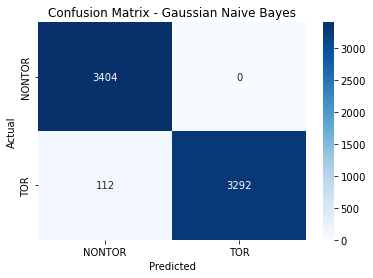
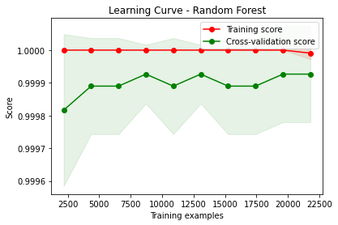
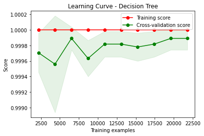
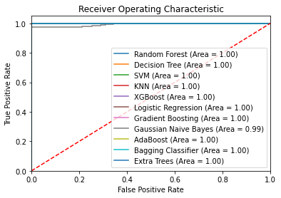
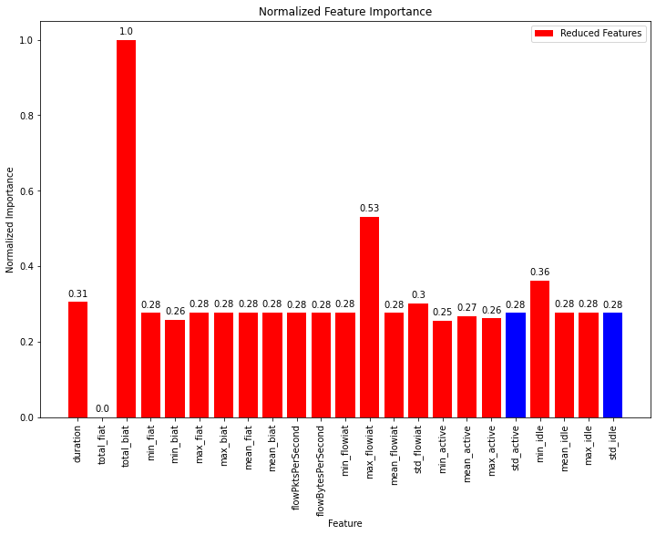

# Models-15s


```python
dataset_name = list(dataset_files)[0]
time_directory = dataset_files[dataset_name]

print("\n", '-'*120, "\n")
print(dataset_name)

# Update the dataset file path in the code
filepath = os.path.join('../../CICDataSet-TOR/CSV/Scenario-B/', dataset_name)

# Update the directory for storing trained models
time_directory_path = os.path.join(models_directory, time_directory)
if not os.path.exists(time_directory_path):
    os.makedirs(time_directory_path)

# DATASET LOADING        
df_data = load_arff_datafiles(filepath)

# SECTION-A
X_train, X_test, y_train, y_test, class_labels, X_train_selected, X_test_selected = secA(df_data, filter_warnings=True)
```

    
     ------------------------------------------------------------------------------------------------------------------------ 
    
    TimeBasedFeatures-15s-Layer2.arff
    
    
    Data Distribution: ORIGINAL:
    VOIP               1509
    VIDEO-STREAMING     598
    FILE-TRANSFER       480
    CHAT                243
    BROWSING            227
    EMAIL               186
    P2P                  71
    AUDIO-STREAMING      46
    Name: class1, dtype: int64
    Total: 3360
    
    
    Number of Negative Values in Independent Variables: 9507
    Number of Inf Values: 0
    NaN Value Counts: 9507
    Missing Value Counts: 9507
    
    AFTER IMPUTATION:
    NaN Value Counts: 0
    Missing Value Counts: 0
    
    
    Data Distribution: AFTER Outlier Removal:
    VOIP               1499
    VIDEO-STREAMING     509
    FILE-TRANSFER       461
    EMAIL               172
    BROWSING            152
    CHAT                142
    P2P                  69
    AUDIO-STREAMING      20
    Name: class1, dtype: int64
    Total: 3024
    
    
    Data Distribution: AFTER OVERSAMPLING:
    VOIP               1499
    VIDEO-STREAMING    1499
    CHAT               1499
    EMAIL              1499
    P2P                1499
    AUDIO-STREAMING    1499
    FILE-TRANSFER      1499
    BROWSING           1499
    Name: class1, dtype: int64
    Total: 11992
    
    
    Data Distribution: AFTER ENCODING:
    Value: 0, Count: 1499
    Value: 1, Count: 1499
    Value: 2, Count: 1499
    Value: 3, Count: 1499
    Value: 4, Count: 1499
    Value: 5, Count: 1499
    Value: 6, Count: 1499
    Value: 7, Count: 1499
    Total: 11992
    
    
    
    


    

    


    
    No. of Total Features: 23
    No. of Reduced Features: 22
    
    All Features with Reduced Features:
    duration|total_fiat|total_biat|min_fiat|min_biat|max_fiat|max_biat|mean_fiat|mean_biat|flowPktsPerSecond|flowBytesPerSecond|min_flowiat|max_flowiat|mean_flowiat|std_flowiat|min_active|mean_active|max_active|std_active|min_idle|mean_idle|max_idle|std_idle
    


```python
# SECTION-B
secB(X_train, y_train, y_test, class_labels, X_train_selected, X_test_selected, time_directory_path, filter_warnings=True)
```

    
    
    
    Classifier: Random Forest
    
    Best parameters for Random Forest: {'n_estimators': 100, 'min_samples_split': 2, 'min_samples_leaf': 1, 'max_depth': 20, 'bootstrap': False}
    Best cross-validation score for Random Forest: 0.9717502544393071
    
    Cross-validation results for Random Forest:
    [0.97133924 0.96300156 0.97394476 0.97236705 0.96298227]
    Mean accuracy: 0.9687269775218563
    
    Random Forest Evaluation:
    Accuracy: 0.9774906210921217
    Precision: 0.9776317166259787
    Recall: 0.9774906210921217
    F1 Score: 0.9774938463371587
    Confusion Matrix:
     [[300   0   0   0   0   0   0   0]
     [  1 286   4   1   0   2   6   0]
     [  0   6 294   0   0   0   0   0]
     [  0   1   1 297   0   1   0   0]
     [  0   1   2   0 295   0   2   0]
     [  0   0   0   0   0 297   2   0]
     [  0   6   7   5   1   0 281   0]
     [  0   1   2   0   0   0   2 295]]
    


    

    


    
    
    
    Classifier: Decision Tree
    
    Best parameters for Decision Tree: {'splitter': 'random', 'min_samples_split': 5, 'min_samples_leaf': 1, 'max_features': None, 'max_depth': 50, 'criterion': 'entropy'}
    Best cross-validation score for Decision Tree: 0.9184814497036115
    
    Cross-validation results for Decision Tree:
    [0.91297551 0.92443981 0.91349661 0.92440042 0.91501564]
    Mean accuracy: 0.9180655983385508
    
    Decision Tree Evaluation:
    Accuracy: 0.9337223843268029
    Precision: 0.9341935506212089
    Recall: 0.9337223843268029
    F1 Score: 0.9335408765493257
    Confusion Matrix:
     [[295   3   0   0   0   0   2   0]
     [  1 267  13   5   1   3   6   4]
     [  2  12 277   2   4   0   2   1]
     [  0   7   6 278   2   0   7   0]
     [  0   3   3   2 290   0   1   1]
     [  0   4   0   0   0 291   4   0]
     [  3  16   9  13  10   1 247   1]
     [  0   4   0   0   0   0   1 295]]
    


    

    


    
    
    
    Classifier: SVM
    No hyperparameters specified for SVM. Using default settings.
    
    Cross-validation results for SVM:
    [0.77123502 0.78999479 0.78999479 0.77841502 0.78884254]
    Mean accuracy: 0.7836964312204229
    
    SVM Evaluation:
    Accuracy: 0.7969987494789496
    Precision: 0.8105206827596869
    Recall: 0.7969987494789496
    F1 Score: 0.7908082200429825
    Confusion Matrix:
     [[284   5  11   0   0   0   0   0]
     [ 15 124 107  31   0  20   3   0]
     [  3  33 254   6   0   1   3   0]
     [  9  15  13 229   0  31   3   0]
     [  3   1  10  15 267   3   1   0]
     [  5   1   0   3   0 287   3   0]
     [ 17  17  25  26   0  42 173   0]
     [  0   1   2   0   0   2   1 294]]
    


    

    


    
    
    
    Classifier: KNN
    
    Best parameters for KNN: {'weights': 'distance', 'n_neighbors': 3, 'algorithm': 'auto'}
    Best cross-validation score for KNN: 0.9601787948950211
    
    Cross-validation results for KNN:
    [0.95883273 0.95726941 0.96195935 0.95151199 0.955683  ]
    Mean accuracy: 0.9570512970291596
    
    KNN Evaluation:
    Accuracy: 0.9708211754897874
    Precision: 0.9709239607212939
    Recall: 0.9708211754897874
    F1 Score: 0.9707117689163277
    Confusion Matrix:
     [[300   0   0   0   0   0   0   0]
     [  0 288   6   3   0   0   3   0]
     [  0   3 294   0   0   0   2   1]
     [  0   1   1 294   2   1   1   0]
     [  0   2   3   2 289   2   2   0]
     [  0   0   0   1   0 296   2   0]
     [  1   4   5   8   3   5 273   1]
     [  1   3   0   0   0   0   1 295]]
    


    

    


    
    
    
    Classifier: XGBoost
    
    Best parameters for XGBoost: {'subsample': 0.8, 'reg_lambda': 0.1, 'reg_alpha': 1, 'n_estimators': 300, 'min_child_weight': 3, 'max_depth': 7, 'learning_rate': 0.1, 'gamma': 0.0, 'colsample_bytree': 0.8}
    Best cross-validation score for XGBoost: 0.9686234086336025
    
    Cross-validation results for XGBoost:
    [0.96456488 0.9666493  0.96925482 0.96298227 0.97653806]
    Mean accuracy: 0.967997865589753
    
    XGBoost Evaluation:
    Accuracy: 0.9799916631929971
    Precision: 0.9801068018641725
    Recall: 0.9799916631929971
    F1 Score: 0.9799600595887671
    Confusion Matrix:
     [[300   0   0   0   0   0   0   0]
     [  2 292   0   3   0   0   3   0]
     [  0   4 296   0   0   0   0   0]
     [  0   1   0 298   0   0   1   0]
     [  0   2   1   0 294   0   3   0]
     [  0   0   0   0   0 297   2   0]
     [  1   8   6   4   2   0 279   0]
     [  0   0   3   0   0   0   2 295]]
    


    

    


    
    
    
    Classifier: Logistic Regression
    
    Best parameters for Logistic Regression: {'solver': 'newton-cg', 'penalty': 'none', 'max_iter': 10000, 'C': 1}
    Best cross-validation score for Logistic Regression: 0.858749805061182
    
    Cross-validation results for Logistic Regression:
    [0.86242835 0.86086503 0.84210526 0.85714286 0.87434828]
    Mean accuracy: 0.8593779563456593
    
    Logistic Regression Evaluation:
    Accuracy: 0.8666110879533139
    Precision: 0.8694073736332598
    Recall: 0.8666110879533139
    F1 Score: 0.8649229015134988
    Confusion Matrix:
     [[300   0   0   0   0   0   0   0]
     [  2 177  66  29   1   9  16   0]
     [  3  35 252   6   1   0   3   0]
     [  1  14  11 265   0   5   4   0]
     [  1   1   9   3 284   2   0   0]
     [  1   3   0   0   0 289   6   0]
     [  1  18  17  35   0  12 217   0]
     [  0   0   5   0   0   0   0 295]]
    


    

    


    
    
    
    Classifier: Gradient Boosting
    
    Best parameters for Gradient Boosting: {'subsample': 1.0, 'n_estimators': 100, 'min_samples_split': 5, 'min_samples_leaf': 2, 'max_features': 'sqrt', 'max_depth': 7, 'learning_rate': 0.3}
    Best cross-validation score for Gradient Boosting: 0.9725842393799777
    
    Cross-validation results for Gradient Boosting:
    [0.97186034 0.96977592 0.96508598 0.97080292 0.97445255]
    Mean accuracy: 0.9703955451250081
    
    Gradient Boosting Evaluation:
    Accuracy: 0.9837432263443101
    Precision: 0.9837981887788652
    Recall: 0.9837432263443101
    F1 Score: 0.9836972759926014
    Confusion Matrix:
     [[300   0   0   0   0   0   0   0]
     [  0 292   1   2   0   0   5   0]
     [  0   2 298   0   0   0   0   0]
     [  0   2   0 298   0   0   0   0]
     [  0   1   1   1 296   0   1   0]
     [  0   0   0   0   0 299   0   0]
     [  1   4   5   4   4   0 282   0]
     [  0   0   3   0   0   0   2 295]]
    


    

    


    
    
    
    Classifier: Gaussian Naive Bayes
    No hyperparameters specified for Gaussian Naive Bayes. Using default settings.
    
    Cross-validation results for Gaussian Naive Bayes:
    [0.54768108 0.54299114 0.54872329 0.55161627 0.55109489]
    Mean accuracy: 0.5484213351909802
    
    Gaussian Naive Bayes Evaluation:
    Accuracy: 0.5502292621925803
    Precision: 0.5361297865815076
    Recall: 0.5502292621925803
    F1 Score: 0.4826335184435897
    Confusion Matrix:
     [[152   3  10   7  17 107   4   0]
     [ 13   5 144  43  46  44   2   3]
     [ 32   8 198  57   1   1   1   2]
     [ 21   0  12 108  81  77   1   0]
     [  5   0  10  11 260  13   1   0]
     [  0   0   1   5   2 290   1   0]
     [ 19   1  41  41 133  51  14   0]
     [  1   0   1   1   1   1   2 293]]
    


    

    


    
    
    
    Classifier: AdaBoost
    
    Best parameters for AdaBoost: {'n_estimators': 200, 'learning_rate': 0.3, 'algorithm': 'SAMME'}
    Best cross-validation score for AdaBoost: 0.6917551340228145
    
    Cross-validation results for AdaBoost:
    [0.68994268 0.67378843 0.70088588 0.69708029 0.71793535]
    Mean accuracy: 0.6959265258615208
    
    AdaBoost Evaluation:
    Accuracy: 0.7157148812005002
    Precision: 0.7466082455784169
    Recall: 0.7157148812005002
    F1 Score: 0.7119758222754426
    Confusion Matrix:
     [[202  27  38   4   0  18  11   0]
     [  7  98 144  31   0   7  13   0]
     [  1  16 283   0   0   0   0   0]
     [  1  19  32 186  34  17  10   1]
     [  0   2  26  39 231   2   0   0]
     [  1  19   1   6   0 271   1   0]
     [  7  17  54  10  14  42 156   0]
     [  0   0  10   0   0   0   0 290]]
    


    

    


    
    
    
    Classifier: Bagging Classifier
    
    Best parameters for Bagging Classifier: {'n_estimators': 50, 'max_samples': 1.0, 'max_features': 0.5, 'bootstrap_features': False, 'bootstrap': False}
    Best cross-validation score for Bagging Classifier: 0.9670597683773646
    
    Cross-validation results for Bagging Classifier:
    [0.95779052 0.9671704  0.97186034 0.96715328 0.97810219]
    Mean accuracy: 0.9684153471052062
    
    Bagging Classifier Evaluation:
    Accuracy: 0.9766569403918299
    Precision: 0.97677615083446
    Recall: 0.9766569403918299
    F1 Score: 0.976628639394658
    Confusion Matrix:
     [[300   0   0   0   0   0   0   0]
     [  0 289   4   0   0   1   6   0]
     [  0   6 292   1   0   0   1   0]
     [  0   1   0 297   0   1   1   0]
     [  0   1   2   1 293   0   3   0]
     [  0   0   0   0   0 299   0   0]
     [  0   7   8   5   3   0 277   0]
     [  0   1   2   0   0   0   1 296]]
    


    

    


    
    
    
    Classifier: Extra Trees
    
    Best parameters for Extra Trees: {'n_estimators': 100, 'min_samples_split': 5, 'min_samples_leaf': 1, 'max_features': 'log2', 'max_depth': None, 'bootstrap': False}
    Best cross-validation score for Extra Trees: 0.9730011775119667
    
    Cross-validation results for Extra Trees:
    [0.97238145 0.97550808 0.97446587 0.9645464  0.97445255]
    Mean accuracy: 0.9722708701362425
    
    Extra Trees Evaluation:
    Accuracy: 0.9774906210921217
    Precision: 0.977854869896009
    Recall: 0.9774906210921217
    F1 Score: 0.9774370543655913
    Confusion Matrix:
     [[300   0   0   0   0   0   0   0]
     [  0 289   5   0   0   2   4   0]
     [  0   2 298   0   0   0   0   0]
     [  0   2   0 297   0   1   0   0]
     [  0   0   5   1 291   0   3   0]
     [  0   0   0   0   0 299   0   0]
     [  2   6   8   8   0   0 276   0]
     [  0   3   1   0   0   0   1 295]]
    


    

    


    
    
    
    
    


    

    


    Statistics for Learning Curve - Random Forest:
    Mean training score: 1.0
    Mean validation score: 0.9383405829743834
    Training scores std deviation: 0.0
    Validation scores std deviation: 0.0028430073147768247
    
    
    
    
    


    

    


    Statistics for Learning Curve - Decision Tree:
    Mean training score: 0.9752802759302508
    Mean validation score: 0.8788295954890479
    Training scores std deviation: 0.0027269696202712936
    Validation scores std deviation: 0.008209611629665247
    
    
    
    
    


    

    


    Statistics for Learning Curve - SVM:
    Mean training score: 0.7506251393350616
    Mean validation score: 0.7380912460380553
    Training scores std deviation: 0.0036567485631392033
    Validation scores std deviation: 0.007545013736839484
    
    
    
    
    


    

    


    Statistics for Learning Curve - KNN:
    Mean training score: 1.0
    Mean validation score: 0.9153968573960738
    Training scores std deviation: 0.0
    Validation scores std deviation: 0.0035449475272438845
    
    
    
    
    


    

    


    Statistics for Learning Curve - XGBoost:
    Mean training score: 0.9997399042244517
    Mean validation score: 0.9365060334582935
    Training scores std deviation: 0.00019496719268582342
    Validation scores std deviation: 0.004065271680152638
    
    
    
    
    


    

    


    Statistics for Learning Curve - Logistic Regression:
    Mean training score: 0.8673833074753372
    Mean validation score: 0.8506620312434624
    Training scores std deviation: 0.0024087236787783245
    Validation scores std deviation: 0.003867233266465535
    
    
    
    
    


    

    


    Statistics for Learning Curve - Gradient Boosting:
    Mean training score: 1.0
    Mean validation score: 0.9419996457139815
    Training scores std deviation: 0.0
    Validation scores std deviation: 0.005856258764473259
    
    
    
    
    


    

    


    Statistics for Learning Curve - Gaussian Naive Bayes:
    Mean training score: 0.5415357541696286
    Mean validation score: 0.5396339171264144
    Training scores std deviation: 0.010004448240763896
    Validation scores std deviation: 0.012663951478220659
    
    
    
    
    


    

    


    Statistics for Learning Curve - AdaBoost:
    Mean training score: 0.6937709659538668
    Mean validation score: 0.6892218477102635
    Training scores std deviation: 0.009220893299248427
    Validation scores std deviation: 0.011785134638718008
    
    
    
    
    


    

    


    Statistics for Learning Curve - Bagging Classifier:
    Mean training score: 1.0
    Mean validation score: 0.9343996617981318
    Training scores std deviation: 0.0
    Validation scores std deviation: 0.003510006820329835
    
    
    
    
    


    

    


    Statistics for Learning Curve - Extra Trees:
    Mean training score: 0.9999449626408878
    Mean validation score: 0.9417895084607523
    Training scores std deviation: 9.997038288902977e-05
    Validation scores std deviation: 0.007125530071357309
    
    
    
    
    


    

    


    
    
    


    

    


    
    Statistics for Normalized Total Feature Importance:
    Mean Normalized Total Importance: 0.24019203423944593
    Standard Deviation of Normalized Total Importance: 0.25083292335872426
    
    
    
    
    
    
    
    


    

    


    

    


    Statistics for ROC Curve - Random Forest:
    Micro-average AUC: 0.9995652752056048
    Macro-average AUC: 0.9995084154255081
    
    
    
    
    


    

    


    

    


    Statistics for ROC Curve - Decision Tree:
    Micro-average AUC: 0.9702026542103892
    Macro-average AUC: 0.970056713645572
    
    
    
    
    


    

    


    

    


    Statistics for ROC Curve - SVM:
    Micro-average AUC: 0.9783335356761897
    Macro-average AUC: 0.968753587235962
    
    
    
    
    


    

    


    

    


    Statistics for ROC Curve - KNN:
    Micro-average AUC: 0.991326665095748
    Macro-average AUC: 0.9912630424240765
    
    
    
    
    


    

    


    

    


    Statistics for ROC Curve - XGBoost:
    Micro-average AUC: 0.9996636086211411
    Macro-average AUC: 0.99965717802128
    
    
    
    
    


    

    


    

    


    Statistics for ROC Curve - Logistic Regression:
    Micro-average AUC: 0.987217748160068
    Macro-average AUC: 0.9802767394305509
    
    
    
    
    


    

    


    

    


    Statistics for ROC Curve - Gradient Boosting:
    Micro-average AUC: 0.9994498392472677
    Macro-average AUC: 0.9996409996823884
    
    
    
    
    


    

    


    

    


    Statistics for ROC Curve - Gaussian Naive Bayes:
    Micro-average AUC: 0.8823751147626544
    Macro-average AUC: 0.858707089812971
    
    
    
    
    


    

    


    

    


    Statistics for ROC Curve - AdaBoost:
    Micro-average AUC: 0.9426008876889914
    Macro-average AUC: 0.9363094678285262
    
    
    
    
    


    

    


    

    


    Statistics for ROC Curve - Bagging Classifier:
    Micro-average AUC: 0.9991067706782588
    Macro-average AUC: 0.9989786907692249
    
    
    
    
    


    

    


    

    


    Statistics for ROC Curve - Extra Trees:
    Micro-average AUC: 0.9994596812766153
    Macro-average AUC: 0.9995540615020974
    


```python
# SECTION-C
secC(X_train, y_train, y_test, class_labels, X_train_selected, X_test_selected, time_directory_path)
```

    Fitting 5 folds for each of 5 candidates, totalling 25 fits
    [CV] END ...........batch_size=16, epochs=10, optimizer=adam; total time=  19.3s
    [CV] END ...........batch_size=16, epochs=10, optimizer=adam; total time=  14.1s
    [CV] END ...........batch_size=16, epochs=10, optimizer=adam; total time=  14.2s
    [CV] END ...........batch_size=16, epochs=10, optimizer=adam; total time=  14.2s
    [CV] END ...........batch_size=16, epochs=10, optimizer=adam; total time=  14.1s
    [CV] END ........batch_size=16, epochs=10, optimizer=rmsprop; total time=  11.6s
    [CV] END ........batch_size=16, epochs=10, optimizer=rmsprop; total time=  12.0s
    [CV] END ........batch_size=16, epochs=10, optimizer=rmsprop; total time=  11.6s
    [CV] END ........batch_size=16, epochs=10, optimizer=rmsprop; total time=  11.9s
    [CV] END ........batch_size=16, epochs=10, optimizer=rmsprop; total time=  11.9s
    [CV] END ...........batch_size=32, epochs=20, optimizer=adam; total time=  14.0s
    [CV] END ...........batch_size=32, epochs=20, optimizer=adam; total time=  14.0s
    [CV] END ...........batch_size=32, epochs=20, optimizer=adam; total time=  13.9s
    [CV] END ...........batch_size=32, epochs=20, optimizer=adam; total time=  14.1s
    [CV] END ...........batch_size=32, epochs=20, optimizer=adam; total time=  13.9s
    [CV] END ........batch_size=16, epochs=30, optimizer=rmsprop; total time=  34.1s
    [CV] END ........batch_size=16, epochs=30, optimizer=rmsprop; total time=  34.8s
    [CV] END ........batch_size=16, epochs=30, optimizer=rmsprop; total time=  35.0s
    [CV] END ........batch_size=16, epochs=30, optimizer=rmsprop; total time=  33.8s
    [CV] END ........batch_size=16, epochs=30, optimizer=rmsprop; total time=  34.0s
    [CV] END ........batch_size=16, epochs=20, optimizer=rmsprop; total time=  22.9s
    [CV] END ........batch_size=16, epochs=20, optimizer=rmsprop; total time=  22.7s
    [CV] END ........batch_size=16, epochs=20, optimizer=rmsprop; total time=  22.7s
    [CV] END ........batch_size=16, epochs=20, optimizer=rmsprop; total time=  22.7s
    [CV] END ........batch_size=16, epochs=20, optimizer=rmsprop; total time=  23.8s
    
    Best parameters for Deep Neural Network: {'optimizer': 'rmsprop', 'epochs': 30, 'batch_size': 16}
    Best cross-validation score for Deep Neural Network: 0.8131975345605469
    
    Fold 1 of 5:
    Accuracy: 0.7837415320479416
    Precision: 0.7882594416707978
    Recall: 0.7838389121338911
    F1 Score: 0.7762976669149907
    Confusion Matrix:
     [[232   1   3   3   0   0   0   0]
     [ 13 108  74  20   0  10  13   2]
     [  8  31 191   1   0   0   6   3]
     [ 11  14  22 162   3  23   5   0]
     [  5   3   2   7 213   8   2   0]
     [  1   4   0   3   0 230   2   0]
     [ 15  12  11  24   0  47 131   0]
     [  1   1   0   0   0   0   1 237]]
    
    Fold 2 of 5:
    Accuracy: 0.7748827514330381
    Precision: 0.7831565932459881
    Recall: 0.7747341352859135
    F1 Score: 0.7697847221061876
    Confusion Matrix:
     [[220   3   5   6   0   3   3   0]
     [ 16 129  50  24   0   5  15   1]
     [  6  18 212   0   0   0   3   1]
     [ 17  23  14 161   0  21   4   0]
     [  4   2  10  15 201   6   1   1]
     [ 11   3   0  15   0 210   1   0]
     [  9  33  19  24   0  36 117   1]
     [  0   1   1   1   0   0   0 237]]
    
    Fold 3 of 5:
    Accuracy: 0.7998957790515894
    Precision: 0.8120258107794742
    Recall: 0.7999259065550907
    F1 Score: 0.7967535975063678
    Confusion Matrix:
     [[219  10   7   2   0   2   0   0]
     [ 10 130  62  14   0  14  10   0]
     [  1  27 205   3   1   0   1   1]
     [  7   8  15 164   0  41   5   0]
     [  2   0   3   8 218   7   2   0]
     [  3   1   0   9   0 225   2   0]
     [  7  14  13  20   0  46 139   1]
     [  0   1   1   2   0   0   1 235]]
    
    Fold 4 of 5:
    Accuracy: 0.7815432742440042
    Precision: 0.7873454158191826
    Recall: 0.7815921373779637
    F1 Score: 0.7750073476211756
    Confusion Matrix:
     [[222   5   5   6   0   2   0   0]
     [ 13  96  69  33   0  12  17   0]
     [  3  24 194  14   0   0   3   2]
     [ 11   1  14 185   2  16  10   0]
     [  1   0   5  12 211   4   6   0]
     [  3   2   0   8   0 215  12   0]
     [ 15   9  11  30   0  32 143   0]
     [  1   0   2   2   0   0   2 233]]
    
    Fold 5 of 5:
    Accuracy: 0.7857142857142857
    Precision: 0.7939901195260091
    Recall: 0.7857261157601116
    F1 Score: 0.7848181684209843
    Confusion Matrix:
     [[217   1  10   4   0   8   0   0]
     [  4 146  45  23   0  11  10   0]
     [  5  49 181   1   0   0   4   0]
     [  8  14  23 155   7  29   4   0]
     [  2   5   8  10 208   4   3   0]
     [  1   6   0   6   0 223   4   0]
     [  6  17  14  29   3  27 142   2]
     [  0   1   1   1   0   0   1 235]]
    
    Average Evaluation Metrics Across Folds:
    Average Accuracy: 0.7851555244981717
    Average Precision: 0.7929554762082904
    Average Recall: 0.7851634414225941
    Average F1 Score: 0.7805323005139412
    Average Confusion Matrix:
     [[2.220e+02 4.000e+00 6.000e+00 4.200e+00 0.000e+00 3.000e+00 6.000e-01
      0.000e+00]
     [1.120e+01 1.218e+02 6.000e+01 2.280e+01 0.000e+00 1.040e+01 1.300e+01
      6.000e-01]
     [4.600e+00 2.980e+01 1.966e+02 3.800e+00 2.000e-01 0.000e+00 3.400e+00
      1.400e+00]
     [1.080e+01 1.200e+01 1.760e+01 1.654e+02 2.400e+00 2.600e+01 5.600e+00
      0.000e+00]
     [2.800e+00 2.000e+00 5.600e+00 1.040e+01 2.102e+02 5.800e+00 2.800e+00
      2.000e-01]
     [3.800e+00 3.200e+00 0.000e+00 8.200e+00 0.000e+00 2.206e+02 4.200e+00
      0.000e+00]
     [1.040e+01 1.700e+01 1.360e+01 2.540e+01 6.000e-01 3.760e+01 1.344e+02
      8.000e-01]
     [4.000e-01 8.000e-01 1.000e+00 1.200e+00 0.000e+00 0.000e+00 1.000e+00
      2.354e+02]]
    
    
    Deep Neural Network Training Results:
    Epoch	Accuracy
    1	0.262540727853775
    2	0.4312703609466553
    3	0.5179153084754944
    4	0.5741042494773865
    5	0.6017915606498718
    6	0.614657998085022
    7	0.6371335387229919
    8	0.6542345285415649
    9	0.6672638654708862
    10	0.6796416640281677
    11	0.6895765662193298
    12	0.7034202218055725
    13	0.7061889171600342
    14	0.7144951224327087
    15	0.72622150182724
    16	0.7366449236869812
    17	0.7415309548377991
    18	0.7504885792732239
    19	0.7605863213539124
    20	0.7625406980514526
    21	0.7679153084754944
    22	0.7697068452835083
    23	0.7752442955970764
    24	0.7781758904457092
    25	0.7819218039512634
    26	0.7866449356079102
    27	0.7882736325263977
    28	0.7856677770614624
    29	0.7946254014968872
    30	0.7957654595375061
    
    
    Deep Neural Network Evaluation:
    Accuracy: 0.8057523968320134
    Precision: 0.8132323962997062
    Recall: 0.8058082497212933
    F1 Score: 0.8050300026750403
    Confusion Matrix:
     [[279   3  13   3   0   2   0   0]
     [ 14 170  68  25   0  12  10   1]
     [  4  59 231   1   1   0   4   0]
     [  3  14  25 219   7  26   6   0]
     [  3   8   6  11 268   1   3   0]
     [  1  13   0   4   0 281   0   0]
     [ 13  17  16  27   2  34 191   0]
     [  0   3   2   0   0   0   1 294]]
    


    

    


    
    
    
    
    


    

    


    Statistical Information for Training and Validation Loss:
    -------------------------------------------------------
    Mean Training Loss: 0.8945326856979201
    Mean Validation Loss: 0.876976741912181
    Minimum Training Loss: 0.6203608104576893
    Minimum Validation Loss: 0.6256030658945587
    Maximum Training Loss: 1.8761722408599109
    Maximum Validation Loss: 1.7444719243127282
    Standard Deviation of Training Loss: 0.30618606939047543
    Standard Deviation of Validation Loss: 0.27312480481881224
    
    
    
    
    


    

    


    
    Statistics for Normalized Feature Importance:
    Mean Normalized Importance of All Features: 0.6622531258880364
    Standard Deviation of Normalized Importance of All Features: 0.16977099801658108
    Mean Normalized Importance of Selected Features: 0.6587009803921567
    Standard Deviation of Normalized Importance of Selected Features: 0.17274861338949696
    
    
    
    
    


    

    


    

    


    Statistics for ROC Curve - DNN:
    Micro-average AUC: 0.8890013696182933
    Macro-average AUC: 0.8890295332183681
