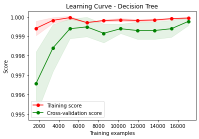

# Models-30s


```python
dataset_name = list(dataset_files)[1]
time_directory = dataset_files[dataset_name]

print("\n", '-'*120, "\n")
print(dataset_name)

# Update the dataset file path in the code
filepath = os.path.join('../../CICDataSet-TOR/CSV/Scenario-A/', dataset_name)

# Update the directory for storing trained models
time_directory_path = os.path.join(models_directory, time_directory)
if not os.path.exists(time_directory_path):
    os.makedirs(time_directory_path)

# DATASET LOADING        
df_data = load_arff_datafiles(filepath)

# SECTION-A
X_train, X_test, y_train, y_test, class_labels, X_train_selected, X_test_selected = secA(df_data, filter_warnings=True)
```

    
     ------------------------------------------------------------------------------------------------------------------------ 
    
    TimeBasedFeatures-30s-TOR-NonTOR.arff
    
    
    Data Distribution: ORIGINAL:
    NONTOR    14651
    TOR        1771
    Name: class1, dtype: int64
    Total: 16422
    
    
    Number of Negative Values in Independent Variables: 46840
    Number of Inf Values: 0
    NaN Value Counts: 46840
    Missing Value Counts: 46840
    
    AFTER IMPUTATION:
    NaN Value Counts: 0
    Missing Value Counts: 0
    
    
    Data Distribution: AFTER Outlier Removal:
    NONTOR    13326
    TOR        1453
    Name: class1, dtype: int64
    Total: 14779
    
    
    Data Distribution: AFTER OVERSAMPLING:
    NONTOR    13326
    TOR       13326
    Name: class1, dtype: int64
    Total: 26652
    
    
    Data Distribution: AFTER ENCODING:
    Value: 0, Count: 13326
    Value: 1, Count: 13326
    Total: 26652
    
    
    
    


    

    


    
    No. of Total Features: 23
    No. of Reduced Features: 8
    


```python
# SECTION-B
secB(X_train, y_train, y_test, class_labels, X_train_selected, X_test_selected, time_directory_path, filter_warnings=True)
```

    
    
    
    Classifier: Random Forest
    
    Best parameters for Random Forest: {'n_estimators': 200, 'min_samples_split': 5, 'min_samples_leaf': 4, 'max_depth': None, 'bootstrap': False}
    Best cross-validation score for Random Forest: 0.999718618098797
    
    Cross-validation results for Random Forest:
    [1.         1.         0.99976548 0.99976548 0.99953096]
    Mean accuracy: 0.999812382739212
    
    Random Forest Evaluation:
    Accuracy: 0.9992496717313825
    Precision: 0.9992507962398405
    Recall: 0.9992496717313825
    F1 Score: 0.9992496714145604
    Confusion Matrix:
     [[2665    0]
     [   4 2662]]
    


    

    


    
    
    
    Classifier: Decision Tree
    
    Best parameters for Decision Tree: {'splitter': 'best', 'min_samples_split': 5, 'min_samples_leaf': 2, 'max_features': None, 'max_depth': 50, 'criterion': 'entropy'}
    Best cross-validation score for Decision Tree: 0.9997185851063127
    
    Cross-validation results for Decision Tree:
    [0.9992966  0.99929644 1.         0.99976548 0.99953096]
    Mean accuracy: 0.9995778941557113
    
    Decision Tree Evaluation:
    Accuracy: 0.9992496717313825
    Precision: 0.9992496717313825
    Recall: 0.9992496717313825
    F1 Score: 0.9992496717313825
    Confusion Matrix:
     [[2663    2]
     [   2 2664]]
    


    

    


    
    
    
    Classifier: SVM
    No hyperparameters specified for SVM. Using default settings.
    
    Cross-validation results for SVM:
    [0.99976553 0.99929644 0.99953096 0.99953096 1.        ]
    Mean accuracy: 0.999624776475919
    
    SVM Evaluation:
    Accuracy: 0.9992496717313825
    Precision: 0.9992507962398405
    Recall: 0.9992496717313825
    F1 Score: 0.9992496714145604
    Confusion Matrix:
     [[2665    0]
     [   4 2662]]
    


    

    


    
    
    
    Classifier: KNN
    
    Best parameters for KNN: {'weights': 'uniform', 'n_neighbors': 3, 'algorithm': 'auto'}
    Best cross-validation score for KNN: 0.9998123937367067
    
    Cross-validation results for KNN:
    [1.         1.         0.99976548 1.         0.99882739]
    Mean accuracy: 0.9997185741088181
    
    KNN Evaluation:
    Accuracy: 1.0
    Precision: 1.0
    Recall: 1.0
    F1 Score: 1.0
    Confusion Matrix:
     [[2665    0]
     [   0 2666]]
    


    

    


    
    
    
    Classifier: XGBoost
    
    Best parameters for XGBoost: {'subsample': 1.0, 'reg_lambda': 10.0, 'reg_alpha': 1, 'n_estimators': 300, 'min_child_weight': 1, 'max_depth': 5, 'learning_rate': 0.1, 'gamma': 0.1, 'colsample_bytree': 0.8}
    Best cross-validation score for XGBoost: 0.9997654894215098
    
    Cross-validation results for XGBoost:
    [0.99976553 1.         0.99953096 0.99953096 0.99976548]
    Mean accuracy: 0.9997185851063127
    
    XGBoost Evaluation:
    Accuracy: 0.9992496717313825
    Precision: 0.9992507962398405
    Recall: 0.9992496717313825
    F1 Score: 0.9992496714145604
    Confusion Matrix:
     [[2665    0]
     [   4 2662]]
    


    

    


    
    
    
    Classifier: Logistic Regression
    
    Best parameters for Logistic Regression: {'solver': 'newton-cg', 'penalty': 'none', 'max_iter': 10000, 'C': 1}
    Best cross-validation score for Logistic Regression: 0.9998123937367067
    
    Cross-validation results for Logistic Regression:
    [0.99976553 0.99976548 1.         0.99976548 0.99976548]
    Mean accuracy: 0.9998123937367067
    
    Logistic Regression Evaluation:
    Accuracy: 0.9998124179328456
    Precision: 0.9998124882673289
    Recall: 0.9998124179328456
    F1 Score: 0.9998124179196447
    Confusion Matrix:
     [[2664    1]
     [   0 2666]]
    


    

    


    
    
    
    Classifier: Gradient Boosting
    
    Best parameters for Gradient Boosting: {'subsample': 1.0, 'n_estimators': 200, 'min_samples_split': 5, 'min_samples_leaf': 4, 'max_features': 'auto', 'max_depth': 3, 'learning_rate': 0.3}
    Best cross-validation score for Gradient Boosting: 0.9998592980519039
    
    Cross-validation results for Gradient Boosting:
    [0.99976553 1.         1.         0.99976548 1.        ]
    Mean accuracy: 0.9999062023671008
    
    Gradient Boosting Evaluation:
    Accuracy: 0.9992496717313825
    Precision: 0.9992507962398405
    Recall: 0.9992496717313825
    F1 Score: 0.9992496714145604
    Confusion Matrix:
     [[2665    0]
     [   4 2662]]
    


    

    


    
    
    
    Classifier: Gaussian Naive Bayes
    No hyperparameters specified for Gaussian Naive Bayes. Using default settings.
    
    Cross-validation results for Gaussian Naive Bayes:
    [0.97913247 0.98100375 0.98217636 0.98428705 0.9760788 ]
    Mean accuracy: 0.9805356879702802
    
    Gaussian Naive Bayes Evaluation:
    Accuracy: 0.978803226411555
    Precision: 0.9796654421838712
    Recall: 0.978803226411555
    F1 Score: 0.9787937827460504
    Confusion Matrix:
     [[2665    0]
     [ 113 2553]]
    


    

    


    
    
    
    Classifier: AdaBoost
    
    Best parameters for AdaBoost: {'n_estimators': 200, 'learning_rate': 0.3, 'algorithm': 'SAMME.R'}
    Best cross-validation score for AdaBoost: 0.9998592980519039
    
    Cross-validation results for AdaBoost:
    [1.         0.99953096 0.99976548 1.         0.99976548]
    Mean accuracy: 0.999812382739212
    
    AdaBoost Evaluation:
    Accuracy: 0.9998124179328456
    Precision: 0.9998124882937112
    Recall: 0.9998124179328456
    F1 Score: 0.9998124179328456
    Confusion Matrix:
     [[2665    0]
     [   1 2665]]
    


    

    


    
    
    
    Classifier: Bagging Classifier
    
    Best parameters for Bagging Classifier: {'n_estimators': 200, 'max_samples': 1.0, 'max_features': 0.5, 'bootstrap_features': False, 'bootstrap': True}
    Best cross-validation score for Bagging Classifier: 0.9997654784240151
    
    Cross-validation results for Bagging Classifier:
    [0.99976553 0.99976548 0.99906191 0.99976548 1.        ]
    Mean accuracy: 0.9996716807911158
    
    Bagging Classifier Evaluation:
    Accuracy: 0.9992496717313825
    Precision: 0.9992507962398405
    Recall: 0.9992496717313825
    F1 Score: 0.9992496714145604
    Confusion Matrix:
     [[2665    0]
     [   4 2662]]
    


    

    


    
    
    
    Classifier: Extra Trees
    
    Best parameters for Extra Trees: {'n_estimators': 50, 'min_samples_split': 5, 'min_samples_leaf': 1, 'max_features': 'sqrt', 'max_depth': None, 'bootstrap': False}
    Best cross-validation score for Extra Trees: 0.9998592870544091
    
    Cross-validation results for Extra Trees:
    [0.99976553 1.         1.         1.         0.99953096]
    Mean accuracy: 0.9998592980519037
    
    Extra Trees Evaluation:
    Accuracy: 1.0
    Precision: 1.0
    Recall: 1.0
    F1 Score: 1.0
    Confusion Matrix:
     [[2665    0]
     [   0 2666]]
    


    

    


    
    
    
    
    


    

    


    Statistics for Learning Curve - Random Forest:
    Mean training score: 0.9999170490017377
    Mean validation score: 0.9996107073808588
    Training scores std deviation: 4.428433706216244e-05
    Validation scores std deviation: 0.00021908065473166442
    
    
    
    
    


    

    


    Statistics for Learning Curve - Decision Tree:
    Mean training score: 0.9998066003213166
    Mean validation score: 0.9990150423733473
    Training scores std deviation: 9.148977729086187e-05
    Validation scores std deviation: 0.0006100330390884641
    
    
    
    
    


    

    


    Statistics for Learning Curve - SVM:
    Mean training score: 0.9997268800202033
    Mean validation score: 0.999601316620074
    Training scores std deviation: 7.276027393159716e-05
    Validation scores std deviation: 0.00024455955909892334
    
    
    
    
    


    

    


    Statistics for Learning Curve - KNN:
    Mean training score: 0.9998773829168577
    Mean validation score: 0.9997373512313894
    Training scores std deviation: 3.405305986586319e-05
    Validation scores std deviation: 0.00012886356153955187
    
    
    
    
    


    

    


    Statistics for Learning Curve - XGBoost:
    Mean training score: 0.9998840938435742
    Mean validation score: 0.999362143103801
    Training scores std deviation: 4.027177189239108e-05
    Validation scores std deviation: 0.00028906122246732686
    
    
    
    
    


    

    


    Statistics for Learning Curve - Logistic Regression:
    Mean training score: 0.9998919396058673
    Mean validation score: 0.9997467309946796
    Training scores std deviation: 2.9098971350893994e-05
    Validation scores std deviation: 0.0002430269080403907
    
    
    
    
    


    

    


    Statistics for Learning Curve - Gradient Boosting:
    Mean training score: 0.9999887762990637
    Mean validation score: 0.9993340181106743
    Training scores std deviation: 2.2447401872587312e-05
    Validation scores std deviation: 0.0005251005535773623
    
    
    
    
    


    

    


    Statistics for Learning Curve - Gaussian Naive Bayes:
    Mean training score: 0.9809763060045518
    Mean validation score: 0.9810796174631419
    Training scores std deviation: 0.0007209423603741239
    Validation scores std deviation: 0.0025365690558182925
    
    
    
    
    


    

    


    Statistics for Learning Curve - AdaBoost:
    Mean training score: 1.0
    Mean validation score: 0.9994418683423916
    Training scores std deviation: 0.0
    Validation scores std deviation: 0.0005959979364020514
    
    
    
    
    


    

    


    Statistics for Learning Curve - Bagging Classifier:
    Mean training score: 1.0
    Mean validation score: 0.9995637986666637
    Training scores std deviation: 0.0
    Validation scores std deviation: 0.0002956771009608951
    
    
    
    
    


    

    


    Statistics for Learning Curve - Extra Trees:
    Mean training score: 0.9999901488093726
    Mean validation score: 0.9997138946747931
    Training scores std deviation: 1.6770689668428317e-05
    Validation scores std deviation: 0.0002272922016633163
    
    
    
    
    


    

    


    
    
    


    

    


    
    Statistics for Normalized Total Feature Importance:
    Mean Normalized Total Importance: 0.14958128230905005
    Standard Deviation of Normalized Total Importance: 0.2344514621291626
    
    
    
    
    
    ROC Scores:
    Random Forest ROC AUC: 1.00
    Decision Tree ROC AUC: 1.00
    SVM ROC AUC: 1.00
    KNN ROC AUC: 1.00
    XGBoost ROC AUC: 1.00
    Logistic Regression ROC AUC: 1.00
    Gradient Boosting ROC AUC: 1.00
    Gaussian Naive Bayes ROC AUC: 1.00
    AdaBoost ROC AUC: 1.00
    Bagging Classifier ROC AUC: 1.00
    Extra Trees ROC AUC: 1.00
    


    

    


```python
# SECTION-C
secC(X_train, y_train, y_test, class_labels, X_train_selected, X_test_selected, time_directory_path)
```

    Fitting 5 folds for each of 5 candidates, totalling 25 fits
    [CV] END ...........batch_size=16, epochs=10, optimizer=adam; total time=  40.8s
    [CV] END ...........batch_size=16, epochs=10, optimizer=adam; total time=  44.0s
    [CV] END ...........batch_size=16, epochs=10, optimizer=adam; total time=  40.4s
    [CV] END ...........batch_size=16, epochs=10, optimizer=adam; total time=  39.0s
    [CV] END ...........batch_size=16, epochs=10, optimizer=adam; total time=  38.6s
    [CV] END ........batch_size=16, epochs=10, optimizer=rmsprop; total time=  33.3s
    [CV] END ........batch_size=16, epochs=10, optimizer=rmsprop; total time=  32.4s
    [CV] END ........batch_size=16, epochs=10, optimizer=rmsprop; total time=  33.6s
    [CV] END ........batch_size=16, epochs=10, optimizer=rmsprop; total time=  32.6s
    [CV] END ........batch_size=16, epochs=10, optimizer=rmsprop; total time=  32.5s
    [CV] END ...........batch_size=32, epochs=20, optimizer=adam; total time=  39.4s
    [CV] END ...........batch_size=32, epochs=20, optimizer=adam; total time=  39.3s
    [CV] END ...........batch_size=32, epochs=20, optimizer=adam; total time=  39.2s
    [CV] END ...........batch_size=32, epochs=20, optimizer=adam; total time=  38.8s
    [CV] END ...........batch_size=32, epochs=20, optimizer=adam; total time=  39.2s
    [CV] END ........batch_size=16, epochs=30, optimizer=rmsprop; total time= 1.6min
    [CV] END ........batch_size=16, epochs=30, optimizer=rmsprop; total time= 1.6min
    [CV] END ........batch_size=16, epochs=30, optimizer=rmsprop; total time= 1.6min
    [CV] END ........batch_size=16, epochs=30, optimizer=rmsprop; total time= 1.6min
    [CV] END ........batch_size=16, epochs=30, optimizer=rmsprop; total time= 1.6min
    [CV] END ........batch_size=16, epochs=20, optimizer=rmsprop; total time= 1.1min
    [CV] END ........batch_size=16, epochs=20, optimizer=rmsprop; total time= 1.1min
    [CV] END ........batch_size=16, epochs=20, optimizer=rmsprop; total time= 1.1min
    [CV] END ........batch_size=16, epochs=20, optimizer=rmsprop; total time= 1.1min
    [CV] END ........batch_size=16, epochs=20, optimizer=rmsprop; total time= 1.1min
    
    Best parameters for Deep Neural Network: {'optimizer': 'rmsprop', 'epochs': 30, 'batch_size': 16}
    Best cross-validation score for Deep Neural Network: 0.999812382739212
    
    Fold 1 of 5:
    Accuracy: 0.9995310668229778
    Precision: 0.9995316159250586
    Recall: 0.99953095684803
    F1 Score: 0.999531066590963
    Confusion Matrix:
     [[2133    0]
     [   2 2130]]
    
    Fold 2 of 5:
    Accuracy: 1.0
    Precision: 1.0
    Recall: 1.0
    F1 Score: 1.0
    Confusion Matrix:
     [[2132    0]
     [   0 2132]]
    
    Fold 3 of 5:
    Accuracy: 0.999765478424015
    Precision: 0.9997655883731833
    Recall: 0.9997654784240151
    F1 Score: 0.9997654784111163
    Confusion Matrix:
     [[2132    0]
     [   1 2131]]
    
    Fold 4 of 5:
    Accuracy: 0.999765478424015
    Precision: 0.9997655883731833
    Recall: 0.9997654784240151
    F1 Score: 0.9997654784111163
    Confusion Matrix:
     [[2132    0]
     [   1 2131]]
    
    Fold 5 of 5:
    Accuracy: 1.0
    Precision: 1.0
    Recall: 1.0
    F1 Score: 1.0
    Confusion Matrix:
     [[2132    0]
     [   0 2132]]
    
    Average Evaluation Metrics Across Folds:
    Average Accuracy: 0.9998124047342015
    Average Precision: 0.999812558534285
    Average Recall: 0.999812382739212
    Average F1 Score: 0.9998124046826391
    Average Confusion Matrix:
     [[2.1322e+03 0.0000e+00]
     [8.0000e-01 2.1312e+03]]
    
    
    Deep Neural Network Training Results:
    Epoch	Accuracy
    1	0.9813851118087769
    2	0.9981678128242493
    3	0.9994869828224182
    4	0.9995602965354919
    5	0.9997801184654236
    6	0.9997801184654236
    7	0.9997801184654236
    8	0.9997801184654236
    9	0.9997801184654236
    10	0.9997801184654236
    11	0.9997801184654236
    12	0.9997801184654236
    13	0.9997801184654236
    14	0.9997801184654236
    15	0.9997801184654236
    16	0.9997801184654236
    17	0.9997801184654236
    18	0.9997801184654236
    19	0.9997801184654236
    20	0.9997801184654236
    21	0.9997801184654236
    22	0.9997801184654236
    23	0.9997068643569946
    24	0.9997801184654236
    25	0.9997801184654236
    26	0.9997068643569946
    27	0.9997801184654236
    28	0.9997801184654236
    29	0.9997068643569946
    30	0.9997801184654236
    
    
    Deep Neural Network Evaluation:
    Accuracy: 0.9996248358656913
    Precision: 0.9996250468691413
    Recall: 0.9996249062265566
    F1 Score: 0.9996248358524904
    Confusion Matrix:
     [[2665    0]
     [   2 2664]]
    


    

    


    
    
    
    
    


    

    


    Statistical Information for Training and Validation Loss:
    -------------------------------------------------------
    Mean Training Loss: 0.009960655513595658
    Mean Validation Loss: 0.004340158959731666
    Minimum Training Loss: 0.005104626314831707
    Minimum Validation Loss: 1.6261563415151473e-05
    Maximum Training Loss: 0.0992764375045774
    Maximum Validation Loss: 0.014152887438621552
    Standard Deviation of Training Loss: 0.016620377123664463
    Standard Deviation of Validation Loss: 0.003958846734109024
    
    
    
    
    


    

    


    
    Statistics for Normalized Feature Importance:
    Mean Normalized Importance of All Features: 0.5864223827188004
    Standard Deviation of Normalized Importance of All Features: 0.19644586455594426
    Mean Normalized Importance of Selected Features: 0.5813988543864939
    Standard Deviation of Normalized Importance of Selected Features: 0.2560849626430134
    
    
    
    
    


    

    


    ROC AUC score for Deep Neural Network: 1.00
    
