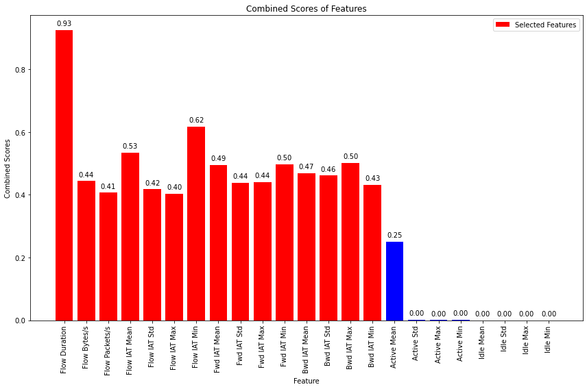

# Models-5s


```python
dataset_name = list(dataset_files)[1]
time_directory = dataset_files[dataset_name]

print("\n", '-'*120, "\n")
print(dataset_name)

# Update the dataset file path in the code
filepath = os.path.join('../../CICDataSet-TOR/CSV/Scenario-A/', dataset_name)

# Update the directory for storing trained models
time_directory_path = os.path.join(models_directory, time_directory)
if not os.path.exists(time_directory_path):
    os.makedirs(time_directory_path)

# DATASET LOADING        
df_data = load_csv_datafiles(filepath)

# SECTION-A
X_train, X_test, y_train, y_test, class_labels, X_train_selected, X_test_selected = secA(df_data, filter_warnings=True)
```

    
     ------------------------------------------------------------------------------------------------------------------------ 
    
    Scenario-A-merged_5s.csv
    
    
    Data Distribution: ORIGINAL:
    nonTOR    69686
    TOR       14508
    Name: class1, dtype: int64
    Total: 84194
    
    
    Number of Negative Values in Independent Variables: 516
    Number of Inf Values: 12
    NaN Value Counts: 530
    Missing Value Counts: 530
    
    AFTER IMPUTATION:
    NaN Value Counts: 0
    Missing Value Counts: 0
    
    
    Data Distribution: AFTER Outlier Removal:
    nonTOR    62361
    TOR       13420
    Name: class1, dtype: int64
    Total: 75781
    
    
    Data Distribution: AFTER OVERSAMPLING:
    TOR       62361
    nonTOR    62361
    Name: class1, dtype: int64
    Total: 124722
    
    
    Data Distribution: AFTER ENCODING:
    Value: 0, Count: 62361
    Value: 1, Count: 62361
    Total: 124722
    
    
    
    


    

    


    
    No. of Total Features: 23
    No. of Reduced Features: 15
    


```python
# SECTION-B
secB(X_train, y_train, y_test, class_labels, X_train_selected, X_test_selected, time_directory_path, filter_warnings=True)
```

    
    
    
    Classifier: Random Forest
    
    Best parameters for Random Forest: {'n_estimators': 50, 'min_samples_split': 2, 'min_samples_leaf': 2, 'max_depth': None, 'bootstrap': False}
    Best cross-validation score for Random Forest: 0.9930745520375345
    
    Cross-validation results for Random Forest:
    [0.99338545 0.99323512 0.99298421 0.99208218 0.99368579]
    Mean accuracy: 0.9930745515353021
    
    Random Forest Evaluation:
    Accuracy: 0.9933453597915414
    Precision: 0.9933567781907268
    Recall: 0.9933453597915414
    F1 Score: 0.9933453219330542
    Confusion Matrix:
     [[12419    53]
     [  113 12360]]
    


    

    


    
    
    
    Classifier: Decision Tree
    
    Best parameters for Decision Tree: {'splitter': 'best', 'min_samples_split': 2, 'min_samples_leaf': 1, 'max_features': None, 'max_depth': 30, 'criterion': 'entropy'}
    Best cross-validation score for Decision Tree: 0.9879030333785191
    
    Cross-validation results for Decision Tree:
    [0.98767288 0.98917619 0.98807316 0.98827362 0.98827362]
    Mean accuracy: 0.9882938927680487
    
    Decision Tree Evaluation:
    Accuracy: 0.9891761876127481
    Precision: 0.9891934103322414
    Recall: 0.9891761876127481
    F1 Score: 0.9891760936465754
    Confusion Matrix:
     [[12374    98]
     [  172 12301]]
    


    

    


    
    
    
    Classifier: SVM
    No hyperparameters specified for SVM. Using default settings.
    
    Cross-validation results for SVM:
    [0.91541391 0.91591501 0.91405663 0.91556001 0.91280381]
    Mean accuracy: 0.9147498739270997
    
    SVM Evaluation:
    Accuracy: 0.9209460813790339
    Precision: 0.9214997577718429
    Recall: 0.9209460813790339
    F1 Score: 0.9209201746044021
    Confusion Matrix:
     [[11712   760]
     [ 1212 11261]]
    


    

    


    
    
    
    Classifier: KNN
    
    Best parameters for KNN: {'weights': 'distance', 'n_neighbors': 3, 'algorithm': 'auto'}
    Best cross-validation score for KNN: 0.9786223316955031
    
    Cross-validation results for KNN:
    [0.97890359 0.97890359 0.97940366 0.97880231 0.97890253]
    Mean accuracy: 0.9789831339796965
    
    KNN Evaluation:
    Accuracy: 0.9811986370014031
    Precision: 0.9815377965384747
    Recall: 0.9811986370014031
    F1 Score: 0.9811953360413879
    Confusion Matrix:
     [[12403    69]
     [  400 12073]]
    


    

    


    
    
    
    Classifier: XGBoost
    
    Best parameters for XGBoost: {'subsample': 0.6, 'reg_lambda': 0.1, 'reg_alpha': 0.1, 'n_estimators': 300, 'min_child_weight': 3, 'max_depth': 5, 'learning_rate': 0.3, 'gamma': 0.1, 'colsample_bytree': 0.6}
    Best cross-validation score for XGBoost: 0.9942171042391985
    
    Cross-validation results for XGBoost:
    [0.9946382  0.99388655 0.99398647 0.99358557 0.99383613]
    Mean accuracy: 0.9939865845677328
    
    XGBoost Evaluation:
    Accuracy: 0.9944277410302665
    Precision: 0.9944388060160273
    Recall: 0.9944277410302665
    F1 Score: 0.9944277103861837
    Confusion Matrix:
     [[12432    40]
     [   99 12374]]
    


    

    


    
    
    
    Classifier: Logistic Regression
    
    Best parameters for Logistic Regression: {'solver': 'newton-cg', 'penalty': 'none', 'max_iter': 10000, 'C': 1}
    Best cross-validation score for Logistic Regression: 0.8775970608151766
    
    Cross-validation results for Logistic Regression:
    [0.87893365 0.87773101 0.87557003 0.87872714 0.87867702]
    Mean accuracy: 0.8779277708377625
    
    Logistic Regression Evaluation:
    Accuracy: 0.8800160352776107
    Precision: 0.8825098221350232
    Recall: 0.8800160352776107
    F1 Score: 0.8798203804548568
    Confusion Matrix:
     [[11479   993]
     [ 2000 10473]]
    


    

    


    
    
    
    Classifier: Gradient Boosting
    
    Best parameters for Gradient Boosting: {'subsample': 1.0, 'n_estimators': 200, 'min_samples_split': 10, 'min_samples_leaf': 4, 'max_features': 'sqrt', 'max_depth': 7, 'learning_rate': 0.3}
    Best cross-validation score for Gradient Boosting: 0.9916914425466923
    
    Cross-validation results for Gradient Boosting:
    [0.99012828 0.99393666 0.99168128 0.99398647 0.99308444]
    Mean accuracy: 0.9925634270614594
    
    Gradient Boosting Evaluation:
    Accuracy: 0.9934255361795951
    Precision: 0.993446866438547
    Recall: 0.9934255361795951
    F1 Score: 0.993425466002276
    Confusion Matrix:
     [[12431    41]
     [  123 12350]]
    


    

    


    
    
    
    Classifier: Gaussian Naive Bayes
    No hyperparameters specified for Gaussian Naive Bayes. Using default settings.
    
    Cross-validation results for Gaussian Naive Bayes:
    [0.76653638 0.76583484 0.76537209 0.76371837 0.76301679]
    Mean accuracy: 0.7648956915939196
    
    Gaussian Naive Bayes Evaluation:
    Accuracy: 0.7672479454800561
    Precision: 0.8196031632304968
    Recall: 0.7672479454800561
    F1 Score: 0.7573114939076407
    Confusion Matrix:
     [[12093   379]
     [ 5427  7046]]
    


    

    


    
    
    
    Classifier: AdaBoost
    
    Best parameters for AdaBoost: {'n_estimators': 200, 'learning_rate': 0.3, 'algorithm': 'SAMME.R'}
    Best cross-validation score for AdaBoost: 0.9107610117352136
    
    Cross-validation results for AdaBoost:
    [0.91020245 0.9109541  0.91295415 0.91220246 0.91440742]
    Mean accuracy: 0.9121441126881044
    
    AdaBoost Evaluation:
    Accuracy: 0.9118460613349368
    Precision: 0.9142140935391051
    Recall: 0.9118460613349368
    F1 Score: 0.9117200362299871
    Confusion Matrix:
     [[11844   628]
     [ 1571 10902]]
    


    

    


    
    
    
    Classifier: Bagging Classifier
    
    Best parameters for Bagging Classifier: {'n_estimators': 200, 'max_samples': 1.0, 'max_features': 1.0, 'bootstrap_features': True, 'bootstrap': False}
    Best cross-validation score for Bagging Classifier: 0.9934052962119267
    
    Cross-validation results for Bagging Classifier:
    [0.99318501 0.99203247 0.99378602 0.99328489 0.99358557]
    Mean accuracy: 0.9931747911052021
    
    Bagging Classifier Evaluation:
    Accuracy: 0.993465624373622
    Precision: 0.9934774293984096
    Recall: 0.993465624373622
    F1 Score: 0.9934655859391714
    Confusion Matrix:
     [[12421    51]
     [  112 12361]]
    


    

    


    
    
    
    Classifier: Extra Trees
    
    Best parameters for Extra Trees: {'n_estimators': 100, 'min_samples_split': 5, 'min_samples_leaf': 1, 'max_features': 'auto', 'max_depth': None, 'bootstrap': False}
    Best cross-validation score for Extra Trees: 0.992052275467065
    
    Cross-validation results for Extra Trees:
    [0.99208258 0.99203247 0.99158106 0.99243297 0.99243297]
    Mean accuracy: 0.9921124117759648
    
    Extra Trees Evaluation:
    Accuracy: 0.9923832431348968
    Precision: 0.9924112143985525
    Recall: 0.9923832431348968
    F1 Score: 0.992383136125993
    Confusion Matrix:
     [[12424    48]
     [  142 12331]]
    


    

    


    
    
    
    
    


    

    


    Statistics for Learning Curve - Random Forest:
    Mean training score: 0.9995251374865131
    Mean validation score: 0.9896970256137042
    Training scores std deviation: 6.597532164502231e-05
    Validation scores std deviation: 0.0005315356254571423
    
    
    
    
    


    

    


    Statistics for Learning Curve - Decision Tree:
    Mean training score: 0.9999388198174033
    Mean validation score: 0.9831714701935839
    Training scores std deviation: 1.3848166695381694e-05
    Validation scores std deviation: 0.0007753765958626312
    
    
    
    
    


    

    


    Statistics for Learning Curve - SVM:
    Mean training score: 0.8974096503066994
    Mean validation score: 0.8964250436402329
    Training scores std deviation: 0.0006103964473890345
    Validation scores std deviation: 0.0019517279275766213
    
    
    
    
    


    

    


    Statistics for Learning Curve - KNN:
    Mean training score: 0.999957673709012
    Mean validation score: 0.9713561339833628
    Training scores std deviation: 1.3044283831536283e-05
    Validation scores std deviation: 0.0011121642803633117
    
    
    
    
    


    

    


    Statistics for Learning Curve - XGBoost:
    Mean training score: 0.9993212567371247
    Mean validation score: 0.9910991428449026
    Training scores std deviation: 8.16384733535876e-05
    Validation scores std deviation: 0.0005537654493182968
    
    
    
    
    


    

    


    Statistics for Learning Curve - Logistic Regression:
    Mean training score: 0.8780416982147206
    Mean validation score: 0.8779588564147062
    Training scores std deviation: 0.0009819305541650812
    Validation scores std deviation: 0.0017259362694838811
    
    
    
    
    


    

    


    Statistics for Learning Curve - Gradient Boosting:
    Mean training score: 0.9996972783928333
    Mean validation score: 0.9898954658906571
    Training scores std deviation: 0.0005286666667863153
    Validation scores std deviation: 0.0017669771290243171
    
    
    
    
    


    

    


    Statistics for Learning Curve - Gaussian Naive Bayes:
    Mean training score: 0.7634118822801937
    Mean validation score: 0.7636378783009415
    Training scores std deviation: 0.0008913005590657247
    Validation scores std deviation: 0.0022562107862545587
    
    
    
    
    


    

    


    Statistics for Learning Curve - AdaBoost:
    Mean training score: 0.9173743444964936
    Mean validation score: 0.9154935675825829
    Training scores std deviation: 0.001743771062793286
    Validation scores std deviation: 0.002073163306769376
    
    
    
    
    


    

    


    Statistics for Learning Curve - Bagging Classifier:
    Mean training score: 0.9999591770884837
    Mean validation score: 0.9899746504198488
    Training scores std deviation: 1.4905991710485518e-05
    Validation scores std deviation: 0.0007892823362987784
    
    
    
    
    


    

    


    Statistics for Learning Curve - Extra Trees:
    Mean training score: 0.9996174789861421
    Mean validation score: 0.9880262916175546
    Training scores std deviation: 6.365589108876506e-05
    Validation scores std deviation: 0.0008627522576187613
    
    
    
    
    


    

    


    
    
    


    

    


    
    Statistics for Normalized Total Feature Importance:
    Mean Normalized Total Importance: 0.17898902003911743
    Standard Deviation of Normalized Total Importance: 0.22442419507577707
    
    
    
    
    
    ROC Scores:
    Random Forest ROC AUC: 1.00
    Decision Tree ROC AUC: 0.99
    SVM ROC AUC: 0.97
    KNN ROC AUC: 0.99
    XGBoost ROC AUC: 1.00
    Logistic Regression ROC AUC: 0.94
    Gradient Boosting ROC AUC: 1.00
    Gaussian Naive Bayes ROC AUC: 0.90
    AdaBoost ROC AUC: 0.98
    Bagging Classifier ROC AUC: 1.00
    Extra Trees ROC AUC: 1.00
    


    

    


```python
# SECTION-C
secC(X_train, y_train, y_test, class_labels, X_train_selected, X_test_selected, time_directory_path)
```

    Fitting 5 folds for each of 5 candidates, totalling 25 fits
    [CV] END ...........batch_size=16, epochs=10, optimizer=adam; total time= 2.5min
    [CV] END ...........batch_size=16, epochs=10, optimizer=adam; total time= 2.6min
    [CV] END ...........batch_size=16, epochs=10, optimizer=adam; total time= 2.6min
    [CV] END ...........batch_size=16, epochs=10, optimizer=adam; total time= 2.6min
    [CV] END ...........batch_size=16, epochs=10, optimizer=adam; total time= 2.5min
    [CV] END ........batch_size=16, epochs=10, optimizer=rmsprop; total time= 2.2min
    [CV] END ........batch_size=16, epochs=10, optimizer=rmsprop; total time= 2.3min
    [CV] END ........batch_size=16, epochs=10, optimizer=rmsprop; total time= 2.3min
    [CV] END ........batch_size=16, epochs=10, optimizer=rmsprop; total time= 2.2min
    [CV] END ........batch_size=16, epochs=10, optimizer=rmsprop; total time= 2.0min
    [CV] END ...........batch_size=32, epochs=20, optimizer=adam; total time= 2.6min
    [CV] END ...........batch_size=32, epochs=20, optimizer=adam; total time= 2.7min
    [CV] END ...........batch_size=32, epochs=20, optimizer=adam; total time= 2.6min
    [CV] END ...........batch_size=32, epochs=20, optimizer=adam; total time= 2.6min
    [CV] END ...........batch_size=32, epochs=20, optimizer=adam; total time= 2.5min
    [CV] END ........batch_size=16, epochs=30, optimizer=rmsprop; total time= 6.8min
    [CV] END ........batch_size=16, epochs=30, optimizer=rmsprop; total time= 7.4min
    [CV] END ........batch_size=16, epochs=30, optimizer=rmsprop; total time= 6.9min
    [CV] END ........batch_size=16, epochs=30, optimizer=rmsprop; total time= 6.1min
    [CV] END ........batch_size=16, epochs=30, optimizer=rmsprop; total time= 6.1min
    [CV] END ........batch_size=16, epochs=20, optimizer=rmsprop; total time= 4.0min
    [CV] END ........batch_size=16, epochs=20, optimizer=rmsprop; total time= 4.0min
    [CV] END ........batch_size=16, epochs=20, optimizer=rmsprop; total time= 4.0min
    [CV] END ........batch_size=16, epochs=20, optimizer=rmsprop; total time= 4.0min
    [CV] END ........batch_size=16, epochs=20, optimizer=rmsprop; total time= 3.9min
    
    Best parameters for Deep Neural Network: {'optimizer': 'adam', 'epochs': 20, 'batch_size': 32}
    Best cross-validation score for Deep Neural Network: 0.9589584688419258
    
    Fold 1 of 5:
    Accuracy: 0.9543495690519143
    Precision: 0.954473845772497
    Recall: 0.9543495690519143
    F1 Score: 0.9543464480396858
    Confusion Matrix:
     [[9605  373]
     [ 538 9440]]
    
    Fold 2 of 5:
    Accuracy: 0.9612647825215475
    Precision: 0.9614234018381018
    Recall: 0.9612647825215475
    F1 Score: 0.9612614533222839
    Confusion Matrix:
     [[9684  294]
     [ 479 9499]]
    
    Fold 3 of 5:
    Accuracy: 0.9588073164620395
    Precision: 0.9589346998170791
    Recall: 0.95880689948477
    F1 Score: 0.9588044312350815
    Confusion Matrix:
     [[9650  328]
     [ 494 9483]]
    
    Fold 4 of 5:
    Accuracy: 0.9578551741418191
    Precision: 0.9580414829864573
    Recall: 0.9578546692670753
    F1 Score: 0.9578508550936959
    Confusion Matrix:
     [[9658  320]
     [ 521 9456]]
    
    Fold 5 of 5:
    Accuracy: 0.9589075419694312
    Precision: 0.9589383681147841
    Recall: 0.9589077477918595
    F1 Score: 0.9589068648958794
    Confusion Matrix:
     [[9608  369]
     [ 451 9527]]
    
    Average Evaluation Metrics Across Folds:
    Average Accuracy: 0.9582368768293502
    Average Precision: 0.9583623597057839
    Average Recall: 0.9582367336234334
    Average F1 Score: 0.9582340105173254
    Average Confusion Matrix:
     [[9641.   336.8]
     [ 496.6 9481. ]]
    
    
    Deep Neural Network Training Results:
    Epoch	Accuracy
    1	0.8537043929100037
    2	0.8920400142669678
    3	0.9212459325790405
    4	0.931252658367157
    5	0.9367963075637817
    6	0.9403510689735413
    7	0.9434204697608948
    8	0.9467247128486633
    9	0.9480558037757874
    10	0.9498410224914551
    11	0.9502795338630676
    12	0.9519551396369934
    13	0.9533019065856934
    14	0.9542258381843567
    15	0.955196738243103
    16	0.9555256366729736
    17	0.9564182758331299
    18	0.9563712477684021
    19	0.9566375017166138
    20	0.9574204683303833
    
    
    Deep Neural Network Evaluation:
    Accuracy: 0.9603928643014632
    Precision: 0.9603937987804937
    Recall: 0.9603928931649515
    F1 Score: 0.9603928459062654
    Confusion Matrix:
     [[11987   485]
     [  503 11970]]
    


    

    


    
    
    
    
    


    

    


    Statistical Information for Training and Validation Loss:
    -------------------------------------------------------
    Mean Training Loss: 0.16683535798248858
    Mean Validation Loss: 0.15505586791994747
    Minimum Training Loss: 0.12137773079422191
    Minimum Validation Loss: 0.1124976877532631
    Maximum Training Loss: 0.350163617938244
    Maximum Validation Loss: 0.29776031061414265
    Standard Deviation of Training Loss: 0.05669607543929739
    Standard Deviation of Validation Loss: 0.045827144184503954
    
    
    
    
    


    

    


    
    Statistics for Normalized Feature Importance:
    Mean Normalized Importance of All Features: 0.3731634124313176
    Standard Deviation of Normalized Importance of All Features: 0.1974528575775403
    Mean Normalized Importance of Selected Features: 0.39040053674138053
    Standard Deviation of Normalized Importance of Selected Features: 0.24274846774083714
    
    
    
    
    


    

    


    ROC AUC score for Deep Neural Network: 0.96
    
