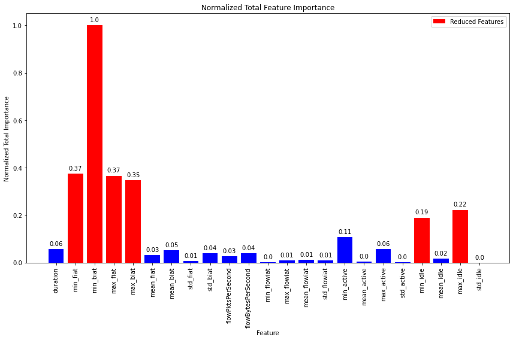

# Models-60s


```python
dataset_name = list(dataset_files)[2]
time_directory = dataset_files[dataset_name]

print("\n", '-'*120, "\n")
print(dataset_name)

# Update the dataset file path in the code
filepath = os.path.join('../../CICDataSet-TOR/CSV/Scenario-A/', dataset_name)

# Update the directory for storing trained models
time_directory_path = os.path.join(models_directory, time_directory)
if not os.path.exists(time_directory_path):
    os.makedirs(time_directory_path)

# DATASET LOADING        
df_data = load_arff_datafiles(filepath)

# SECTION-A
X_train, X_test, y_train, y_test, class_labels, X_train_selected, X_test_selected = secA(df_data, filter_warnings=True)
```

    
     ------------------------------------------------------------------------------------------------------------------------ 
    
    TimeBasedFeatures-60s-TOR-NonTOR.arff
    
    
    Data Distribution: ORIGINAL:
    NONTOR    15515
    TOR         914
    Name: class1, dtype: int64
    Total: 16429
    
    
    Number of Negative Values in Independent Variables: 46909
    Number of Inf Values: 0
    NaN Value Counts: 46909
    Missing Value Counts: 46909
    
    AFTER IMPUTATION:
    NaN Value Counts: 0
    Missing Value Counts: 0
    
    
    Data Distribution: AFTER Outlier Removal:
    NONTOR    14072
    TOR         736
    Name: class1, dtype: int64
    Total: 14808
    
    
    Data Distribution: AFTER OVERSAMPLING:
    NONTOR    14072
    TOR       14072
    Name: class1, dtype: int64
    Total: 28144
    
    
    Data Distribution: AFTER ENCODING:
    Value: 0, Count: 14072
    Value: 1, Count: 14072
    Total: 28144
    
    
    
    


    

    


    
    No. of Total Features: 23
    No. of Reduced Features: 6
    


```python
# SECTION-B
secB(X_train, y_train, y_test, class_labels, X_train_selected, X_test_selected, time_directory_path, filter_warnings=True)
```

    
    
    
    Classifier: Random Forest
    
    Best parameters for Random Forest: {'n_estimators': 200, 'min_samples_split': 5, 'min_samples_leaf': 4, 'max_depth': 10, 'bootstrap': False}
    Best cross-validation score for Random Forest: 1.0
    
    Cross-validation results for Random Forest:
    [1.         0.99977793 1.         1.         0.99977793]
    Mean accuracy: 0.9999111703308905
    
    Random Forest Evaluation:
    Accuracy: 1.0
    Precision: 1.0
    Recall: 1.0
    F1 Score: 1.0
    Confusion Matrix:
     [[2815    0]
     [   0 2814]]
    


    

    


    
    
    
    Classifier: Decision Tree
    
    Best parameters for Decision Tree: {'splitter': 'random', 'min_samples_split': 2, 'min_samples_leaf': 1, 'max_features': None, 'max_depth': 10, 'criterion': 'entropy'}
    Best cross-validation score for Decision Tree: 0.9999555851654452
    
    Cross-validation results for Decision Tree:
    [1.         1.         0.99933378 1.         0.99977793]
    Mean accuracy: 0.9998223406617811
    
    Decision Tree Evaluation:
    Accuracy: 0.9994670456564221
    Precision: 0.9994676132329328
    Recall: 0.9994670456564221
    F1 Score: 0.9994670455555016
    Confusion Matrix:
     [[2812    3]
     [   0 2814]]
    


    

    


    
    
    
    Classifier: SVM
    No hyperparameters specified for SVM. Using default settings.
    
    Cross-validation results for SVM:
    [0.99888963 0.99977793 0.99844548 0.99977793 0.99977793]
    Mean accuracy: 0.9993337774816788
    
    SVM Evaluation:
    Accuracy: 0.9994670456564221
    Precision: 0.9994676130315217
    Recall: 0.9994670456564221
    F1 Score: 0.9994670454545813
    Confusion Matrix:
     [[2815    0]
     [   3 2811]]
    


    

    


    
    
    
    Classifier: KNN
    
    Best parameters for KNN: {'weights': 'uniform', 'n_neighbors': 3, 'algorithm': 'auto'}
    Best cross-validation score for KNN: 1.0
    
    Cross-validation results for KNN:
    [1. 1. 1. 1. 1.]
    Mean accuracy: 1.0
    
    KNN Evaluation:
    Accuracy: 1.0
    Precision: 1.0
    Recall: 1.0
    F1 Score: 1.0
    Confusion Matrix:
     [[2815    0]
     [   0 2814]]
    


    

    


    
    
    
    Classifier: XGBoost
    
    Best parameters for XGBoost: {'subsample': 0.6, 'reg_lambda': 0.1, 'reg_alpha': 0, 'n_estimators': 300, 'min_child_weight': 1, 'max_depth': 3, 'learning_rate': 0.1, 'gamma': 0.0, 'colsample_bytree': 0.8}
    Best cross-validation score for XGBoost: 0.9999555851654452
    
    Cross-validation results for XGBoost:
    [1.         0.99977793 1.         1.         1.        ]
    Mean accuracy: 0.9999555851654452
    
    XGBoost Evaluation:
    Accuracy: 1.0
    Precision: 1.0
    Recall: 1.0
    F1 Score: 1.0
    Confusion Matrix:
     [[2815    0]
     [   0 2814]]
    


    

    


    
    
    
    Classifier: Logistic Regression
    
    Best parameters for Logistic Regression: {'solver': 'newton-cg', 'penalty': 'none', 'max_iter': 10000, 'C': 1}
    Best cross-validation score for Logistic Regression: 1.0
    
    Cross-validation results for Logistic Regression:
    [1. 1. 1. 1. 1.]
    Mean accuracy: 1.0
    
    Logistic Regression Evaluation:
    Accuracy: 1.0
    Precision: 1.0
    Recall: 1.0
    F1 Score: 1.0
    Confusion Matrix:
     [[2815    0]
     [   0 2814]]
    


    

    


    
    
    
    Classifier: Gradient Boosting
    
    Best parameters for Gradient Boosting: {'subsample': 1.0, 'n_estimators': 200, 'min_samples_split': 2, 'min_samples_leaf': 2, 'max_features': 'sqrt', 'max_depth': 3, 'learning_rate': 0.3}
    Best cross-validation score for Gradient Boosting: 1.0
    
    Cross-validation results for Gradient Boosting:
    [1. 1. 1. 1. 1.]
    Mean accuracy: 1.0
    
    Gradient Boosting Evaluation:
    Accuracy: 1.0
    Precision: 1.0
    Recall: 1.0
    F1 Score: 1.0
    Confusion Matrix:
     [[2815    0]
     [   0 2814]]
    


    

    


    
    
    
    Classifier: Gaussian Naive Bayes
    No hyperparameters specified for Gaussian Naive Bayes. Using default settings.
    
    Cross-validation results for Gaussian Naive Bayes:
    [0.98934044 0.99200533 0.98645348 0.98911837 0.98800799]
    Mean accuracy: 0.9889851210304241
    
    Gaussian Naive Bayes Evaluation:
    Accuracy: 0.991650381950613
    Precision: 0.9917875000667278
    Recall: 0.991650381950613
    F1 Score: 0.9916497874192249
    Confusion Matrix:
     [[2815    0]
     [  47 2767]]
    


    

    


    
    
    
    Classifier: AdaBoost
    
    Best parameters for AdaBoost: {'n_estimators': 100, 'learning_rate': 0.1, 'algorithm': 'SAMME'}
    Best cross-validation score for AdaBoost: 0.9999555851654452
    
    Cross-validation results for AdaBoost:
    [0.99977793 1.         1.         1.         1.        ]
    Mean accuracy: 0.9999555851654452
    
    AdaBoost Evaluation:
    Accuracy: 1.0
    Precision: 1.0
    Recall: 1.0
    F1 Score: 1.0
    Confusion Matrix:
     [[2815    0]
     [   0 2814]]
    


    

    


    
    
    
    Classifier: Bagging Classifier
    
    Best parameters for Bagging Classifier: {'n_estimators': 50, 'max_samples': 0.5, 'max_features': 1.0, 'bootstrap_features': True, 'bootstrap': True}
    Best cross-validation score for Bagging Classifier: 0.9998223406617811
    
    Cross-validation results for Bagging Classifier:
    [0.99977793 1.         1.         0.99977793 1.        ]
    Mean accuracy: 0.9999111703308905
    
    Bagging Classifier Evaluation:
    Accuracy: 1.0
    Precision: 1.0
    Recall: 1.0
    F1 Score: 1.0
    Confusion Matrix:
     [[2815    0]
     [   0 2814]]
    


    

    


    
    
    
    Classifier: Extra Trees
    
    Best parameters for Extra Trees: {'n_estimators': 50, 'min_samples_split': 2, 'min_samples_leaf': 1, 'max_features': 'sqrt', 'max_depth': 20, 'bootstrap': True}
    Best cross-validation score for Extra Trees: 1.0
    
    Cross-validation results for Extra Trees:
    [1. 1. 1. 1. 1.]
    Mean accuracy: 1.0
    
    Extra Trees Evaluation:
    Accuracy: 1.0
    Precision: 1.0
    Recall: 1.0
    F1 Score: 1.0
    Confusion Matrix:
     [[2815    0]
     [   0 2814]]
    


    

    


    
    
    
    
    


    

    


    Statistics for Learning Curve - Random Forest:
    Mean training score: 0.9999977792582723
    Mean validation score: 0.9997557184099488
    Training scores std deviation: 4.441483455472905e-06
    Validation scores std deviation: 0.00020185981777838974
    
    
    
    
    


    

    


    Statistics for Learning Curve - Decision Tree:
    Mean training score: 0.9997865062232686
    Mean validation score: 0.9994048412169665
    Training scores std deviation: 0.0004160886320359973
    Validation scores std deviation: 0.0006683633810082721
    
    
    
    
    


    

    


    Statistics for Learning Curve - SVM:
    Mean training score: 0.997953807026593
    Mean validation score: 0.9977215189873417
    Training scores std deviation: 0.0004162193542574211
    Validation scores std deviation: 0.0007340061392429681
    
    
    
    
    


    

    


    Statistics for Learning Curve - KNN:
    Mean training score: 0.9999768647047936
    Mean validation score: 0.9997868087941372
    Training scores std deviation: 4.627059041273363e-05
    Validation scores std deviation: 9.857186513150058e-05
    
    
    
    
    


    

    


    Statistics for Learning Curve - XGBoost:
    Mean training score: 1.0
    Mean validation score: 0.9997423939595826
    Training scores std deviation: 0.0
    Validation scores std deviation: 0.00033802806325485625
    
    
    
    
    


    

    


    Statistics for Learning Curve - Logistic Regression:
    Mean training score: 1.0
    Mean validation score: 0.9999333777481679
    Training scores std deviation: 0.0
    Validation scores std deviation: 8.593590596646669e-05
    
    
    
    
    


    

    


    Statistics for Learning Curve - Gradient Boosting:
    Mean training score: 1.0
    Mean validation score: 0.9999600266489008
    Training scores std deviation: 0.0
    Validation scores std deviation: 2.6648900732846314e-05
    
    
    
    
    


    

    


    Statistics for Learning Curve - Gaussian Naive Bayes:
    Mean training score: 0.9890837345518028
    Mean validation score: 0.9886120364201643
    Training scores std deviation: 0.00040840679819130205
    Validation scores std deviation: 0.001972306443124904
    
    
    
    
    


    

    


    Statistics for Learning Curve - AdaBoost:
    Mean training score: 1.0
    Mean validation score: 0.9997912502775927
    Training scores std deviation: 0.0
    Validation scores std deviation: 0.00021195071457338942
    
    
    
    
    


    

    


    Statistics for Learning Curve - Bagging Classifier:
    Mean training score: 0.9999736267046876
    Mean validation score: 0.999680213191206
    Training scores std deviation: 2.9326171545291945e-05
    Validation scores std deviation: 0.00041006435023967474
    
    
    
    
    


    

    


    Statistics for Learning Curve - Extra Trees:
    Mean training score: 1.0
    Mean validation score: 0.9999378192316234
    Training scores std deviation: 0.0
    Validation scores std deviation: 5.4610837845825346e-05
    
    
    
    
    


    

    


    
    
    


    

    


    
    Statistics for Normalized Total Feature Importance:
    Mean Normalized Total Importance: 0.1290527114377266
    Standard Deviation of Normalized Total Importance: 0.22091331847912737
    
    
    
    
    
    ROC Scores:
    Random Forest ROC AUC: 1.00
    Decision Tree ROC AUC: 1.00
    SVM ROC AUC: 1.00
    KNN ROC AUC: 1.00
    XGBoost ROC AUC: 1.00
    Logistic Regression ROC AUC: 1.00
    Gradient Boosting ROC AUC: 1.00
    Gaussian Naive Bayes ROC AUC: 1.00
    AdaBoost ROC AUC: 1.00
    Bagging Classifier ROC AUC: 1.00
    Extra Trees ROC AUC: 1.00
    


    

    


```python
# SECTION-C
secC(X_train, y_train, y_test, class_labels, X_train_selected, X_test_selected, time_directory_path)
```

    Fitting 5 folds for each of 5 candidates, totalling 25 fits
    [CV] END ...........batch_size=16, epochs=10, optimizer=adam; total time=  41.0s
    [CV] END ...........batch_size=16, epochs=10, optimizer=adam; total time=  40.9s
    [CV] END ...........batch_size=16, epochs=10, optimizer=adam; total time=  41.6s
    [CV] END ...........batch_size=16, epochs=10, optimizer=adam; total time=  40.6s
    [CV] END ...........batch_size=16, epochs=10, optimizer=adam; total time=  39.1s
    [CV] END ........batch_size=16, epochs=10, optimizer=rmsprop; total time=  33.0s
    [CV] END ........batch_size=16, epochs=10, optimizer=rmsprop; total time=  33.5s
    [CV] END ........batch_size=16, epochs=10, optimizer=rmsprop; total time=  33.4s
    [CV] END ........batch_size=16, epochs=10, optimizer=rmsprop; total time=  34.0s
    [CV] END ........batch_size=16, epochs=10, optimizer=rmsprop; total time=  34.1s
    [CV] END ...........batch_size=32, epochs=20, optimizer=adam; total time=  40.3s
    [CV] END ...........batch_size=32, epochs=20, optimizer=adam; total time=  40.6s
    [CV] END ...........batch_size=32, epochs=20, optimizer=adam; total time=  40.8s
    [CV] END ...........batch_size=32, epochs=20, optimizer=adam; total time=  40.1s
    [CV] END ...........batch_size=32, epochs=20, optimizer=adam; total time=  40.7s
    [CV] END ........batch_size=16, epochs=30, optimizer=rmsprop; total time= 1.7min
    [CV] END ........batch_size=16, epochs=30, optimizer=rmsprop; total time= 1.7min
    [CV] END ........batch_size=16, epochs=30, optimizer=rmsprop; total time= 1.7min
    [CV] END ........batch_size=16, epochs=30, optimizer=rmsprop; total time= 1.7min
    [CV] END ........batch_size=16, epochs=30, optimizer=rmsprop; total time= 1.7min
    [CV] END ........batch_size=16, epochs=20, optimizer=rmsprop; total time= 1.1min
    [CV] END ........batch_size=16, epochs=20, optimizer=rmsprop; total time= 1.1min
    [CV] END ........batch_size=16, epochs=20, optimizer=rmsprop; total time= 1.1min
    [CV] END ........batch_size=16, epochs=20, optimizer=rmsprop; total time= 1.1min
    [CV] END ........batch_size=16, epochs=20, optimizer=rmsprop; total time= 1.1min
    
    Best parameters for Deep Neural Network: {'optimizer': 'adam', 'epochs': 10, 'batch_size': 16}
    Best cross-validation score for Deep Neural Network: 1.0
    
    Fold 1 of 5:
    Accuracy: 1.0
    Precision: 1.0
    Recall: 1.0
    F1 Score: 1.0
    Confusion Matrix:
     [[2252    0]
     [   0 2251]]
    
    Fold 2 of 5:
    Accuracy: 1.0
    Precision: 1.0
    Recall: 1.0
    F1 Score: 1.0
    Confusion Matrix:
     [[2252    0]
     [   0 2251]]
    
    Fold 3 of 5:
    Accuracy: 1.0
    Precision: 1.0
    Recall: 1.0
    F1 Score: 1.0
    Confusion Matrix:
     [[2251    0]
     [   0 2252]]
    
    Fold 4 of 5:
    Accuracy: 1.0
    Precision: 1.0
    Recall: 1.0
    F1 Score: 1.0
    Confusion Matrix:
     [[2251    0]
     [   0 2252]]
    
    Fold 5 of 5:
    Accuracy: 1.0
    Precision: 1.0
    Recall: 1.0
    F1 Score: 1.0
    Confusion Matrix:
     [[2251    0]
     [   0 2252]]
    
    Average Evaluation Metrics Across Folds:
    Average Accuracy: 1.0
    Average Precision: 1.0
    Average Recall: 1.0
    Average F1 Score: 1.0
    Average Confusion Matrix:
     [[2251.4    0. ]
     [   0.  2251.6]]
    
    
    Deep Neural Network Training Results:
    Epoch	Accuracy
    1	0.9849399924278259
    2	0.9922964572906494
    3	0.9982649683952332
    4	1.0
    5	1.0
    6	1.0
    7	1.0
    8	1.0
    9	1.0
    10	1.0
    
    
    Deep Neural Network Evaluation:
    Accuracy: 1.0
    Precision: 1.0
    Recall: 1.0
    F1 Score: 1.0
    Confusion Matrix:
     [[2815    0]
     [   0 2814]]
    


    

    


    
    
    
    
    


    

    


    Statistical Information for Training and Validation Loss:
    -------------------------------------------------------
    Mean Training Loss: 0.012389489294675352
    Mean Validation Loss: 0.004744654588350537
    Minimum Training Loss: 0.00017776970082007188
    Minimum Validation Loss: 0.0001728561916102584
    Maximum Training Loss: 0.09101713971218764
    Maximum Validation Loss: 0.025222898972984027
    Standard Deviation of Training Loss: 0.02674584850168683
    Standard Deviation of Validation Loss: 0.007600654004176623
    
    
    
    
    


    

    


    
    Statistics for Normalized Feature Importance:
    Mean Normalized Importance of All Features: 0.05263795907508929
    Standard Deviation of Normalized Importance of All Features: 0.20208771642559895
    Mean Normalized Importance of Selected Features: 0.18012573855631944
    Standard Deviation of Normalized Importance of Selected Features: 0.36667389334972916
    
    
    
    
    


    

    


    ROC AUC score for Deep Neural Network: 1.00
    
