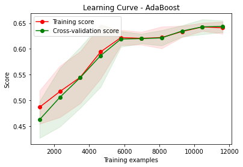
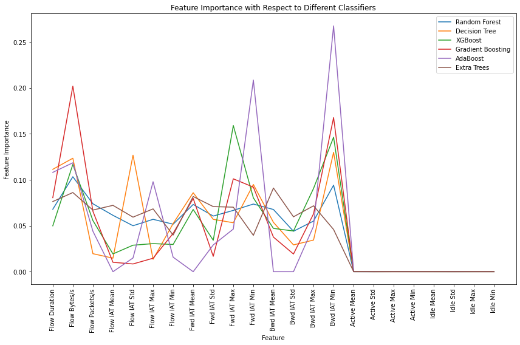
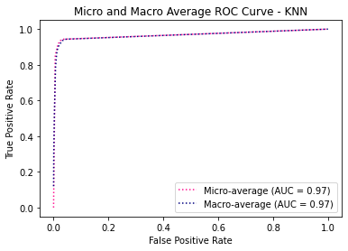
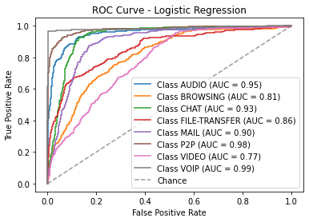
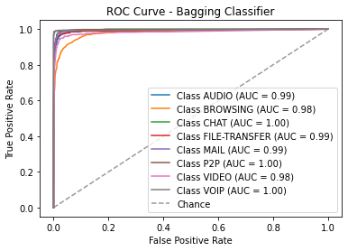

# Models-10s


```python
dataset_name = list(dataset_files)[0]
time_directory = dataset_files[dataset_name]

print("\n", '-'*120, "\n")
print(dataset_name)

# Update the dataset file path in the code
filepath = os.path.join('../../CICDataSet-TOR/CSV/Scenario-B/', dataset_name)

# Update the directory for storing trained models
time_directory_path = os.path.join(models_directory, time_directory)
if not os.path.exists(time_directory_path):
    os.makedirs(time_directory_path)

# DATASET LOADING        
df_data = load_csv_datafiles(filepath)

# SECTION-A
X_train, X_test, y_train, y_test, class_labels, X_train_selected, X_test_selected = secA(df_data, filter_warnings=True)
```

    
     ------------------------------------------------------------------------------------------------------------------------ 
    
    TimeBasedFeatures-10s-Layer2.csv
    
    
    Data Distribution: ORIGINAL:
    VOIP             2291
    BROWSING         1604
    P2P              1085
    VIDEO             874
    FILE-TRANSFER     864
    AUDIO             721
    CHAT              323
    MAIL              282
    Name: class1, dtype: int64
    Total: 8044
    
    
    Number of Negative Values in Independent Variables: 378
    Number of Inf Values: 0
    NaN Value Counts: 378
    Missing Value Counts: 378
    
    AFTER IMPUTATION:
    NaN Value Counts: 0
    Missing Value Counts: 0
    
    
    Data Distribution: AFTER Outlier Removal:
    VOIP             2269
    BROWSING         1268
    P2P              1079
    FILE-TRANSFER     848
    VIDEO             786
    AUDIO             493
    MAIL              264
    CHAT              233
    Name: class1, dtype: int64
    Total: 7240
    
    
    Data Distribution: AFTER OVERSAMPLING:
    P2P              2269
    AUDIO            2269
    BROWSING         2269
    VIDEO            2269
    FILE-TRANSFER    2269
    MAIL             2269
    CHAT             2269
    VOIP             2269
    Name: class1, dtype: int64
    Total: 18152
    
    
    Data Distribution: AFTER ENCODING:
    Value: 0, Count: 2269
    Value: 1, Count: 2269
    Value: 2, Count: 2269
    Value: 3, Count: 2269
    Value: 4, Count: 2269
    Value: 5, Count: 2269
    Value: 6, Count: 2269
    Value: 7, Count: 2269
    Total: 18152
    
    
    
    


    

    


    
    No. of Total Features: 23
    No. of Reduced Features: 15
    


```python
# SECTION-B
secB(X_train, y_train, y_test, class_labels, X_train_selected, X_test_selected, time_directory_path, filter_warnings=True)
```

    
    
    
    Classifier: Random Forest
    
    Best parameters for Random Forest: {'n_estimators': 100, 'min_samples_split': 2, 'min_samples_leaf': 1, 'max_depth': 20, 'bootstrap': False}
    Best cross-validation score for Random Forest: 0.9217683010673154
    
    Cross-validation results for Random Forest:
    [0.92598967 0.92940771 0.91219008 0.92011019 0.92596419]
    Mean accuracy: 0.922732369857233
    
    Random Forest Evaluation:
    Accuracy: 0.9336270999724594
    Precision: 0.9336654929214105
    Recall: 0.9336270999724594
    F1 Score: 0.933376471555989
    Confusion Matrix:
     [[421  16   2   5   5   0   3   2]
     [ 21 375  21   2  13   1  21   0]
     [  3   9 437   0   3   0   2   0]
     [  6   3   1 429  10   0   4   1]
     [  1   8   4   0 438   1   2   0]
     [  0   3   0   0   1 447   3   0]
     [  8  15   7   8  10   2 401   2]
     [  0   5   4   2   0   0   1 442]]
    


    

    


    
    
    
    Classifier: Decision Tree
    
    Best parameters for Decision Tree: {'splitter': 'best', 'min_samples_split': 2, 'min_samples_leaf': 1, 'max_features': None, 'max_depth': 50, 'criterion': 'entropy'}
    Best cross-validation score for Decision Tree: 0.8630956411241189
    
    Cross-validation results for Decision Tree:
    [0.86643718 0.85433884 0.86466942 0.86639118 0.87258953]
    Mean accuracy: 0.8648852315993608
    
    Decision Tree Evaluation:
    Accuracy: 0.8804736987055908
    Precision: 0.8795018155273834
    Recall: 0.8804736987055908
    F1 Score: 0.8797481771409128
    Confusion Matrix:
     [[413  17   0   8   4   0  11   1]
     [ 26 313  38  11  25   2  37   2]
     [  4  33 399   1   6   1   9   1]
     [  7   8   2 410   7   0  17   3]
     [  9  23   5  14 390   0  11   2]
     [  1   1   0   2   0 444   4   2]
     [  8  20   4  17  16   4 383   1]
     [  0   3   5   0   1   0   0 445]]
    


    

    


    
    
    
    Classifier: SVM
    No hyperparameters specified for SVM. Using default settings.
    
    Cross-validation results for SVM:
    [0.60240964 0.60847107 0.61225895 0.60984848 0.61157025]
    Mean accuracy: 0.6089116797769591
    
    SVM Evaluation:
    Accuracy: 0.6089231616634536
    Precision: 0.61604528273049
    Recall: 0.6089231616634536
    F1 Score: 0.5627074477163329
    Confusion Matrix:
     [[387  15  30   3  17   0   2   0]
     [ 52 108 148  50  57  36   1   2]
     [ 26  37 364  10  16   0   1   0]
     [ 17   3  22 233  42  62   4  71]
     [ 22  22  77  69 257   4   3   0]
     [  6   1   1   3   2 398   0  43]
     [ 43  10  43 123 117  89  28   0]
     [  4   0   5   5   4   0   0 436]]
    


    

    


    
    
    
    Classifier: KNN
    
    Best parameters for KNN: {'weights': 'distance', 'n_neighbors': 3, 'algorithm': 'auto'}
    Best cross-validation score for KNN: 0.8794852135815991
    
    Cross-validation results for KNN:
    [0.89225473 0.87431129 0.87327824 0.89325069 0.87190083]
    Mean accuracy: 0.8809991560101089
    
    KNN Evaluation:
    Accuracy: 0.8992013219498761
    Precision: 0.8998148411048261
    Recall: 0.8992013219498761
    F1 Score: 0.8981651620467509
    Confusion Matrix:
     [[415  13   4   6  11   0   5   0]
     [ 30 324  33   7  21   8  30   1]
     [  6  12 428   0   3   0   5   0]
     [  9   7   7 411   9   1   9   1]
     [  6   8  12   4 419   0   5   0]
     [  2   0   0   2   3 441   5   1]
     [ 15  10   7  10  17   3 390   1]
     [  4   3   3   2   1   2   2 437]]
    


    

    


    
    
    
    Classifier: XGBoost
    
    Best parameters for XGBoost: {'subsample': 1.0, 'reg_lambda': 10.0, 'reg_alpha': 0.5, 'n_estimators': 300, 'min_child_weight': 3, 'max_depth': 7, 'learning_rate': 0.3, 'gamma': 0.0, 'colsample_bytree': 0.6}
    Best cross-validation score for XGBoost: 0.9241785560186436
    
    Cross-validation results for XGBoost:
    [0.91290878 0.9214876  0.92217631 0.93147383 0.93009642]
    Mean accuracy: 0.9236285875497267
    
    XGBoost Evaluation:
    Accuracy: 0.938859818231892
    Precision: 0.9392340268932973
    Recall: 0.938859818231892
    F1 Score: 0.9383932232680708
    Confusion Matrix:
     [[428  11   3   5   4   0   3   0]
     [ 23 370  24   0  12   0  25   0]
     [  3   4 445   0   2   0   0   0]
     [  6   2   3 429   6   0   5   3]
     [  3   2   4   0 442   1   2   0]
     [  1   3   1   0   0 444   5   0]
     [  9  13   5   9   6   3 406   2]
     [  2   1   6   0   0   0   0 445]]
    


    

    


    
    
    
    Classifier: Logistic Regression
    
    Best parameters for Logistic Regression: {'solver': 'saga', 'penalty': 'none', 'max_iter': 3000, 'C': 0.1}
    Best cross-validation score for Logistic Regression: 0.6107706386348226
    
    Cross-validation results for Logistic Regression:
    [0.60791738 0.61535813 0.60571625 0.6119146  0.60915978]
    Mean accuracy: 0.6100132288303153
    
    Logistic Regression Evaluation:
    Accuracy: 0.6083723492150923
    Precision: 0.5786433671243909
    Recall: 0.6083723492150923
    F1 Score: 0.5843232126973232
    Confusion Matrix:
     [[388  14  21   4  15   0  12   0]
     [ 66 123  90  45  83   6  29  12]
     [ 45  93 260  18  27   2   8   1]
     [ 12   6   9 273  28  39  20  67]
     [ 21  27  22  50 232   1  94   7]
     [  5   0   0  20   0 411   3  15]
     [ 52   6  28 138  91  55  82   1]
     [  2   3   5   1   3   0   0 440]]
    


    

    


    
    
    
    Classifier: Gradient Boosting
    
    Best parameters for Gradient Boosting: {'subsample': 0.8, 'n_estimators': 200, 'min_samples_split': 2, 'min_samples_leaf': 2, 'max_features': 'auto', 'max_depth': 7, 'learning_rate': 0.3}
    Best cross-validation score for Gradient Boosting: 0.9213546037751954
    
    Cross-validation results for Gradient Boosting:
    [0.91841652 0.9280303  0.93044077 0.92389807 0.92114325]
    Mean accuracy: 0.924385783986003
    
    Gradient Boosting Evaluation:
    Accuracy: 0.937207380886808
    Precision: 0.9373224942410008
    Recall: 0.937207380886808
    F1 Score: 0.9369892744063768
    Confusion Matrix:
     [[428  13   2   4   4   0   3   0]
     [ 21 377  23   1  11   0  21   0]
     [  3   9 440   0   1   0   1   0]
     [  5   4   2 427   7   1   5   3]
     [  3   8   3   0 438   0   2   0]
     [  0   4   1   1   0 444   4   0]
     [  8  15   4   9   8   3 405   1]
     [  0   3   7   0   0   0   0 444]]
    


    

    


    
    
    
    Classifier: Gaussian Naive Bayes
    No hyperparameters specified for Gaussian Naive Bayes. Using default settings.
    
    Cross-validation results for Gaussian Naive Bayes:
    [0.34388985 0.37947658 0.35881543 0.27548209 0.29132231]
    Mean accuracy: 0.3297972527654894
    
    Gaussian Naive Bayes Evaluation:
    Accuracy: 0.3423299366565684
    Precision: 0.31360227604422664
    Recall: 0.3423299366565684
    F1 Score: 0.2783256056038123
    Confusion Matrix:
     [[ 59   5  66  73 196  44   4   7]
     [ 22  29 151  42 129  10   3  68]
     [ 19   5 219  15 179   0   6  11]
     [  6   2  10  45  28 188   0 175]
     [ 10  13  41 119 180  32   0  59]
     [  4   0   2   2   2 270   0 174]
     [ 35   0  27  72 102 169   0  48]
     [  0   0   1   2  10   0   0 441]]
    


    

    


    
    
    
    Classifier: AdaBoost
    
    Best parameters for AdaBoost: {'n_estimators': 200, 'learning_rate': 0.3, 'algorithm': 'SAMME.R'}
    Best cross-validation score for AdaBoost: 0.6475444872761411
    
    Cross-validation results for AdaBoost:
    [0.64268503 0.64703857 0.64497245 0.62878788 0.64566116]
    Mean accuracy: 0.6418290161827949
    
    AdaBoost Evaluation:
    Accuracy: 0.6551914073258056
    Precision: 0.6638992492167963
    Recall: 0.6551914073258056
    F1 Score: 0.6342722280620265
    Confusion Matrix:
     [[356  21  33   3  26   0  15   0]
     [ 34 112 198  49  51   0   9   1]
     [ 16  30 396   4   1   1   5   1]
     [  7  10  23 296  65   1  45   7]
     [ 15  14  92  25 296   0  10   2]
     [  1   4   2  36   1 406   1   3]
     [ 17   8  44 133 165   5  80   1]
     [  1   2   6   7   1   0   0 437]]
    


    

    


    
    
    
    Classifier: Bagging Classifier
    
    Best parameters for Bagging Classifier: {'n_estimators': 200, 'max_samples': 1.0, 'max_features': 1.0, 'bootstrap_features': True, 'bootstrap': False}
    Best cross-validation score for Bagging Classifier: 0.9208038766636795
    
    Cross-validation results for Bagging Classifier:
    [0.91256454 0.91563361 0.9273416  0.91838843 0.92768595]
    Mean accuracy: 0.9203228261333409
    
    Bagging Classifier Evaluation:
    Accuracy: 0.9341779124208207
    Precision: 0.9343547604158337
    Recall: 0.9341779124208207
    F1 Score: 0.9340083025386355
    Confusion Matrix:
     [[425  12   1   4   7   0   3   2]
     [ 22 377  23   3  10   1  18   0]
     [  3  10 435   1   3   0   2   0]
     [  7   5   4 419   8   0   8   3]
     [  1   9   5   0 435   1   3   0]
     [  0   4   0   0   0 448   2   0]
     [  7  14   4   6   9   2 410   1]
     [  0   4   6   1   0   0   0 443]]
    


    

    


    
    
    
    Classifier: Extra Trees
    
    Best parameters for Extra Trees: {'n_estimators': 100, 'min_samples_split': 2, 'min_samples_leaf': 1, 'max_features': 'sqrt', 'max_depth': None, 'bootstrap': False}
    Best cross-validation score for Extra Trees: 0.922388467684196
    
    Cross-validation results for Extra Trees:
    [0.93080895 0.92493113 0.92286501 0.91976584 0.92320937]
    Mean accuracy: 0.9243160599896635
    
    Extra Trees Evaluation:
    Accuracy: 0.9383090057835307
    Precision: 0.9384503049839888
    Recall: 0.9383090057835307
    F1 Score: 0.9380135930296823
    Confusion Matrix:
     [[425   7   3   7   6   0   4   2]
     [ 19 380  23   1  10   1  20   0]
     [  2   9 440   0   2   0   1   0]
     [  7   2   5 426   8   0   5   1]
     [  1   5   4   0 441   1   2   0]
     [  0   2   0   1   1 446   3   1]
     [ 11  15   5   7   6   2 406   1]
     [  0   3   4   2   0   1   1 443]]
    


    

    


    
    
    
    
    


    

    


    Statistics for Learning Curve - Random Forest:
    Mean training score: 0.9999652762268092
    Mean validation score: 0.8866819438319984
    Training scores std deviation: 2.165407707596746e-05
    Validation scores std deviation: 0.005717994315516816
    
    
    
    
    


    

    


    Statistics for Learning Curve - Decision Tree:
    Mean training score: 0.9999652762268092
    Mean validation score: 0.8174370136982404
    Training scores std deviation: 2.165407707596746e-05
    Validation scores std deviation: 0.006649129501279749
    
    
    
    
    


    

    


    Statistics for Learning Curve - SVM:
    Mean training score: 0.5723877387645622
    Mean validation score: 0.567130510234563
    Training scores std deviation: 0.0038673228810338885
    Validation scores std deviation: 0.0049584512230185385
    
    
    
    
    


    

    


    Statistics for Learning Curve - KNN:
    Mean training score: 0.9999652762268092
    Mean validation score: 0.8283104981911116
    Training scores std deviation: 1.1574591063578943e-05
    Validation scores std deviation: 0.004297994171142045
    
    
    
    
    


    

    


    Statistics for Learning Curve - XGBoost:
    Mean training score: 0.9986445737406294
    Mean validation score: 0.8862602333774294
    Training scores std deviation: 0.00027435109914190437
    Validation scores std deviation: 0.00852075658244119
    
    
    
    
    


    

    


    Statistics for Learning Curve - Logistic Regression:
    Mean training score: 0.6190220912110957
    Mean validation score: 0.6102482420828533
    Training scores std deviation: 0.00553200038833346
    Validation scores std deviation: 0.009318575494077289
    
    
    
    
    


    

    


    Statistics for Learning Curve - Gradient Boosting:
    Mean training score: 0.9999111610043794
    Mean validation score: 0.8897456366196781
    Training scores std deviation: 0.00011386739557652477
    Validation scores std deviation: 0.0054692264575981735
    
    
    
    
    


    

    


    Statistics for Learning Curve - Gaussian Naive Bayes:
    Mean training score: 0.3058509427219844
    Mean validation score: 0.2990787020573439
    Training scores std deviation: 0.03573692376670111
    Validation scores std deviation: 0.037274304294157554
    
    
    
    
    


    

    


    Statistics for Learning Curve - AdaBoost:
    Mean training score: 0.5925507755223764
    Mean validation score: 0.5881747248735201
    Training scores std deviation: 0.02642853691493331
    Validation scores std deviation: 0.028983573834652932
    
    
    
    
    


    

    


    Statistics for Learning Curve - Bagging Classifier:
    Mean training score: 0.9999594889312775
    Mean validation score: 0.8785968051663561
    Training scores std deviation: 1.417592104357323e-05
    Validation scores std deviation: 0.0077755542494949955
    
    
    
    
    


    

    


    Statistics for Learning Curve - Extra Trees:
    Mean training score: 0.9999594889312775
    Mean validation score: 0.8831830414930086
    Training scores std deviation: 1.417592104357323e-05
    Validation scores std deviation: 0.0038122915921160712
    
    
    
    
    


    

    


    
    
    


    

    


    
    Statistics for Normalized Total Feature Importance:
    Mean Normalized Total Importance: 0.3648191354616315
    Standard Deviation of Normalized Total Importance: 0.3145555528740238
    
    
    
    
    
    
    
    


    

    


    

    


    Statistics for ROC Curve - Random Forest:
    Micro-average AUC: 0.993798456886476
    Macro-average AUC: 0.9927007154744472
    
    
    
    
    


    

    


    

    


    Statistics for ROC Curve - Decision Tree:
    Micro-average AUC: 0.9316992564031947
    Macro-average AUC: 0.9316946532662747
    
    
    
    
    


    

    


    

    


    Statistics for ROC Curve - SVM:
    Micro-average AUC: 0.9216928230342888
    Macro-average AUC: 0.9069608621624403
    
    
    
    
    


    

    


    

    


    Statistics for ROC Curve - KNN:
    Micro-average AUC: 0.9670467247999865
    Macro-average AUC: 0.9664121495381401
    
    
    
    
    


    

    


    

    


    Statistics for ROC Curve - XGBoost:
    Micro-average AUC: 0.9966144224118622
    Macro-average AUC: 0.9958913196855239
    
    
    
    
    


    

    


    

    


    Statistics for ROC Curve - Logistic Regression:
    Micro-average AUC: 0.9158986626886176
    Macro-average AUC: 0.8989416618362356
    
    
    
    
    


    

    


    

    


    Statistics for ROC Curve - Gradient Boosting:
    Micro-average AUC: 0.9941005401427191
    Macro-average AUC: 0.9935542238257884
    
    
    
    
    


    

    


    

    


    Statistics for ROC Curve - Gaussian Naive Bayes:
    Micro-average AUC: 0.767657505309374
    Macro-average AUC: 0.7798384624948009
    
    
    
    
    


    

    


    

    


    Statistics for ROC Curve - AdaBoost:
    Micro-average AUC: 0.9011638608305397
    Macro-average AUC: 0.8811838840810637
    
    
    
    
    


    

    


    

    


    Statistics for ROC Curve - Bagging Classifier:
    Micro-average AUC: 0.9925525300504793
    Macro-average AUC: 0.9915900252339824
    
    
    
    
    


    

    


    

    


    Statistics for ROC Curve - Extra Trees:
    Micro-average AUC: 0.993483901955211
    Macro-average AUC: 0.9927213771250429
    


```python
# SECTION-C
secC(X_train, y_train, y_test, class_labels, X_train_selected, X_test_selected, time_directory_path)
```

    Fitting 5 folds for each of 5 candidates, totalling 25 fits
    [CV] END ...........batch_size=16, epochs=10, optimizer=adam; total time=  20.3s
    [CV] END ...........batch_size=16, epochs=10, optimizer=adam; total time=  20.8s
    [CV] END ...........batch_size=16, epochs=10, optimizer=adam; total time=  20.6s
    [CV] END ...........batch_size=16, epochs=10, optimizer=adam; total time=  20.5s
    [CV] END ...........batch_size=16, epochs=10, optimizer=adam; total time=  24.3s
    [CV] END ........batch_size=16, epochs=10, optimizer=rmsprop; total time=  20.1s
    [CV] END ........batch_size=16, epochs=10, optimizer=rmsprop; total time=  18.3s
    [CV] END ........batch_size=16, epochs=10, optimizer=rmsprop; total time=  17.8s
    [CV] END ........batch_size=16, epochs=10, optimizer=rmsprop; total time=  17.2s
    [CV] END ........batch_size=16, epochs=10, optimizer=rmsprop; total time=  17.1s
    [CV] END ...........batch_size=32, epochs=20, optimizer=adam; total time=  20.3s
    [CV] END ...........batch_size=32, epochs=20, optimizer=adam; total time=  21.4s
    [CV] END ...........batch_size=32, epochs=20, optimizer=adam; total time=  21.1s
    [CV] END ...........batch_size=32, epochs=20, optimizer=adam; total time=  22.9s
    [CV] END ...........batch_size=32, epochs=20, optimizer=adam; total time=  20.7s
    [CV] END ........batch_size=16, epochs=30, optimizer=rmsprop; total time=  49.4s
    [CV] END ........batch_size=16, epochs=30, optimizer=rmsprop; total time=  51.8s
    [CV] END ........batch_size=16, epochs=30, optimizer=rmsprop; total time=  50.7s
    [CV] END ........batch_size=16, epochs=30, optimizer=rmsprop; total time=  50.9s
    [CV] END ........batch_size=16, epochs=30, optimizer=rmsprop; total time=  51.8s
    [CV] END ........batch_size=16, epochs=20, optimizer=rmsprop; total time=  34.1s
    [CV] END ........batch_size=16, epochs=20, optimizer=rmsprop; total time=  33.5s
    [CV] END ........batch_size=16, epochs=20, optimizer=rmsprop; total time=  33.7s
    [CV] END ........batch_size=16, epochs=20, optimizer=rmsprop; total time=  33.6s
    [CV] END ........batch_size=16, epochs=20, optimizer=rmsprop; total time=  34.0s
    
    Best parameters for Deep Neural Network: {'optimizer': 'rmsprop', 'epochs': 30, 'batch_size': 16}
    Best cross-validation score for Deep Neural Network: 0.6436856042825376
    
    Fold 1 of 5:
    Accuracy: 0.5931153184165232
    Precision: 0.5832901081403102
    Recall: 0.593280772258045
    F1 Score: 0.5505780699819418
    Confusion Matrix:
     [[302   2  31   1  24   0   3   0]
     [ 37  58 145  31  65  17   7   3]
     [ 38  15 292   2  14   1   1   0]
     [  3   1  16 185  43  46   9  60]
     [ 21  10  78  25 182   2  45   0]
     [  3   0   5   5   0 317   0  33]
     [ 48   2  55  69  76  73  41   0]
     [  4   1   3   1   5   3   0 346]]
    
    Fold 2 of 5:
    Accuracy: 0.6002066115702479
    Precision: 0.5936117525979658
    Recall: 0.6002066115702479
    F1 Score: 0.5573149900553581
    Confusion Matrix:
     [[298  20  29   6  10   0   0   0]
     [ 19 108 125  37  51  10   2  11]
     [ 12  63 280   3   4   0   1   0]
     [  8   3  12 190  49  42   2  57]
     [ 13  28  67  27 223   1   2   2]
     [  8   0   2  35   0 286   0  32]
     [ 22   9  61  85 103  74   9   0]
     [  3   2   1   4   4   0   0 349]]
    
    Fold 3 of 5:
    Accuracy: 0.5788567493112947
    Precision: 0.5773619794820892
    Recall: 0.5788567493112948
    F1 Score: 0.5236935491248131
    Confusion Matrix:
     [[291   8  42   2  20   0   0   0]
     [ 35  42 169  44  52   9   1  11]
     [ 21  22 307   3  10   0   0   0]
     [ 12   4  10 189  59  32   6  51]
     [ 28  13  64  26 228   1   3   0]
     [  4   2   6   9   0 257   0  85]
     [ 50   2  54  99  98  44  15   1]
     [  5   0   3   1   2   0   0 352]]
    
    Fold 4 of 5:
    Accuracy: 0.6012396694214877
    Precision: 0.5300588315656456
    Recall: 0.6012396694214877
    F1 Score: 0.5535127495687282
    Confusion Matrix:
     [[291  24  31   3  12   0   1   1]
     [ 48 102 109  30  47  15   6   6]
     [ 28  47 277   0   7   0   4   0]
     [ 16   3   8 206  41  33  12  44]
     [ 38  21  69  28 187   3  16   1]
     [  3   0   1   2   0 330   0  27]
     [ 48   5  56  99  90  64   1   0]
     [  5   0   3   0   1   2   0 352]]
    
    Fold 5 of 5:
    Accuracy: 0.5895316804407713
    Precision: 0.5537704067353321
    Recall: 0.5895316804407713
    F1 Score: 0.5544525213890701
    Confusion Matrix:
     [[282  16  33   4  26   0   2   0]
     [ 30  92 110  44  49  22   9   7]
     [ 17  52 279   7   5   2   1   0]
     [  9   3  19 222  14  31  12  53]
     [ 14  28  60  58 136   3  63   1]
     [  3   0   5   6   0 331   0  18]
     [ 53   9  60  98  52  56  35   0]
     [  4   0   4   2   3  15   0 335]]
    
    Average Evaluation Metrics Across Folds:
    Average Accuracy: 0.592590005832065
    Average Precision: 0.5676186157042686
    Average Recall: 0.5926230966003694
    Average F1 Score: 0.5479103760239823
    Average Confusion Matrix:
     [[2.928e+02 1.400e+01 3.320e+01 3.200e+00 1.840e+01 0.000e+00 1.200e+00
      2.000e-01]
     [3.380e+01 8.040e+01 1.316e+02 3.720e+01 5.280e+01 1.460e+01 5.000e+00
      7.600e+00]
     [2.320e+01 3.980e+01 2.870e+02 3.000e+00 8.000e+00 6.000e-01 1.400e+00
      0.000e+00]
     [9.600e+00 2.800e+00 1.300e+01 1.984e+02 4.120e+01 3.680e+01 8.200e+00
      5.300e+01]
     [2.280e+01 2.000e+01 6.760e+01 3.280e+01 1.912e+02 2.000e+00 2.580e+01
      8.000e-01]
     [4.200e+00 4.000e-01 3.800e+00 1.140e+01 0.000e+00 3.042e+02 0.000e+00
      3.900e+01]
     [4.420e+01 5.400e+00 5.720e+01 9.000e+01 8.380e+01 6.220e+01 2.020e+01
      2.000e-01]
     [4.200e+00 6.000e-01 2.800e+00 1.600e+00 3.000e+00 4.000e+00 0.000e+00
      3.468e+02]]
    
    
    Deep Neural Network Training Results:
    Epoch	Accuracy
    1	0.2723555266857147
    2	0.40934035181999207
    3	0.4610997438430786
    4	0.5377165675163269
    5	0.5648337602615356
    6	0.5765630006790161
    7	0.5826966762542725
    8	0.5868933796882629
    9	0.5924889445304871
    10	0.5966856479644775
    
    
    Deep Neural Network Evaluation:
    Accuracy: 0.5888185072982649
    Precision: 0.5572920967001054
    Recall: 0.5886910318872713
    F1 Score: 0.5568913434175098
    Confusion Matrix:
     [[357  19  43   4  25   0   4   2]
     [ 40 128 132  64  48  28   9   5]
     [ 17  65 356   8   6   2   0   0]
     [ 14   7  21 251  33  47  15  66]
     [ 20  45  62  78 161   4  79   5]
     [  5   2   1  12   0 416   2  16]
     [ 63  10  44 135  72  72  57   0]
     [  2   0   7   4   3  26   0 412]]
    


    

    


    
    
    
    
    


    

    


    Statistical Information for Training and Validation Loss:
    -------------------------------------------------------
    Mean Training Loss: 1.4106339620066115
    Mean Validation Loss: 1.3816014653023672
    Minimum Training Loss: 1.216655376780268
    Minimum Validation Loss: 1.2249684142984334
    Maximum Training Loss: 1.9167427576153935
    Maximum Validation Loss: 1.7513820051941733
    Standard Deviation of Training Loss: 0.20937541801929377
    Standard Deviation of Validation Loss: 0.15859717907123816
    
    
    
    
    


    

    


    
    Statistics for Normalized Feature Importance:
    Mean Normalized Importance of All Features: 0.8053622217692226
    Standard Deviation of Normalized Importance of All Features: 0.22881340413883342
    Mean Normalized Importance of Selected Features: 0.7393019275135819
    Standard Deviation of Normalized Importance of Selected Features: 0.2602540192691342
    
    
    
    
    


    

    


    

    


    Statistics for ROC Curve - DNN:
    Micro-average AUC: 0.76503914702758
    Macro-average AUC: 0.7649749284849643
    
