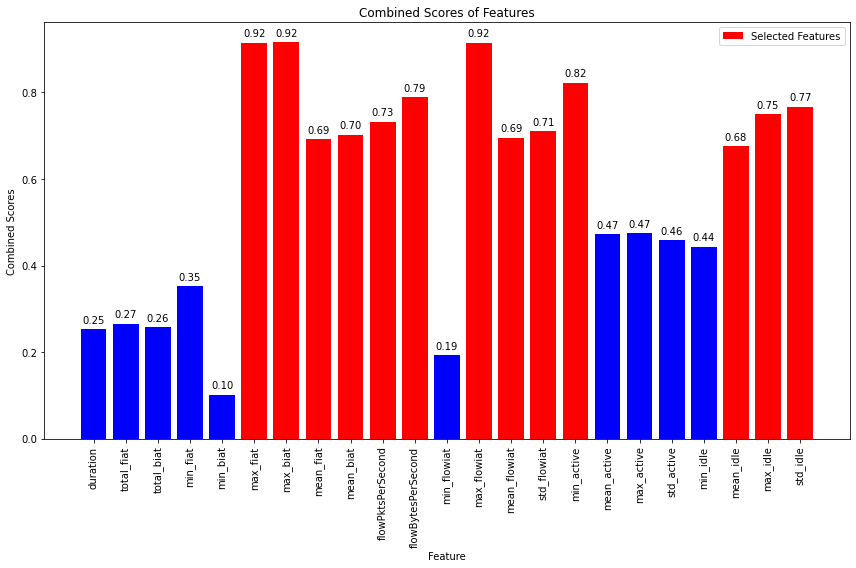
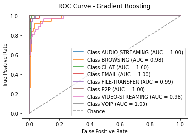

# Models-120s


```python
dataset_name = list(dataset_files)[3]
time_directory = dataset_files[dataset_name]

print("\n", '-'*120, "\n")
print(dataset_name)

# Update the dataset file path in the code
filepath = os.path.join('../../CICDataSet-TOR/CSV/Scenario-B/', dataset_name)

# Update the directory for storing trained models
time_directory_path = os.path.join(models_directory, time_directory)
if not os.path.exists(time_directory_path):
    os.makedirs(time_directory_path)

# DATASET LOADING        
df_data = load_arff_datafiles(filepath)

# SECTION-A
X_train, X_test, y_train, y_test, class_labels, X_train_selected, X_test_selected = secA(df_data, filter_warnings=True)
```

    
     ------------------------------------------------------------------------------------------------------------------------ 
    
    TimeBasedFeatures-120s-Layer2.arff
    
    
    Data Distribution: ORIGINAL:
    VOIP               193
    VIDEO-STREAMING     90
    FILE-TRANSFER       63
    CHAT                45
    BROWSING            41
    EMAIL               28
    AUDIO-STREAMING     16
    P2P                 10
    Name: class1, dtype: int64
    Total: 486
    
    
    Number of Negative Values in Independent Variables: 915
    Number of Inf Values: 0
    NaN Value Counts: 915
    Missing Value Counts: 915
    
    AFTER IMPUTATION:
    NaN Value Counts: 0
    Missing Value Counts: 0
    
    
    Data Distribution: AFTER Outlier Removal:
    VOIP               189
    VIDEO-STREAMING     88
    FILE-TRANSFER       54
    CHAT                32
    BROWSING            32
    EMAIL               27
    P2P                 10
    AUDIO-STREAMING      5
    Name: class1, dtype: int64
    Total: 437
    Error occurred: Expected n_neighbors <= n_samples,  but n_samples = 5, n_neighbors = 6
    
    
    Data Distribution: AFTER OVERSAMPLING:
    P2P                189
    CHAT               189
    FILE-TRANSFER      189
    AUDIO-STREAMING    189
    EMAIL              189
    VOIP               189
    BROWSING           189
    VIDEO-STREAMING    189
    Name: class1, dtype: int64
    Total: 1512
    
    
    Data Distribution: AFTER ENCODING:
    Value: 0, Count: 189
    Value: 1, Count: 189
    Value: 2, Count: 189
    Value: 3, Count: 189
    Value: 4, Count: 189
    Value: 5, Count: 189
    Value: 6, Count: 189
    Value: 7, Count: 189
    Total: 1512
    
    
    
    


    

    


    
    No. of Total Features: 23
    No. of Reduced Features: 13
    


```python
# SECTION-B
secB(X_train, y_train, y_test, class_labels, X_train_selected, X_test_selected, time_directory_path, filter_warnings=True)
```

    
    
    
    Classifier: Random Forest
    
    Best parameters for Random Forest: {'n_estimators': 100, 'min_samples_split': 2, 'min_samples_leaf': 1, 'max_depth': 20, 'bootstrap': False}
    Best cross-validation score for Random Forest: 0.9280340180377902
    
    Cross-validation results for Random Forest:
    [0.92561983 0.92561983 0.92975207 0.92975207 0.90456432]
    Mean accuracy: 0.923061623401118
    
    Random Forest Evaluation:
    Accuracy: 0.9108910891089109
    Precision: 0.9119730169873893
    Recall: 0.9108910891089109
    F1 Score: 0.909874050322649
    Confusion Matrix:
     [[38  0  0  0  0  0  0  0]
     [ 0 28  7  2  0  0  1  0]
     [ 0  3 35  0  0  0  0  0]
     [ 1  0  0 36  0  0  1  0]
     [ 0  1  0  0 36  0  1  0]
     [ 0  0  0  0  0 38  0  0]
     [ 1  3  2  0  2  1 28  0]
     [ 0  1  0  0  0  0  0 37]]
    


    

    


    
    
    
    Classifier: Decision Tree
    
    Best parameters for Decision Tree: {'splitter': 'best', 'min_samples_split': 2, 'min_samples_leaf': 1, 'max_features': 'sqrt', 'max_depth': 40, 'criterion': 'gini'}
    Best cross-validation score for Decision Tree: 0.8635129110798669
    
    Cross-validation results for Decision Tree:
    [0.88429752 0.85123967 0.82644628 0.8553719  0.82157676]
    Mean accuracy: 0.8477864270772606
    
    Decision Tree Evaluation:
    Accuracy: 0.8448844884488449
    Precision: 0.8461275463896315
    Recall: 0.8448844884488449
    F1 Score: 0.8442835740914534
    Confusion Matrix:
     [[34  0  0  0  4  0  0  0]
     [ 0 25 10  0  0  0  3  0]
     [ 0  3 34  0  0  0  1  0]
     [ 2  0  0 32  2  0  2  0]
     [ 0  3  0  2 29  1  3  0]
     [ 0  0  0  1  0 37  0  0]
     [ 0  3  1  1  4  1 27  0]
     [ 0  0  0  0  0  0  0 38]]
    


    

    


    
    
    
    Classifier: SVM
    No hyperparameters specified for SVM. Using default settings.
    
    Cross-validation results for SVM:
    [0.70247934 0.71487603 0.72727273 0.7768595  0.76348548]
    Mean accuracy: 0.7369946160968417
    
    SVM Evaluation:
    Accuracy: 0.7095709570957096
    Precision: 0.703326365040336
    Recall: 0.7095709570957096
    F1 Score: 0.6925065297919926
    Confusion Matrix:
     [[37  0  0  1  0  0  0  0]
     [ 0 16 11  8  0  0  3  0]
     [ 0 11 26  1  0  0  0  0]
     [ 1  0  0 35  0  2  0  0]
     [ 2  1  1  3 23  1  7  0]
     [ 1  0  0  1  0 35  1  0]
     [ 6  1  5  3  3 10  9  0]
     [ 0  2  0  2  0  0  0 34]]
    


    

    


    
    
    
    Classifier: KNN
    
    Best parameters for KNN: {'weights': 'distance', 'n_neighbors': 3, 'algorithm': 'auto'}
    Best cross-validation score for KNN: 0.8792565412708756
    
    Cross-validation results for KNN:
    [0.88429752 0.86363636 0.84710744 0.87190083 0.89626556]
    Mean accuracy: 0.8726415417852611
    
    KNN Evaluation:
    Accuracy: 0.8712871287128713
    Precision: 0.8709783010015973
    Recall: 0.8712871287128713
    F1 Score: 0.870726873538197
    Confusion Matrix:
     [[38  0  0  0  0  0  0  0]
     [ 0 30  4  3  0  0  0  1]
     [ 0  4 33  0  0  0  1  0]
     [ 0  1  0 34  1  0  2  0]
     [ 0  0  0  0 34  0  4  0]
     [ 0  0  0  1  0 35  2  0]
     [ 1  2  3  1  1  4 25  0]
     [ 0  2  0  0  1  0  0 35]]
    


    

    


    
    
    
    Classifier: XGBoost
    
    Best parameters for XGBoost: {'subsample': 0.8, 'reg_lambda': 10.0, 'reg_alpha': 0.1, 'n_estimators': 300, 'min_child_weight': 1, 'max_depth': 7, 'learning_rate': 0.3, 'gamma': 0.0, 'colsample_bytree': 1.0}
    Best cross-validation score for XGBoost: 0.9222660402592504
    
    Cross-validation results for XGBoost:
    [0.91735537 0.90909091 0.9338843  0.94628099 0.91286307]
    Mean accuracy: 0.9238949281574707
    
    XGBoost Evaluation:
    Accuracy: 0.9207920792079208
    Precision: 0.922546891483496
    Recall: 0.9207920792079208
    F1 Score: 0.919603806070782
    Confusion Matrix:
     [[38  0  0  0  0  0  0  0]
     [ 0 32  5  0  0  0  1  0]
     [ 0  2 36  0  0  0  0  0]
     [ 0  0  0 36  1  0  1  0]
     [ 0  1  0  0 36  0  1  0]
     [ 0  0  0  0  0 38  0  0]
     [ 0  4  2  2  3  0 26  0]
     [ 0  0  0  0  1  0  0 37]]
    


    

    


    
    
    
    Classifier: Logistic Regression
    
    Best parameters for Logistic Regression: {'solver': 'newton-cg', 'penalty': 'none', 'max_iter': 10000, 'C': 1}
    Best cross-validation score for Logistic Regression: 0.9073625732999554
    
    Cross-validation results for Logistic Regression:
    [0.90495868 0.90909091 0.91322314 0.9214876  0.90456432]
    Mean accuracy: 0.910664929186242
    
    Logistic Regression Evaluation:
    Accuracy: 0.9405940594059405
    Precision: 0.9410920579237411
    Recall: 0.9405940594059405
    F1 Score: 0.9401445567782201
    Confusion Matrix:
     [[38  0  0  0  0  0  0  0]
     [ 0 33  2  0  0  0  3  0]
     [ 0  4 34  0  0  0  0  0]
     [ 0  1  0 37  0  0  0  0]
     [ 0  0  0  0 38  0  0  0]
     [ 0  0  0  0  0 38  0  0]
     [ 1  2  0  3  1  0 30  0]
     [ 0  0  0  0  1  0  0 37]]
    


    

    


    
    
    
    Classifier: Gradient Boosting
    
    Best parameters for Gradient Boosting: {'subsample': 0.6, 'n_estimators': 300, 'min_samples_split': 5, 'min_samples_leaf': 2, 'max_features': 'auto', 'max_depth': 5, 'learning_rate': 0.1}
    Best cross-validation score for Gradient Boosting: 0.9296800521244128
    
    Cross-validation results for Gradient Boosting:
    [0.9338843  0.91735537 0.91322314 0.94214876 0.89626556]
    Mean accuracy: 0.9205754260827819
    
    Gradient Boosting Evaluation:
    Accuracy: 0.9306930693069307
    Precision: 0.9331738149784247
    Recall: 0.9306930693069307
    F1 Score: 0.9302154150274257
    Confusion Matrix:
     [[38  0  0  0  0  0  0  0]
     [ 0 32  5  0  0  0  1  0]
     [ 0  0 38  0  0  0  0  0]
     [ 0  0  0 36  1  0  1  0]
     [ 0  1  0  0 36  0  1  0]
     [ 0  0  0  0  0 38  0  0]
     [ 0  5  0  0  4  0 28  0]
     [ 0  1  0  0  1  0  0 36]]
    


    

    


    
    
    
    Classifier: Gaussian Naive Bayes
    No hyperparameters specified for Gaussian Naive Bayes. Using default settings.
    
    Cross-validation results for Gaussian Naive Bayes:
    [0.67768595 0.70247934 0.71900826 0.69834711 0.71784232]
    Mean accuracy: 0.7030725969616954
    
    Gaussian Naive Bayes Evaluation:
    Accuracy: 0.7128712871287128
    Precision: 0.6796093456908766
    Recall: 0.7128712871287128
    F1 Score: 0.6782543803206329
    Confusion Matrix:
     [[38  0  0  0  0  0  0  0]
     [ 1 12 16  8  0  1  0  0]
     [ 0 12 26  0  0  0  0  0]
     [ 0  0  0 34  0  2  2  0]
     [ 0  1  0  0 33  1  3  0]
     [ 1  0  0  1  0 36  0  0]
     [ 1  4  7  4 11  7  3  0]
     [ 0  0  0  4  0  0  0 34]]
    


    

    


    
    
    
    Classifier: AdaBoost
    
    Best parameters for AdaBoost: {'n_estimators': 100, 'learning_rate': 0.1, 'algorithm': 'SAMME'}
    Best cross-validation score for AdaBoost: 0.6294571516751826
    
    Cross-validation results for AdaBoost:
    [0.65289256 0.67355372 0.62396694 0.59917355 0.61825726]
    Mean accuracy: 0.6335688076540584
    
    AdaBoost Evaluation:
    Accuracy: 0.6336633663366337
    Precision: 0.5891057605160276
    Recall: 0.6336633663366337
    F1 Score: 0.5791519862121819
    Confusion Matrix:
     [[27  7  0  0  0  0  4  0]
     [ 0  2 26  9  0  1  0  0]
     [ 0  0 38  0  0  0  0  0]
     [ 1  1  0 34  0  2  0  0]
     [ 0  0  4  0 22 12  0  0]
     [ 0  0  0  1  0 36  1  0]
     [ 0  2 13  4  3 15  0  0]
     [ 0  0  4  1  0  0  0 33]]
    


    

    


    
    
    
    Classifier: Bagging Classifier
    
    Best parameters for Bagging Classifier: {'n_estimators': 200, 'max_samples': 1.0, 'max_features': 0.5, 'bootstrap_features': True, 'bootstrap': False}
    Best cross-validation score for Bagging Classifier: 0.9255409622440933
    
    Cross-validation results for Bagging Classifier:
    [0.91735537 0.9214876  0.90909091 0.91735537 0.91286307]
    Mean accuracy: 0.9156304653475533
    
    Bagging Classifier Evaluation:
    Accuracy: 0.9108910891089109
    Precision: 0.9126637213270875
    Recall: 0.9108910891089109
    F1 Score: 0.9104925297317389
    Confusion Matrix:
     [[38  0  0  0  0  0  0  0]
     [ 0 30  5  2  0  0  1  0]
     [ 0  3 35  0  0  0  0  0]
     [ 1  1  0 35  0  0  1  0]
     [ 0  1  1  0 34  0  2  0]
     [ 0  0  0  0  0 38  0  0]
     [ 1  3  3  0  2  0 28  0]
     [ 0  0  0  0  0  0  0 38]]
    


    

    


    
    
    
    Classifier: Extra Trees
    
    Best parameters for Extra Trees: {'n_estimators': 100, 'min_samples_split': 5, 'min_samples_leaf': 1, 'max_features': 'log2', 'max_depth': None, 'bootstrap': False}
    Best cross-validation score for Extra Trees: 0.9172799286718563
    
    Cross-validation results for Extra Trees:
    [0.9338843  0.91322314 0.9338843  0.92975207 0.90871369]
    Mean accuracy: 0.9238914989197902
    
    Extra Trees Evaluation:
    Accuracy: 0.9207920792079208
    Precision: 0.9213484593632758
    Recall: 0.9207920792079208
    F1 Score: 0.9198872377694728
    Confusion Matrix:
     [[38  0  0  0  0  0  0  0]
     [ 0 32  3  1  0  0  2  0]
     [ 0  2 36  0  0  0  0  0]
     [ 1  0  0 36  0  0  1  0]
     [ 0  1  0  0 36  0  1  0]
     [ 0  0  0  0  0 38  0  0]
     [ 1  4  2  1  2  0 27  0]
     [ 0  1  0  0  1  0  0 36]]
    


    

    


    
    
    
    
    


    

    


    Statistics for Learning Curve - Random Forest:
    Mean training score: 1.0
    Mean validation score: 0.8642656287507288
    Training scores std deviation: 0.0
    Validation scores std deviation: 0.018459453616118268
    
    
    
    
    


    

    


    Statistics for Learning Curve - Decision Tree:
    Mean training score: 1.0
    Mean validation score: 0.7972764994341758
    Training scores std deviation: 0.0
    Validation scores std deviation: 0.01788797509742075
    
    
    
    
    


    

    


    Statistics for Learning Curve - SVM:
    Mean training score: 0.734353209000989
    Mean validation score: 0.6786464798875211
    Training scores std deviation: 0.014686949402101418
    Validation scores std deviation: 0.020762981300191115
    
    
    
    
    


    

    


    Statistics for Learning Curve - KNN:
    Mean training score: 1.0
    Mean validation score: 0.8169754123658312
    Training scores std deviation: 0.0
    Validation scores std deviation: 0.02121425324871399
    
    
    
    
    


    

    


    Statistics for Learning Curve - XGBoost:
    Mean training score: 1.0
    Mean validation score: 0.8581324371592194
    Training scores std deviation: 0.0
    Validation scores std deviation: 0.02834878500348672
    
    
    
    
    


    

    


    Statistics for Learning Curve - Logistic Regression:
    Mean training score: 0.9677024869784029
    Mean validation score: 0.8544247453791023
    Training scores std deviation: 0.008179174220402114
    Validation scores std deviation: 0.025280836461598667
    
    
    
    
    


    

    


    Statistics for Learning Curve - Gradient Boosting:
    Mean training score: 1.0
    Mean validation score: 0.8503021158396489
    Training scores std deviation: 0.0
    Validation scores std deviation: 0.026521411896727833
    
    
    
    
    


    

    


    Statistics for Learning Curve - Gaussian Naive Bayes:
    Mean training score: 0.7334779171200415
    Mean validation score: 0.6896694214876032
    Training scores std deviation: 0.012373667303361346
    Validation scores std deviation: 0.013309164490415073
    
    
    
    
    


    

    


    Statistics for Learning Curve - AdaBoost:
    Mean training score: 0.6093198091730383
    Mean validation score: 0.5630249305579369
    Training scores std deviation: 0.04581538043268227
    Validation scores std deviation: 0.04795106100877609
    
    
    
    
    


    

    


    Statistics for Learning Curve - Bagging Classifier:
    Mean training score: 1.0
    Mean validation score: 0.856553273207366
    Training scores std deviation: 0.0
    Validation scores std deviation: 0.021086240340932295
    
    
    
    
    


    

    


    Statistics for Learning Curve - Extra Trees:
    Mean training score: 0.999273889285927
    Mean validation score: 0.8540149514762868
    Training scores std deviation: 0.0008394301277223302
    Validation scores std deviation: 0.02907672495308177
    
    
    
    
    


    

    


    
    
    


    

    


    
    Statistics for Normalized Total Feature Importance:
    Mean Normalized Total Importance: 0.3400350415907013
    Standard Deviation of Normalized Total Importance: 0.26406473570455513
    
    
    
    
    
    
    
    


    

    


    

    


    Statistics for ROC Curve - Random Forest:
    Micro-average AUC: 0.9960072386305109
    Macro-average AUC: 0.9938794692739121
    
    
    
    
    


    

    


    

    


    Statistics for ROC Curve - Decision Tree:
    Micro-average AUC: 0.9113625648279113
    Macro-average AUC: 0.9111759191451347
    
    
    
    
    


    

    


    

    


    Statistics for ROC Curve - SVM:
    Micro-average AUC: 0.9653519807426286
    Macro-average AUC: 0.9517060973510563
    
    
    
    
    


    

    


    

    


    Statistics for ROC Curve - KNN:
    Micro-average AUC: 0.9646533253042419
    Macro-average AUC: 0.9634833182051992
    
    
    
    
    


    

    


    

    


    Statistics for ROC Curve - XGBoost:
    Micro-average AUC: 0.9941104435761823
    Macro-average AUC: 0.9923173454382621
    
    
    
    
    


    

    


    

    


    Statistics for ROC Curve - Logistic Regression:
    Micro-average AUC: 0.9926750100752649
    Macro-average AUC: 0.9889251609138388
    
    
    
    
    


    

    


    

    


    Statistics for ROC Curve - Gradient Boosting:
    Micro-average AUC: 0.9960679236240456
    Macro-average AUC: 0.9946698533199931
    
    
    
    
    


    

    


    

    


    Statistics for ROC Curve - Gaussian Naive Bayes:
    Micro-average AUC: 0.944298178049771
    Macro-average AUC: 0.9247859873942754
    
    
    
    
    


    

    


    

    


    Statistics for ROC Curve - AdaBoost:
    Micro-average AUC: 0.8868940642296196
    Macro-average AUC: 0.8756454891960301
    
    
    
    
    


    

    


    

    


    Statistics for ROC Curve - Bagging Classifier:
    Micro-average AUC: 0.9957559405162583
    Macro-average AUC: 0.9937887465046038
    
    
    
    
    


    

    


    

    


    Statistics for ROC Curve - Extra Trees:
    Micro-average AUC: 0.996823373992279
    Macro-average AUC: 0.9956570750580119
    


```python
# SECTION-C
secC(X_train, y_train, y_test, class_labels, X_train_selected, X_test_selected, time_directory_path)
```

    Fitting 5 folds for each of 5 candidates, totalling 25 fits
    [CV] END ...........batch_size=16, epochs=10, optimizer=adam; total time=   2.1s
    [CV] END ...........batch_size=16, epochs=10, optimizer=adam; total time=   2.2s
    [CV] END ...........batch_size=16, epochs=10, optimizer=adam; total time=   2.0s
    [CV] END ...........batch_size=16, epochs=10, optimizer=adam; total time=   2.0s
    [CV] END ...........batch_size=16, epochs=10, optimizer=adam; total time=   2.0s
    [CV] END ........batch_size=16, epochs=10, optimizer=rmsprop; total time=   1.6s
    [CV] END ........batch_size=16, epochs=10, optimizer=rmsprop; total time=   1.6s
    [CV] END ........batch_size=16, epochs=10, optimizer=rmsprop; total time=   1.7s
    [CV] END ........batch_size=16, epochs=10, optimizer=rmsprop; total time=   1.7s
    [CV] END ........batch_size=16, epochs=10, optimizer=rmsprop; total time=   1.6s
    [CV] END ...........batch_size=32, epochs=20, optimizer=adam; total time=   2.3s
    [CV] END ...........batch_size=32, epochs=20, optimizer=adam; total time=   2.0s
    [CV] END ...........batch_size=32, epochs=20, optimizer=adam; total time=   2.0s
    [CV] END ...........batch_size=32, epochs=20, optimizer=adam; total time=   2.0s
    [CV] END ...........batch_size=32, epochs=20, optimizer=adam; total time=   2.0s
    [CV] END ........batch_size=16, epochs=30, optimizer=rmsprop; total time=   4.2s
    [CV] END ........batch_size=16, epochs=30, optimizer=rmsprop; total time=   4.6s
    [CV] END ........batch_size=16, epochs=30, optimizer=rmsprop; total time=   4.4s
    [CV] END ........batch_size=16, epochs=30, optimizer=rmsprop; total time=   4.4s
    [CV] END ........batch_size=16, epochs=30, optimizer=rmsprop; total time=   4.4s
    [CV] END ........batch_size=16, epochs=20, optimizer=rmsprop; total time=   3.3s
    [CV] END ........batch_size=16, epochs=20, optimizer=rmsprop; total time=   3.2s
    [CV] END ........batch_size=16, epochs=20, optimizer=rmsprop; total time=   3.5s
    [CV] END ........batch_size=16, epochs=20, optimizer=rmsprop; total time=   3.1s
    [CV] END ........batch_size=16, epochs=20, optimizer=rmsprop; total time=   3.0s
    
    Best parameters for Deep Neural Network: {'optimizer': 'rmsprop', 'epochs': 30, 'batch_size': 16}
    Best cross-validation score for Deep Neural Network: 0.7047083433352765
    
    Fold 1 of 5:
    Accuracy: 0.6611570247933884
    Precision: 0.6568648744378816
    Recall: 0.6626344086021505
    F1 Score: 0.6207182836260838
    Confusion Matrix:
     [[29  0  0  1  0  0  0  0]
     [ 2 19  5  3  0  0  1  0]
     [ 0 23  7  1  0  0  0  0]
     [ 0  0  0 27  0  3  0  0]
     [ 1  4  0  1 23  1  0  1]
     [ 0  0  0  5  0 25  0  0]
     [ 2  0  7 10  1  8  1  1]
     [ 0  0  0  1  0  0  0 29]]
    
    Fold 2 of 5:
    Accuracy: 0.7024793388429752
    Precision: 0.6142900151946962
    Recall: 0.7043010752688172
    F1 Score: 0.6506469522306617
    Confusion Matrix:
     [[28  0  0  2  0  0  0  0]
     [ 5 12  8  5  0  0  0  0]
     [ 0 10 20  0  0  0  0  0]
     [ 0  0  0 28  0  2  0  0]
     [ 2  2  0  0 22  3  0  1]
     [ 1  0  0  0  0 30  0  0]
     [ 5  1  6  6  5  8  0  0]
     [ 0  0  0  0  0  0  0 30]]
    
    Fold 3 of 5:
    Accuracy: 0.6239669421487604
    Precision: 0.5569815367928576
    Recall: 0.6254032258064517
    F1 Score: 0.554778150773446
    Confusion Matrix:
     [[28  0  0  2  0  0  0  0]
     [ 3  2 17  7  0  0  0  1]
     [ 0  3 26  1  0  0  0  0]
     [ 2  0  0 28  0  1  0  0]
     [ 1  0  2  0 16  6  0  5]
     [ 2  0  0  6  0 22  0  0]
     [ 1  1  5  8  0 16  0  0]
     [ 0  0  0  1  0  0  0 29]]
    
    Fold 4 of 5:
    Accuracy: 0.7066115702479339
    Precision: 0.7477838049484391
    Recall: 0.707258064516129
    F1 Score: 0.6584593824118122
    Confusion Matrix:
     [[31  0  0  0  0  0  0  0]
     [ 0  8 10 10  0  2  0  1]
     [ 0  7 23  0  0  0  0  0]
     [ 0  1  0 26  0  3  0  0]
     [ 0  1  0  1 26  2  0  0]
     [ 2  0  0  1  0 27  0  0]
     [ 2  1 10  3  2 11  1  0]
     [ 0  0  1  0  0  0  0 29]]
    
    Fold 5 of 5:
    Accuracy: 0.6514522821576764
    Precision: 0.6326865103027894
    Recall: 0.6502688172043011
    F1 Score: 0.6029839364083682
    Confusion Matrix:
     [[30  0  0  0  0  0  0  0]
     [ 2  6 15  4  0  2  0  1]
     [ 0  4 25  1  0  0  0  0]
     [ 2  0  0 25  0  3  0  0]
     [ 3  4  2  0 17  3  1  0]
     [ 3  0  0  2  0 24  1  0]
     [ 2  1 11  7  1  7  1  0]
     [ 1  0  1  0  0  0  0 29]]
    
    Average Evaluation Metrics Across Folds:
    Average Accuracy: 0.6691334316381469
    Average Precision: 0.6417213483353328
    Average Recall: 0.66997311827957
    Average F1 Score: 0.6175173410900744
    Average Confusion Matrix:
     [[29.2  0.   0.   1.   0.   0.   0.   0. ]
     [ 2.4  9.4 11.   5.8  0.   0.8  0.2  0.6]
     [ 0.   9.4 20.2  0.6  0.   0.   0.   0. ]
     [ 0.8  0.2  0.  26.8  0.   2.4  0.   0. ]
     [ 1.4  2.2  0.8  0.4 20.8  3.   0.2  1.4]
     [ 1.6  0.   0.   2.8  0.  25.6  0.2  0. ]
     [ 2.4  0.8  7.8  6.8  1.8 10.   0.6  0.2]
     [ 0.2  0.   0.4  0.4  0.   0.   0.  29.2]]
    
    
    Deep Neural Network Training Results:
    Epoch	Accuracy
    1	0.20930232107639313
    2	0.2894056737422943
    3	0.2984496057033539
    4	0.29974159598350525
    5	0.34754520654678345
    6	0.3695090413093567
    7	0.34366926550865173
    8	0.41472867131233215
    9	0.5051679611206055
    10	0.5452196598052979
    11	0.5594315528869629
    12	0.5684754252433777
    13	0.5762273669242859
    14	0.5775193572044373
    15	0.5813953280448914
    16	0.5968992114067078
    17	0.5930232405662537
    18	0.5930232405662537
    19	0.6149870753288269
    20	0.6124030947685242
    21	0.6279069781303406
    22	0.6408268809318542
    23	0.6485788226127625
    24	0.6304909586906433
    25	0.6408268809318542
    26	0.6524547934532166
    27	0.6563307642936707
    28	0.6550387740135193
    29	0.6666666865348816
    30	0.6666666865348816
    
    
    Deep Neural Network Evaluation:
    Accuracy: 0.6666666666666666
    Precision: 0.5895163268007833
    Recall: 0.6644736842105263
    F1 Score: 0.60791174694489
    Confusion Matrix:
     [[38  0  0  0  0  0  0  0]
     [ 5  4 21  7  0  1  0  0]
     [ 0  8 30  0  0  0  0  0]
     [ 2  0  0 35  0  1  0  0]
     [ 2  1  1  0 24  1  9  0]
     [ 1  0  0  3  0 34  0  0]
     [ 5  0 10  4  5 13  0  0]
     [ 0  0  0  1  0  0  0 37]]
    


    

    


    
    
    
    
    


    

    


    Statistical Information for Training and Validation Loss:
    -------------------------------------------------------
    Mean Training Loss: 1.326151125411552
    Mean Validation Loss: 1.368843654463791
    Minimum Training Loss: 0.938377956087275
    Minimum Validation Loss: 1.0181795899401005
    Maximum Training Loss: 2.0430552947120764
    Maximum Validation Loss: 2.006656668849827
    Standard Deviation of Training Loss: 0.3201332191321104
    Standard Deviation of Validation Loss: 0.28698115787587475
    
    
    
    
    


    

    


    
    Statistics for Normalized Feature Importance:
    Mean Normalized Importance of All Features: 0.2621456567313827
    Standard Deviation of Normalized Importance of All Features: 0.2427221246356592
    Mean Normalized Importance of Selected Features: 0.3502660861151426
    Standard Deviation of Normalized Importance of Selected Features: 0.2871410593653279
    
    
    
    
    


    

    


    

    


    Statistics for ROC Curve - DNN:
    Micro-average AUC: 0.8095238095238093
    Macro-average AUC: 0.8084240672435806
    
