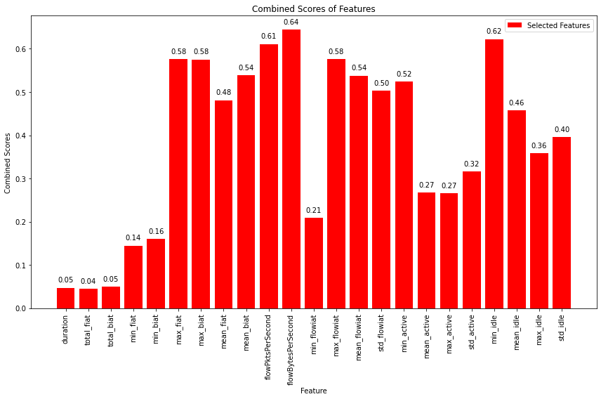

# Models-30s


```python
dataset_name = list(dataset_files)[1]
time_directory = dataset_files[dataset_name]

print("\n", '-'*120, "\n")
print(dataset_name)

# Update the dataset file path in the code
filepath = os.path.join('../../CICDataSet-TOR/CSV/Scenario-B/', dataset_name)

# Update the directory for storing trained models
time_directory_path = os.path.join(models_directory, time_directory)
if not os.path.exists(time_directory_path):
    os.makedirs(time_directory_path)

# DATASET LOADING        
df_data = load_arff_datafiles(filepath)

# SECTION-A
X_train, X_test, y_train, y_test, class_labels, X_train_selected, X_test_selected = secA(df_data, filter_warnings=True)
```

    
     ------------------------------------------------------------------------------------------------------------------------ 
    
    TimeBasedFeatures-30s-Layer2.arff
    
    
    Data Distribution: ORIGINAL:
    VOIP               758
    VIDEO-STREAMING    345
    FILE-TRANSFER      246
    CHAT               147
    BROWSING           133
    EMAIL              104
    P2P                 38
    AUDIO-STREAMING     32
    Name: class1, dtype: int64
    Total: 1803
    
    
    Number of Negative Values in Independent Variables: 4361
    Number of Inf Values: 0
    NaN Value Counts: 4361
    Missing Value Counts: 4361
    
    AFTER IMPUTATION:
    NaN Value Counts: 0
    Missing Value Counts: 0
    
    
    Data Distribution: AFTER Outlier Removal:
    VOIP               754
    VIDEO-STREAMING    282
    FILE-TRANSFER      237
    BROWSING           109
    EMAIL              101
    CHAT                90
    P2P                 36
    AUDIO-STREAMING     13
    Name: class1, dtype: int64
    Total: 1622
    
    
    Data Distribution: AFTER OVERSAMPLING:
    VOIP               754
    VIDEO-STREAMING    754
    P2P                754
    CHAT               754
    AUDIO-STREAMING    754
    FILE-TRANSFER      754
    EMAIL              754
    BROWSING           754
    Name: class1, dtype: int64
    Total: 6032
    
    
    Data Distribution: AFTER ENCODING:
    Value: 0, Count: 754
    Value: 1, Count: 754
    Value: 2, Count: 754
    Value: 3, Count: 754
    Value: 4, Count: 754
    Value: 5, Count: 754
    Value: 6, Count: 754
    Value: 7, Count: 754
    Total: 6032
    
    
    
    


    

    


    
    No. of Total Features: 23
    No. of Reduced Features: 23
    


```python
# SECTION-B
secB(X_train, y_train, y_test, class_labels, X_train_selected, X_test_selected, time_directory_path, filter_warnings=True)
```

    
    
    
    Classifier: Random Forest
    
    Best parameters for Random Forest: {'n_estimators': 100, 'min_samples_split': 2, 'min_samples_leaf': 1, 'max_depth': 20, 'bootstrap': False}
    Best cross-validation score for Random Forest: 0.962901554404145
    
    Cross-validation results for Random Forest:
    [0.96580311 0.95958549 0.95647668 0.95129534 0.95958549]
    Mean accuracy: 0.9585492227979275
    
    Random Forest Evaluation:
    Accuracy: 0.9685169842584921
    Precision: 0.9692732307526668
    Recall: 0.9685169842584921
    F1 Score: 0.9686537712953193
    Confusion Matrix:
     [[150   0   0   0   0   0   1   0]
     [  0 145   2   0   0   0   4   0]
     [  0   4 147   0   0   0   0   0]
     [  1   4   0 144   0   0   1   0]
     [  1   2   2   0 145   0   1   0]
     [  0   0   0   0   0 151   0   0]
     [  2   2   4   3   0   0 140   0]
     [  0   2   2   0   0   0   0 147]]
    


    

    


    
    
    
    Classifier: Decision Tree
    
    Best parameters for Decision Tree: {'splitter': 'best', 'min_samples_split': 5, 'min_samples_leaf': 1, 'max_features': 'sqrt', 'max_depth': 40, 'criterion': 'entropy'}
    Best cross-validation score for Decision Tree: 0.8926424870466322
    
    Cross-validation results for Decision Tree:
    [0.86632124 0.89015544 0.85388601 0.89326425 0.90051813]
    Mean accuracy: 0.8808290155440416
    
    Decision Tree Evaluation:
    Accuracy: 0.9055509527754764
    Precision: 0.9069713271462898
    Recall: 0.9055509527754764
    F1 Score: 0.9045999825765909
    Confusion Matrix:
     [[150   0   0   0   0   1   0   0]
     [  2 136   6   0   0   0   7   0]
     [  2  10 134   0   0   0   5   0]
     [  2  11   0 132   0   0   4   1]
     [  2   1   4   1 141   0   2   0]
     [  0   0   0   2   0 148   1   0]
     [  7  13  10  10   1   3 106   1]
     [  0   1   1   1   2   0   0 146]]
    


    

    


    
    
    
    Classifier: SVM
    No hyperparameters specified for SVM. Using default settings.
    
    Cross-validation results for SVM:
    [0.74093264 0.74093264 0.70984456 0.73782383 0.7357513 ]
    Mean accuracy: 0.7330569948186528
    
    SVM Evaluation:
    Accuracy: 0.7638773819386909
    Precision: 0.774400772069253
    Recall: 0.7638773819386909
    F1 Score: 0.7558331271925072
    Confusion Matrix:
     [[150   0   0   1   0   0   0   0]
     [  6  66  40  21   0   6  12   0]
     [  5  28 118   0   0   0   0   0]
     [ 15   6   0 113   0  15   1   0]
     [  2   5   9   8 126   1   0   0]
     [  3   0   0  11   0 135   2   0]
     [ 15   1  19  25   2  20  69   0]
     [  1   3   1   1   0   0   0 145]]
    


    

    


    
    
    
    Classifier: KNN
    
    Best parameters for KNN: {'weights': 'distance', 'n_neighbors': 3, 'algorithm': 'auto'}
    Best cross-validation score for KNN: 0.9361658031088084
    
    Cross-validation results for KNN:
    [0.9388601  0.94507772 0.94093264 0.93678756 0.9388601 ]
    Mean accuracy: 0.9401036269430051
    
    KNN Evaluation:
    Accuracy: 0.951946975973488
    Precision: 0.9525991604661221
    Recall: 0.951946975973488
    F1 Score: 0.951670715045555
    Confusion Matrix:
     [[151   0   0   0   0   0   0   0]
     [  0 135   5   5   1   2   3   0]
     [  0   2 149   0   0   0   0   0]
     [  1   3   0 144   0   1   1   0]
     [  0   3   2   1 141   1   3   0]
     [  0   0   0   0   0 151   0   0]
     [  2   3   7   5   0   2 132   0]
     [  0   0   1   1   2   0   1 146]]
    


    

    


    
    
    
    Classifier: XGBoost
    
    Best parameters for XGBoost: {'subsample': 0.8, 'reg_lambda': 5.0, 'reg_alpha': 0.1, 'n_estimators': 300, 'min_child_weight': 1, 'max_depth': 5, 'learning_rate': 0.3, 'gamma': 0.0, 'colsample_bytree': 1.0}
    Best cross-validation score for XGBoost: 0.9602072538860102
    
    Cross-validation results for XGBoost:
    [0.9492228  0.97305699 0.95751295 0.95751295 0.96476684]
    Mean accuracy: 0.9604145077720206
    
    XGBoost Evaluation:
    Accuracy: 0.9585749792874897
    Precision: 0.9593338245481227
    Recall: 0.9585749792874897
    F1 Score: 0.9585737564982746
    Confusion Matrix:
     [[151   0   0   0   0   0   0   0]
     [  1 141   3   1   0   0   5   0]
     [  0   4 146   0   0   0   1   0]
     [  0   4   0 146   0   0   0   0]
     [  1   2   1   0 145   0   2   0]
     [  1   0   0   0   0 149   1   0]
     [  6   2   5   5   0   0 133   0]
     [  0   3   2   0   0   0   0 146]]
    


    

    


    
    
    
    Classifier: Logistic Regression
    
    Best parameters for Logistic Regression: {'solver': 'newton-cg', 'penalty': 'none', 'max_iter': 10000, 'C': 1}
    Best cross-validation score for Logistic Regression: 0.8706735751295337
    
    Cross-validation results for Logistic Regression:
    [0.86528497 0.86217617 0.87046632 0.87564767 0.87772021]
    Mean accuracy: 0.8702590673575129
    
    Logistic Regression Evaluation:
    Accuracy: 0.8649544324772163
    Precision: 0.8635897946160238
    Recall: 0.8649544324772163
    F1 Score: 0.8634905175157226
    Confusion Matrix:
     [[151   0   0   0   0   0   0   0]
     [  0  99  13  18   3   1  17   0]
     [  0  16 130   3   1   0   1   0]
     [  0  11   2 123   4   0  10   0]
     [  0   2   6   1 140   0   1   1]
     [  0   0   0   0   0 151   0   0]
     [  8  21  10  10   0   0 101   1]
     [  0   0   2   0   0   0   0 149]]
    


    

    


    
    
    
    Classifier: Gradient Boosting
    
    Best parameters for Gradient Boosting: {'subsample': 1.0, 'n_estimators': 300, 'min_samples_split': 10, 'min_samples_leaf': 4, 'max_features': 'log2', 'max_depth': 7, 'learning_rate': 0.1}
    Best cross-validation score for Gradient Boosting: 0.9680829015544041
    
    Cross-validation results for Gradient Boosting:
    [0.96994819 0.96683938 0.96994819 0.96994819 0.9492228 ]
    Mean accuracy: 0.965181347150259
    
    Gradient Boosting Evaluation:
    Accuracy: 0.9635459817729909
    Precision: 0.9642158742868532
    Recall: 0.9635459817729909
    F1 Score: 0.9635367880115175
    Confusion Matrix:
     [[149   0   1   0   0   0   1   0]
     [  0 142   3   1   0   0   5   0]
     [  0   2 149   0   0   0   0   0]
     [  0   4   0 145   0   0   1   0]
     [  1   1   2   0 146   0   1   0]
     [  0   0   0   0   0 151   0   0]
     [  4   4   5   4   0   0 134   0]
     [  0   2   2   0   0   0   0 147]]
    


    

    


    
    
    
    Classifier: Gaussian Naive Bayes
    No hyperparameters specified for Gaussian Naive Bayes. Using default settings.
    
    Cross-validation results for Gaussian Naive Bayes:
    [0.48082902 0.4984456  0.50259067 0.49740933 0.52020725]
    Mean accuracy: 0.49989637305699486
    
    Gaussian Naive Bayes Evaluation:
    Accuracy: 0.5269262634631318
    Precision: 0.5645619336146401
    Recall: 0.5269262634631318
    F1 Score: 0.4925723386293064
    Confusion Matrix:
     [[ 77  12   6  51   0   5   0   0]
     [ 12  22  58  40   0  17   2   0]
     [ 44   6  90   9   2   0   0   0]
     [  9   3   0  81   0  57   0   0]
     [  4   2   7   6  76  52   4   0]
     [  0   0   0  10   0 140   1   0]
     [ 12   6  17  25   6  79   6   0]
     [  1   0   1   2   3   0   0 144]]
    


    

    


    
    
    
    Classifier: AdaBoost
    
    Best parameters for AdaBoost: {'n_estimators': 200, 'learning_rate': 0.3, 'algorithm': 'SAMME'}
    Best cross-validation score for AdaBoost: 0.6706735751295337
    
    Cross-validation results for AdaBoost:
    [0.65492228 0.66632124 0.70362694 0.67150259 0.66839378]
    Mean accuracy: 0.6729533678756476
    
    AdaBoost Evaluation:
    Accuracy: 0.6785418392709196
    Precision: 0.71164188468128
    Recall: 0.6785418392709196
    F1 Score: 0.6612701039566335
    Confusion Matrix:
     [[ 77  16  28  28   0   1   1   0]
     [  3  26  82  27   0   9   4   0]
     [  0   2 149   0   0   0   0   0]
     [  6   7   8 103   0  12  14   0]
     [  0   4  10  10 124   3   0   0]
     [  5   0   0   3   0 143   0   0]
     [  1   5  34  15   6  31  59   0]
     [  0   3   7   3   0   0   0 138]]
    


    

    


    
    
    
    Classifier: Bagging Classifier
    
    Best parameters for Bagging Classifier: {'n_estimators': 50, 'max_samples': 1.0, 'max_features': 0.5, 'bootstrap_features': True, 'bootstrap': False}
    Best cross-validation score for Bagging Classifier: 0.9589637305699481
    
    Cross-validation results for Bagging Classifier:
    [0.94818653 0.96373057 0.95440415 0.9626943  0.95958549]
    Mean accuracy: 0.957720207253886
    
    Bagging Classifier Evaluation:
    Accuracy: 0.9618889809444905
    Precision: 0.9623561007410726
    Recall: 0.9618889809444905
    F1 Score: 0.9618358542526411
    Confusion Matrix:
     [[151   0   0   0   0   0   0   0]
     [  0 139   4   2   0   0   5   1]
     [  0   3 148   0   0   0   0   0]
     [  1   3   0 144   0   0   2   0]
     [  0   1   3   0 146   0   1   0]
     [  0   0   0   0   0 151   0   0]
     [  3   1   8   4   0   0 135   0]
     [  0   1   0   0   1   0   2 147]]
    


    

    


    
    
    
    Classifier: Extra Trees
    
    Best parameters for Extra Trees: {'n_estimators': 100, 'min_samples_split': 2, 'min_samples_leaf': 1, 'max_features': 'sqrt', 'max_depth': None, 'bootstrap': False}
    Best cross-validation score for Extra Trees: 0.9635233160621762
    
    Cross-validation results for Extra Trees:
    [0.95336788 0.97098446 0.95647668 0.9626943  0.96373057]
    Mean accuracy: 0.9614507772020724
    
    Extra Trees Evaluation:
    Accuracy: 0.9610604805302403
    Precision: 0.9624334346279086
    Recall: 0.9610604805302403
    F1 Score: 0.9609884953633152
    Confusion Matrix:
     [[151   0   0   0   0   0   0   0]
     [  0 144   4   1   0   0   2   0]
     [  0   4 147   0   0   0   0   0]
     [  0   3   0 146   0   0   1   0]
     [  1   2   2   0 145   0   1   0]
     [  0   0   0   0   0 151   0   0]
     [  2   4   8   7   0   0 130   0]
     [  0   2   2   0   1   0   0 146]]
    


    

    


    
    
    
    
    


    

    


    Statistics for Learning Curve - Random Forest:
    Mean training score: 1.0
    Mean validation score: 0.9246632124352331
    Training scores std deviation: 0.0
    Validation scores std deviation: 0.00664209802765036
    
    
    
    
    


    

    


    Statistics for Learning Curve - Decision Tree:
    Mean training score: 0.972408771280533
    Mean validation score: 0.8280207253886012
    Training scores std deviation: 0.0022809294519615967
    Validation scores std deviation: 0.012870636916553524
    
    
    
    
    


    

    


    Statistics for Learning Curve - SVM:
    Mean training score: 0.6988202771609506
    Mean validation score: 0.6875025906735751
    Training scores std deviation: 0.005099713955189845
    Validation scores std deviation: 0.007707347862307243
    
    
    
    
    


    

    


    Statistics for Learning Curve - KNN:
    Mean training score: 1.0
    Mean validation score: 0.8799585492227979
    Training scores std deviation: 0.0
    Validation scores std deviation: 0.011869288699741385
    
    
    
    
    


    

    


    Statistics for Learning Curve - XGBoost:
    Mean training score: 1.0
    Mean validation score: 0.9217409326424871
    Training scores std deviation: 0.0
    Validation scores std deviation: 0.008631221402971402
    
    
    
    
    


    

    


    Statistics for Learning Curve - Logistic Regression:
    Mean training score: 0.8897587383830906
    Mean validation score: 0.8510466321243524
    Training scores std deviation: 0.005942343223607764
    Validation scores std deviation: 0.013842511667257324
    
    
    
    
    


    

    


    Statistics for Learning Curve - Gradient Boosting:
    Mean training score: 1.0
    Mean validation score: 0.9254715025906737
    Training scores std deviation: 0.0
    Validation scores std deviation: 0.005229697446095667
    
    
    
    
    


    

    


    Statistics for Learning Curve - Gaussian Naive Bayes:
    Mean training score: 0.5143300230282095
    Mean validation score: 0.5132020725388601
    Training scores std deviation: 0.01970592448566406
    Validation scores std deviation: 0.019530174721762716
    
    
    
    
    


    

    


    Statistics for Learning Curve - AdaBoost:
    Mean training score: 0.6826145447816432
    Mean validation score: 0.6647253886010364
    Training scores std deviation: 0.01391110461333927
    Validation scores std deviation: 0.01723800794368282
    
    
    
    
    


    

    


    Statistics for Learning Curve - Bagging Classifier:
    Mean training score: 1.0
    Mean validation score: 0.9185906735751297
    Training scores std deviation: 0.0
    Validation scores std deviation: 0.009613091808034794
    
    
    
    
    


    

    


    Statistics for Learning Curve - Extra Trees:
    Mean training score: 1.0
    Mean validation score: 0.9267357512953367
    Training scores std deviation: 0.0
    Validation scores std deviation: 0.008595803841690277
    
    
    
    
    


    

    


    
    
    


    

    


    
    Statistics for Normalized Total Feature Importance:
    Mean Normalized Total Importance: 0.3505265167904646
    Standard Deviation of Normalized Total Importance: 0.30460451887502094
    
    
    
    
    
    
    
    


    

    


    

    


    Statistics for ROC Curve - Random Forest:
    Micro-average AUC: 0.9990949155138444
    Macro-average AUC: 0.9990457517297024
    
    
    
    
    


    

    


    

    


    Statistics for ROC Curve - Decision Tree:
    Micro-average AUC: 0.9535015541859766
    Macro-average AUC: 0.9532607965296293
    
    
    
    
    


    

    


    

    


    Statistics for ROC Curve - SVM:
    Micro-average AUC: 0.9689957082521445
    Macro-average AUC: 0.9577507785329709
    
    
    
    
    


    

    


    

    


    Statistics for ROC Curve - KNN:
    Micro-average AUC: 0.9850297260928012
    Macro-average AUC: 0.9849665591122003
    
    
    
    
    


    

    


    

    


    Statistics for ROC Curve - XGBoost:
    Micro-average AUC: 0.9988398640784715
    Macro-average AUC: 0.9987681639012053
    
    
    
    
    


    

    


    

    


    Statistics for ROC Curve - Logistic Regression:
    Micro-average AUC: 0.988599318509625
    Macro-average AUC: 0.9803990599880891
    
    
    
    
    


    

    


    

    


    Statistics for ROC Curve - Gradient Boosting:
    Micro-average AUC: 0.9990717735919881
    Macro-average AUC: 0.9991945861009821
    
    
    
    
    


    

    


    

    


    Statistics for ROC Curve - Gaussian Naive Bayes:
    Micro-average AUC: 0.8890099699517833
    Macro-average AUC: 0.8623615844837245
    
    
    
    
    


    

    


    

    


    Statistics for ROC Curve - AdaBoost:
    Micro-average AUC: 0.9209221898965311
    Macro-average AUC: 0.9115902020022641
    
    
    
    
    


    

    


    

    


    Statistics for ROC Curve - Bagging Classifier:
    Micro-average AUC: 0.998539019094341
    Macro-average AUC: 0.9982795461300327
    
    
    
    
    


    

    


    

    


    Statistics for ROC Curve - Extra Trees:
    Micro-average AUC: 0.9988144667998242
    Macro-average AUC: 0.998810169218298
    


```python
# SECTION-C
secC(X_train, y_train, y_test, class_labels, X_train_selected, X_test_selected, time_directory_path)
```

    Fitting 5 folds for each of 5 candidates, totalling 25 fits
    [CV] END ...........batch_size=16, epochs=10, optimizer=adam; total time=   9.7s
    [CV] END ...........batch_size=16, epochs=10, optimizer=adam; total time=   8.0s
    [CV] END ...........batch_size=16, epochs=10, optimizer=adam; total time=   8.5s
    [CV] END ...........batch_size=16, epochs=10, optimizer=adam; total time=   9.8s
    [CV] END ...........batch_size=16, epochs=10, optimizer=adam; total time=   9.8s
    [CV] END ........batch_size=16, epochs=10, optimizer=rmsprop; total time=   7.7s
    [CV] END ........batch_size=16, epochs=10, optimizer=rmsprop; total time=   7.2s
    [CV] END ........batch_size=16, epochs=10, optimizer=rmsprop; total time=   6.4s
    [CV] END ........batch_size=16, epochs=10, optimizer=rmsprop; total time=   6.3s
    [CV] END ........batch_size=16, epochs=10, optimizer=rmsprop; total time=   6.5s
    [CV] END ...........batch_size=32, epochs=20, optimizer=adam; total time=   7.2s
    [CV] END ...........batch_size=32, epochs=20, optimizer=adam; total time=   6.9s
    [CV] END ...........batch_size=32, epochs=20, optimizer=adam; total time=   7.1s
    [CV] END ...........batch_size=32, epochs=20, optimizer=adam; total time=   7.3s
    [CV] END ...........batch_size=32, epochs=20, optimizer=adam; total time=   7.4s
    [CV] END ........batch_size=16, epochs=30, optimizer=rmsprop; total time=  18.1s
    [CV] END ........batch_size=16, epochs=30, optimizer=rmsprop; total time=  17.8s
    [CV] END ........batch_size=16, epochs=30, optimizer=rmsprop; total time=  17.4s
    [CV] END ........batch_size=16, epochs=30, optimizer=rmsprop; total time=  17.0s
    [CV] END ........batch_size=16, epochs=30, optimizer=rmsprop; total time=  17.3s
    [CV] END ........batch_size=16, epochs=20, optimizer=rmsprop; total time=  11.2s
    [CV] END ........batch_size=16, epochs=20, optimizer=rmsprop; total time=  13.9s
    [CV] END ........batch_size=16, epochs=20, optimizer=rmsprop; total time=  12.9s
    [CV] END ........batch_size=16, epochs=20, optimizer=rmsprop; total time=  12.2s
    [CV] END ........batch_size=16, epochs=20, optimizer=rmsprop; total time=  12.3s
    
    Best parameters for Deep Neural Network: {'optimizer': 'rmsprop', 'epochs': 30, 'batch_size': 16}
    Best cross-validation score for Deep Neural Network: 0.7801036269430053
    
    Fold 1 of 5:
    Accuracy: 0.7585492227979275
    Precision: 0.7750989299961231
    Recall: 0.7587723829201103
    F1 Score: 0.7494570752094376
    Confusion Matrix:
     [[111   1   8   0   0   0   0   0]
     [  9  50  34  21   0   0   7   0]
     [  6  11 101   2   0   0   1   0]
     [ 14   4   4  90   0   8   0   0]
     [  7   0   5   6  98   1   3   0]
     [  5   0   0   5   0 111   0   0]
     [ 15   6  12  11   4  19  54   0]
     [  1   1   0   1   0   0   1 117]]
    
    Fold 2 of 5:
    Accuracy: 0.7637305699481866
    Precision: 0.7685531091736257
    Recall: 0.7634814049586777
    F1 Score: 0.760545233761603
    Confusion Matrix:
     [[114   1   3   1   0   0   2   0]
     [  6  75  17  13   0   2   8   0]
     [  7  24  85   3   0   0   1   0]
     [ 15  14   1  76   0  12   3   0]
     [  1   1   6   5 100   2   5   0]
     [  1   0   0   5   0 110   5   0]
     [ 12   6   9  13   2  17  61   0]
     [  0   2   2   1   0   0   0 116]]
    
    Fold 3 of 5:
    Accuracy: 0.7347150259067358
    Precision: 0.7528194857743722
    Recall: 0.7346763085399449
    F1 Score: 0.728700921745991
    Confusion Matrix:
     [[ 96   0   5  20   0   0   0   0]
     [  1  51  43  16   2   1   7   0]
     [ 11  15  93   1   0   0   0   0]
     [  7   5   4  91   0  11   3   0]
     [  3   4   6   2 104   0   0   2]
     [  0   0   0  13   0 107   1   0]
     [  5   5  14  22   6  18  50   0]
     [  0   3   0   0   0   0   0 117]]
    
    Fold 4 of 5:
    Accuracy: 0.7544041450777202
    Precision: 0.7665875393210324
    Recall: 0.7545110192837465
    F1 Score: 0.7464981871638559
    Confusion Matrix:
     [[120   1   0   0   0   0   0   0]
     [ 10  62  29  14   0   0   5   0]
     [  9  16  91   3   1   0   0   1]
     [ 19   3   2  82   0  13   2   0]
     [  4   2   6   5  99   3   2   0]
     [  6   0   0   2   0 105   7   0]
     [ 17   3  12   9   4  23  52   1]
     [  0   2   1   0   0   0   0 117]]
    
    Fold 5 of 5:
    Accuracy: 0.7119170984455958
    Precision: 0.7266545371501785
    Recall: 0.7117510330578513
    F1 Score: 0.6987168578281262
    Confusion Matrix:
     [[104   3  11   2   0   0   0   0]
     [  7  38  50  21   0   1   2   1]
     [  5   8 105   1   0   0   0   2]
     [ 11   5   2  89   0   7   7   0]
     [  0   2  10   9  91   4   5   0]
     [  9   0   0  12   0  95   4   0]
     [ 14   4   8  17   4  27  46   1]
     [  0   2   0   0   0   0   0 119]]
    
    Average Evaluation Metrics Across Folds:
    Average Accuracy: 0.7446632124352331
    Average Precision: 0.7579427202830663
    Average Recall: 0.7446384297520662
    Average F1 Score: 0.7367836551418027
    Average Confusion Matrix:
     [[109.    1.2   5.4   4.6   0.    0.    0.4   0. ]
     [  6.6  55.2  34.6  17.    0.4   0.8   5.8   0.2]
     [  7.6  14.8  95.    2.    0.2   0.    0.4   0.6]
     [ 13.2   6.2   2.6  85.6   0.   10.2   3.    0. ]
     [  3.    1.8   6.6   5.4  98.4   2.    3.    0.4]
     [  4.2   0.    0.    7.4   0.  105.6   3.4   0. ]
     [ 12.6   4.8  11.   14.4   4.   20.8  52.6   0.4]
     [  0.2   2.    0.6   0.4   0.    0.    0.2 117.2]]
    
    
    Deep Neural Network Training Results:
    Epoch	Accuracy
    1	0.303108811378479
    2	0.4355570077896118
    3	0.4371761679649353
    4	0.46178755164146423
    5	0.5255829095840454
    6	0.5453367829322815
    7	0.5569947957992554
    8	0.5748056769371033
    9	0.5731865167617798
    10	0.5731865167617798
    11	0.5832253694534302
    12	0.5909973978996277
    13	0.6033031344413757
    14	0.6101036071777344
    15	0.6149611473083496
    16	0.6298575401306152
    17	0.6301813721656799
    18	0.6463730335235596
    19	0.6674222946166992
    20	0.6680699586868286
    21	0.6745466589927673
    22	0.6871761679649353
    23	0.6972150206565857
    24	0.7046632170677185
    25	0.7056347131729126
    26	0.7150259017944336
    27	0.7215026021003723
    28	0.727979302406311
    29	0.7354274392127991
    30	0.7370466589927673
    
    
    Deep Neural Network Evaluation:
    Accuracy: 0.7423363711681856
    Precision: 0.751918125816189
    Recall: 0.7424061810154525
    F1 Score: 0.7297761579639617
    Confusion Matrix:
     [[124   5  14   8   0   0   0   0]
     [  5  54  54  24   0   1  13   0]
     [  2   8 138   1   0   0   2   0]
     [  9   9   0 124   0   4   4   0]
     [  1   1  10   5 121   1  10   2]
     [  3   0   0  13   0 133   2   0]
     [ 18   3  19  20   3  28  57   3]
     [  1   3   1   1   0   0   0 145]]
    


    

    


    
    
    
    
    


    

    


    Statistical Information for Training and Validation Loss:
    -------------------------------------------------------
    Mean Training Loss: 1.0999395436779411
    Mean Validation Loss: 1.046369969618341
    Minimum Training Loss: 0.8197558191773805
    Minimum Validation Loss: 0.7817878241366055
    Maximum Training Loss: 1.9818624381574323
    Maximum Validation Loss: 1.8777601644782822
    Standard Deviation of Training Loss: 0.2772865898385669
    Standard Deviation of Validation Loss: 0.2595478561574257
    
    
    
    
    


    

    


    
    Statistics for Normalized Feature Importance:
    Mean Normalized Importance of All Features: 0.7073357594330586
    Standard Deviation of Normalized Importance of All Features: 0.29433710722958706
    Mean Normalized Importance of Selected Features: 0.7073357594330588
    Standard Deviation of Normalized Importance of Selected Features: 0.29433710722958706
    
    
    
    
    


    

    


    

    


    Statistics for ROC Curve - DNN:
    Micro-average AUC: 0.8527636406675346
    Macro-average AUC: 0.8528003985873398