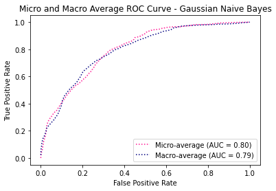

# Models-5s


```python
dataset_name = list(dataset_files)[1]
time_directory = dataset_files[dataset_name]

print("\n", '-'*120, "\n")
print(dataset_name)

# Update the dataset file path in the code
filepath = os.path.join('../../CICDataSet-TOR/CSV/Scenario-B/', dataset_name)

# Update the directory for storing trained models
time_directory_path = os.path.join(models_directory, time_directory)
if not os.path.exists(time_directory_path):
    os.makedirs(time_directory_path)

# DATASET LOADING        
df_data = load_csv_datafiles(filepath)

# SECTION-A
X_train, X_test, y_train, y_test, class_labels, X_train_selected, X_test_selected = secA(df_data, filter_warnings=True)
```

    
     ------------------------------------------------------------------------------------------------------------------------ 
    
    Scenario-B-merged_5s.csv
    
    
    Data Distribution: ORIGINAL:
    VOIP             4524
    BROWSING         2645
    P2P              2139
    FILE-TRANSFER    1663
    VIDEO            1529
    AUDIO            1026
    MAIL              497
    CHAT              485
    Name: class1, dtype: int64
    Total: 14508
    
    
    Number of Negative Values in Independent Variables: 407
    Number of Inf Values: 2
    NaN Value Counts: 409
    Missing Value Counts: 409
    
    AFTER IMPUTATION:
    NaN Value Counts: 0
    Missing Value Counts: 0
    
    
    Data Distribution: AFTER Outlier Removal:
    VOIP             4496
    P2P              2130
    BROWSING         1952
    FILE-TRANSFER    1639
    VIDEO            1389
    AUDIO             679
    MAIL              455
    CHAT              317
    Name: class1, dtype: int64
    Total: 13057
    
    
    Data Distribution: AFTER OVERSAMPLING:
    P2P              4496
    MAIL             4496
    CHAT             4496
    VOIP             4496
    AUDIO            4496
    BROWSING         4496
    VIDEO            4496
    FILE-TRANSFER    4496
    Name: class1, dtype: int64
    Total: 35968
    
    
    Data Distribution: AFTER ENCODING:
    Value: 0, Count: 4496
    Value: 1, Count: 4496
    Value: 2, Count: 4496
    Value: 3, Count: 4496
    Value: 4, Count: 4496
    Value: 5, Count: 4496
    Value: 6, Count: 4496
    Value: 7, Count: 4496
    Total: 35968
    
    
    
    


    

    


    
    No. of Total Features: 23
    No. of Reduced Features: 15
    
    All Features with Reduced Features:
    Flow Duration|Flow Bytes/s|Flow Packets/s|Flow IAT Mean|Flow IAT Std|Flow IAT Max|Flow IAT Min|Fwd IAT Mean|Fwd IAT Std|Fwd IAT Max|Fwd IAT Min|Bwd IAT Mean|Bwd IAT Std|Bwd IAT Max|Bwd IAT Min|Active Mean|Active Std|Active Max|Active Min|Idle Mean|Idle Std|Idle Max|Idle Min
    


```python
# SECTION-B
secB(X_train, y_train, y_test, class_labels, X_train_selected, X_test_selected, time_directory_path, filter_warnings=True)
```

    
    
    
    Classifier: Random Forest
    
    Best parameters for Random Forest: {'n_estimators': 100, 'min_samples_split': 2, 'min_samples_leaf': 1, 'max_depth': 20, 'bootstrap': False}
    Best cross-validation score for Random Forest: 0.938624870788334
    
    Cross-validation results for Random Forest:
    [0.94144222 0.93188532 0.93883579 0.93883579 0.94386514]
    Mean accuracy: 0.9389728536972127
    
    Random Forest Evaluation:
    Accuracy: 0.9459271615234918
    Precision: 0.9464839576151196
    Recall: 0.9459271615234918
    F1 Score: 0.9460149323891502
    Confusion Matrix:
     [[857  20   3   1  11   1   6   1]
     [ 29 786  43   2   9   0  29   1]
     [  0  20 875   0   1   0   4   0]
     [  7   8   5 859  16   0   4   0]
     [  3  21  14   3 846   0  12   0]
     [  3   2   2   0   1 884   7   0]
     [  9  27  14   3  15   9 821   1]
     [  2   8   6   1   0   1   4 877]]
    


    

    


    
    
    
    Classifier: Decision Tree
    
    Best parameters for Decision Tree: {'splitter': 'random', 'min_samples_split': 5, 'min_samples_leaf': 1, 'max_features': None, 'max_depth': 30, 'criterion': 'entropy'}
    Best cross-validation score for Decision Tree: 0.8750954195879903
    
    Cross-validation results for Decision Tree:
    [0.87471764 0.87662902 0.87298002 0.86585578 0.87921446]
    Mean accuracy: 0.873879381909974
    
    Decision Tree Evaluation:
    Accuracy: 0.8912983041423408
    Precision: 0.8917665847305997
    Recall: 0.8912983041423408
    F1 Score: 0.8914282790323551
    Confusion Matrix:
     [[829  36   3   3  15   1  11   2]
     [ 41 691  57  11  39   1  57   2]
     [  1  50 813   6  11   3  15   1]
     [  6  12   7 837  24   2  11   0]
     [ 16  68  17  28 746   1  23   0]
     [  1   2   3   2   0 868  20   3]
     [ 22  52  15  19  24  11 755   1]
     [  3   4   7   3   2   2   5 873]]
    


    

    


    
    
    
    Classifier: SVM
    No hyperparameters specified for SVM. Using default settings.
    
    Cross-validation results for SVM:
    [0.64847958 0.64378801 0.65178106 0.66151173 0.65311088]
    Mean accuracy: 0.6517342523329066
    
    SVM Evaluation:
    Accuracy: 0.6633305532388101
    Precision: 0.6599873075162315
    Recall: 0.6633305532388101
    F1 Score: 0.6434432759245416
    Confusion Matrix:
     [[742  38  59   0  37   0  24   0]
     [ 66 310 269  48  84  74  42   6]
     [ 38  40 784   2  13  19   3   1]
     [ 13   5  26 465  64 109  81 136]
     [ 27  53 134  83 489  53  60   0]
     [  5   2   4  15   0 799   1  73]
     [ 54  20  63 168  77 204 313   0]
     [  4   6  10   4   2   3   0 870]]
    


    

    


    
    
    
    Classifier: KNN
    
    Best parameters for KNN: {'weights': 'distance', 'n_neighbors': 3, 'algorithm': 'auto'}
    Best cross-validation score for KNN: 0.9106138048641869
    
    Cross-validation results for KNN:
    [0.90860122 0.90634231 0.91068636 0.91520417 0.91171359]
    Mean accuracy: 0.9105095295774299
    
    KNN Evaluation:
    Accuracy: 0.9268835140394773
    Precision: 0.9270166558407574
    Recall: 0.9268835140394773
    F1 Score: 0.9266320097073517
    Confusion Matrix:
     [[833  34   6   5  13   0   8   1]
     [ 39 738  52   8  26   1  32   3]
     [  3  15 868   3   3   1   7   0]
     [  7  12   1 833  22   4  20   0]
     [  8  13  10   5 851   0  12   0]
     [  4   4   2   2   0 881   5   1]
     [ 20  25  19  16  16   8 794   1]
     [  2   6   4   6   2   4   5 870]]
    


    

    


    
    
    
    Classifier: XGBoost
    
    Best parameters for XGBoost: {'subsample': 0.8, 'reg_lambda': 0.1, 'reg_alpha': 0.5, 'n_estimators': 200, 'min_child_weight': 3, 'max_depth': 5, 'learning_rate': 0.3, 'gamma': 0.1, 'colsample_bytree': 1.0}
    Best cross-validation score for XGBoost: 0.937269545727567
    
    Cross-validation results for XGBoost:
    [0.9287576  0.93588184 0.93953084 0.93848827 0.9379562 ]
    Mean accuracy: 0.9361229524310819
    
    XGBoost Evaluation:
    Accuracy: 0.9442591048095635
    Precision: 0.9447923157663192
    Recall: 0.9442591048095635
    F1 Score: 0.9443247803602156
    Confusion Matrix:
     [[863  18   3   2  11   0   3   0]
     [ 23 779  40   4  17   1  34   1]
     [  0  17 877   0   1   1   4   0]
     [ 10  14   1 857  13   0   4   0]
     [  2  24  11   5 846   0  11   0]
     [  3   2   4   0   1 885   4   0]
     [  9  36  16   0  19   7 811   1]
     [  2   7   7   2   1   1   4 875]]
    


    

    


    
    
    
    Classifier: Logistic Regression
    
    Best parameters for Logistic Regression: {'solver': 'newton-cg', 'penalty': 'none', 'max_iter': 5000, 'C': 0.1}
    Best cross-validation score for Logistic Regression: 0.6316465439220009
    
    Cross-validation results for Logistic Regression:
    [0.62675934 0.62519548 0.63909644 0.63145091 0.63642683]
    Mean accuracy: 0.6317858011062905
    
    Logistic Regression Evaluation:
    Accuracy: 0.6369196552682791
    Precision: 0.618486452974008
    Recall: 0.6369196552682791
    F1 Score: 0.6208586751207233
    Confusion Matrix:
     [[777  18  37   0  24   0  44   0]
     [108 217 191  38 188   1 141  15]
     [ 66 149 573  27  68   3   8   6]
     [  9  13   9 641  24  37 103  63]
     [ 34  96  53 155 306  10 245   0]
     [  6   0   3  59   0 826   2   3]
     [ 95   9  42 258  64  58 371   2]
     [  5   5   6   1   2   5   4 871]]
    


    

    


    
    
    
    Classifier: Gradient Boosting
    
    Best parameters for Gradient Boosting: {'subsample': 1.0, 'n_estimators': 100, 'min_samples_split': 2, 'min_samples_leaf': 2, 'max_features': 'log2', 'max_depth': 7, 'learning_rate': 0.1}
    Best cross-validation score for Gradient Boosting: 0.9262529175488392
    
    Cross-validation results for Gradient Boosting:
    [0.92684622 0.92302346 0.92754127 0.93066898 0.92631213]
    Mean accuracy: 0.9268784122373829
    
    Gradient Boosting Evaluation:
    Accuracy: 0.9353628023352794
    Precision: 0.9362903700524462
    Recall: 0.9353628023352794
    F1 Score: 0.9355313096917482
    Confusion Matrix:
     [[849  23   5   3  16   1   2   1]
     [ 31 773  43   0  22   1  28   1]
     [  1  18 871   0   1   1   7   1]
     [  7  14   5 846  20   0   7   0]
     [  4  32  13   6 834   0  10   0]
     [  3   3   2   1   1 886   3   0]
     [  9  46  17   3  18  10 795   1]
     [  2   8   8   2   0   0   4 875]]
    


    

    


    
    
    
    Classifier: Gaussian Naive Bayes
    No hyperparameters specified for Gaussian Naive Bayes. Using default settings.
    
    Cross-validation results for Gaussian Naive Bayes:
    [0.38940052 0.39096438 0.38974805 0.37549957 0.37625999]
    Mean accuracy: 0.3843745007816871
    
    Gaussian Naive Bayes Evaluation:
    Accuracy: 0.37976091187100364
    Precision: 0.40668270649897514
    Recall: 0.37976091187100364
    F1 Score: 0.35842921765079705
    Confusion Matrix:
     [[276  21  70 231  85   6 210   1]
     [ 35 155 122 129 192 117 104  45]
     [ 30  57 220  32 378   2 161  20]
     [  9   2   5 250  27 428  38 140]
     [ 10  58  60 295 226 157  93   0]
     [  5   0   2   7   0 613   2 270]
     [ 16  11  49 198  81 413 127   4]
     [  3   1   1   6   7  10   6 865]]
    


    

    


    
    
    
    Classifier: AdaBoost
    
    Best parameters for AdaBoost: {'n_estimators': 200, 'learning_rate': 0.3, 'algorithm': 'SAMME.R'}
    Best cross-validation score for AdaBoost: 0.6203169811685415
    
    Cross-validation results for AdaBoost:
    [0.61563858 0.63579496 0.62953953 0.62780191 0.60775113]
    Mean accuracy: 0.6233052215857393
    
    AdaBoost Evaluation:
    Accuracy: 0.6198220739505144
    Precision: 0.6158342665469265
    Recall: 0.6198220739505144
    F1 Score: 0.6126163622255851
    Confusion Matrix:
     [[618  76  58   2 122   0  24   0]
     [ 45 413 222  70 110   1  26  12]
     [ 30 116 699  13  20   5   3  14]
     [  9  28  26 353  85   2 266 130]
     [ 12 147 169  66 372   1 131   1]
     [  1   5   3  17   0 855  11   7]
     [ 17  43 108 212 191  38 286   4]
     [  2   6  15   5   0   7   1 863]]
    


    

    


    
    
    
    Classifier: Bagging Classifier
    
    Best parameters for Bagging Classifier: {'n_estimators': 200, 'max_samples': 1.0, 'max_features': 0.5, 'bootstrap_features': True, 'bootstrap': False}
    Best cross-validation score for Bagging Classifier: 0.9360880611289332
    
    Cross-validation results for Bagging Classifier:
    [0.93779322 0.93657689 0.93987837 0.93483927 0.93013556]
    Mean accuracy: 0.9358446615311162
    
    Bagging Classifier Evaluation:
    Accuracy: 0.9425910480956352
    Precision: 0.9431054861894511
    Recall: 0.9425910480956352
    F1 Score: 0.9426580125556042
    Confusion Matrix:
     [[853  22   4   4   9   1   6   1]
     [ 32 780  41   3  10   2  30   1]
     [  4  20 872   0   0   0   4   0]
     [  7   9   4 856  19   0   4   0]
     [  5  24  13   4 842   0  11   0]
     [  4   2   2   0   0 887   4   0]
     [  8  31  16   1  16  11 815   1]
     [  2   8   6   1   0   2   4 876]]
    


    

    


    
    
    
    Classifier: Extra Trees
    
    Best parameters for Extra Trees: {'n_estimators': 100, 'min_samples_split': 2, 'min_samples_leaf': 2, 'max_features': 'log2', 'max_depth': None, 'bootstrap': False}
    Best cross-validation score for Extra Trees: 0.9286508142864088
    
    Cross-validation results for Extra Trees:
    [0.93136403 0.92736751 0.93066898 0.92754127 0.9313521 ]
    Mean accuracy: 0.929658778526599
    
    Extra Trees Evaluation:
    Accuracy: 0.9385599110369752
    Precision: 0.9396227975636606
    Recall: 0.9385599110369752
    F1 Score: 0.9385011000849017
    Confusion Matrix:
     [[865  16   7   0  11   0   1   0]
     [ 37 764  48   2  17   1  29   1]
     [  3   9 881   1   2   0   4   0]
     [ 10  14   5 844  21   1   4   0]
     [  8  22  17   3 840   0   9   0]
     [  5   2   2   0   0 885   5   0]
     [ 19  28  22   0  19  12 799   0]
     [  3   5   8   1   0   3   5 874]]
    


    

    


    
    
    
    
    


    

    


    Statistics for Learning Curve - Random Forest:
    Mean training score: 0.9996100597820099
    Mean validation score: 0.9055780151578157
    Training scores std deviation: 0.00011559729501716993
    Validation scores std deviation: 0.003667009568437079
    
    
    
    
    


    

    


    Statistics for Learning Curve - Decision Tree:
    Mean training score: 0.9608616500364583
    Mean validation score: 0.8286473444832092
    Training scores std deviation: 0.0014793467937106296
    Validation scores std deviation: 0.004738508090822318
    
    
    
    
    


    

    


    Statistics for Learning Curve - SVM:
    Mean training score: 0.6210856690154344
    Mean validation score: 0.618735533049649
    Training scores std deviation: 0.0028236081965501
    Validation scores std deviation: 0.004519813182194834
    
    
    
    
    


    

    


    Statistics for Learning Curve - KNN:
    Mean training score: 0.9998017637555762
    Mean validation score: 0.8631334636094954
    Training scores std deviation: 6.787694030481058e-05
    Validation scores std deviation: 0.0041468960889882635
    
    
    
    
    


    

    


    Statistics for Learning Curve - XGBoost:
    Mean training score: 0.9981936160172544
    Mean validation score: 0.9056059402789189
    Training scores std deviation: 0.0002734405165421464
    Validation scores std deviation: 0.0037423961050774683
    
    
    
    
    


    

    


    Statistics for Learning Curve - Logistic Regression:
    Mean training score: 0.6306282639341616
    Mean validation score: 0.6311147846532628
    Training scores std deviation: 0.0039037568488761156
    Validation scores std deviation: 0.0035090063856877
    
    
    
    
    


    

    


    Statistics for Learning Curve - Gradient Boosting:
    Mean training score: 0.9987861366682212
    Mean validation score: 0.8996942230645579
    Training scores std deviation: 0.00015974253608460983
    Validation scores std deviation: 0.0031659287459133885
    
    
    
    
    


    

    


    Statistics for Learning Curve - Gaussian Naive Bayes:
    Mean training score: 0.3962753429365857
    Mean validation score: 0.39526653312907095
    Training scores std deviation: 0.012406190150138975
    Validation scores std deviation: 0.013448209354811228
    
    
    
    
    


    

    


    Statistics for Learning Curve - AdaBoost:
    Mean training score: 0.6002232558450619
    Mean validation score: 0.5972440062849038
    Training scores std deviation: 0.011531251869940258
    Validation scores std deviation: 0.01410917290230131
    
    
    
    
    


    

    


    Statistics for Learning Curve - Bagging Classifier:
    Mean training score: 0.9997847267734088
    Mean validation score: 0.9019878729019242
    Training scores std deviation: 6.200949749492141e-05
    Validation scores std deviation: 0.0032408783927295446
    
    
    
    
    


    

    


    Statistics for Learning Curve - Extra Trees:
    Mean training score: 0.9896764512888755
    Mean validation score: 0.8907554555785164
    Training scores std deviation: 0.0006024697264091067
    Validation scores std deviation: 0.0026767224200785005
    
    
    
    
    


    

    


    
    
    


    

    


    
    Statistics for Normalized Total Feature Importance:
    Mean Normalized Total Importance: 0.3729906674807619
    Standard Deviation of Normalized Total Importance: 0.32038846936092324
    
    
    
    
    
    
    
    


    

    


    

    


    Statistics for ROC Curve - Random Forest:
    Micro-average AUC: 0.9961738837330882
    Macro-average AUC: 0.9955189936466937
    
    
    
    
    


    

    


    

    


    Statistics for ROC Curve - Decision Tree:
    Micro-average AUC: 0.9499254051030761
    Macro-average AUC: 0.9495018503145124
    
    
    
    
    


    

    


    

    


    Statistics for ROC Curve - SVM:
    Micro-average AUC: 0.941134341611421
    Macro-average AUC: 0.9305617153130914
    
    
    
    
    


    

    


    

    


    Statistics for ROC Curve - KNN:
    Micro-average AUC: 0.9767705306734391
    Macro-average AUC: 0.9763790444434202
    
    
    
    
    


    

    


    

    


    Statistics for ROC Curve - XGBoost:
    Micro-average AUC: 0.9968353872897798
    Macro-average AUC: 0.9961268937648502
    
    
    
    
    


    

    


    

    


    Statistics for ROC Curve - Logistic Regression:
    Micro-average AUC: 0.9292764694418213
    Macro-average AUC: 0.9107345483477748
    
    
    
    
    


    

    


    

    


    Statistics for ROC Curve - Gradient Boosting:
    Micro-average AUC: 0.9955536070934224
    Macro-average AUC: 0.9950068963374341
    
    
    
    
    


    

    


    

    


    Statistics for ROC Curve - Gaussian Naive Bayes:
    Micro-average AUC: 0.7991052993013725
    Macro-average AUC: 0.7939232590122156
    
    
    
    
    


    

    


    

    


    Statistics for ROC Curve - AdaBoost:
    Micro-average AUC: 0.9035728371681115
    Macro-average AUC: 0.8858982981823111
    
    
    
    
    


    

    


    

    


    Statistics for ROC Curve - Bagging Classifier:
    Micro-average AUC: 0.995302361806176
    Macro-average AUC: 0.994692802174744
    
    
    
    
    


    

    


    

    


    Statistics for ROC Curve - Extra Trees:
    Micro-average AUC: 0.9959049737104462
    Macro-average AUC: 0.9953547118112452
    


```python
# SECTION-C
secC(X_train, y_train, y_test, class_labels, X_train_selected, X_test_selected, time_directory_path)
```

    Fitting 5 folds for each of 5 candidates, totalling 25 fits
    [CV] END ...........batch_size=16, epochs=10, optimizer=adam; total time=  43.8s
    [CV] END ...........batch_size=16, epochs=10, optimizer=adam; total time=  43.7s
    [CV] END ...........batch_size=16, epochs=10, optimizer=adam; total time=  43.0s
    [CV] END ...........batch_size=16, epochs=10, optimizer=adam; total time=  43.7s
    [CV] END ...........batch_size=16, epochs=10, optimizer=adam; total time=  43.6s
    [CV] END ........batch_size=16, epochs=10, optimizer=rmsprop; total time=  36.5s
    [CV] END ........batch_size=16, epochs=10, optimizer=rmsprop; total time=  36.7s
    [CV] END ........batch_size=16, epochs=10, optimizer=rmsprop; total time=  36.4s
    [CV] END ........batch_size=16, epochs=10, optimizer=rmsprop; total time=  36.8s
    [CV] END ........batch_size=16, epochs=10, optimizer=rmsprop; total time=  36.3s
    [CV] END ...........batch_size=32, epochs=20, optimizer=adam; total time=  43.5s
    [CV] END ...........batch_size=32, epochs=20, optimizer=adam; total time=  43.7s
    [CV] END ...........batch_size=32, epochs=20, optimizer=adam; total time=  43.2s
    [CV] END ...........batch_size=32, epochs=20, optimizer=adam; total time=  41.6s
    [CV] END ...........batch_size=32, epochs=20, optimizer=adam; total time=  42.6s
    [CV] END ........batch_size=16, epochs=30, optimizer=rmsprop; total time= 1.8min
    [CV] END ........batch_size=16, epochs=30, optimizer=rmsprop; total time= 1.8min
    [CV] END ........batch_size=16, epochs=30, optimizer=rmsprop; total time= 1.8min
    [CV] END ........batch_size=16, epochs=30, optimizer=rmsprop; total time= 1.8min
    [CV] END ........batch_size=16, epochs=30, optimizer=rmsprop; total time= 1.8min
    [CV] END ........batch_size=16, epochs=20, optimizer=rmsprop; total time= 1.2min
    [CV] END ........batch_size=16, epochs=20, optimizer=rmsprop; total time= 1.2min
    [CV] END ........batch_size=16, epochs=20, optimizer=rmsprop; total time= 1.3min
    [CV] END ........batch_size=16, epochs=20, optimizer=rmsprop; total time= 1.5min
    [CV] END ........batch_size=16, epochs=20, optimizer=rmsprop; total time= 1.7min
    
    Best parameters for Deep Neural Network: {'optimizer': 'rmsprop', 'epochs': 30, 'batch_size': 16}
    Best cross-validation score for Deep Neural Network: 0.734343906720577
    
    Fold 1 of 5:
    Accuracy: 0.6941789748045178
    Precision: 0.6918026229560537
    Recall: 0.6942167458661721
    F1 Score: 0.6832414361449852
    Confusion Matrix:
     [[608  19  40   0  41   0  11   0]
     [ 59 291 272   0  31   2  63   2]
     [ 19  41 630  11   9   5   4   0]
     [  3   7  23 358 102 111  78  38]
     [ 20  69  98  54 389   0  89   0]
     [  5   1   4  20   0 678   6   5]
     [ 43  74  59  89  57  50 347   0]
     [  5   4  13   0   1   1   2 694]]
    
    Fold 2 of 5:
    Accuracy: 0.7006081668114683
    Precision: 0.6949560419005814
    Recall: 0.7006316643486323
    F1 Score: 0.6877182514368905
    Confusion Matrix:
     [[562  41  56   0  54   0   6   0]
     [ 47 259 223   0 121   0  67   3]
     [  9  49 629  12  19   0   1   0]
     [  6   4  26 452  57  66  41  68]
     [ 24  37  78  77 430   1  72   0]
     [  3   1   2  10   0 693   3   7]
     [ 58  37  48 179  56  37 302   2]
     [  1   3   5   0   1   4   1 705]]
    
    Fold 3 of 5:
    Accuracy: 0.7117289313640313
    Precision: 0.7093185689002184
    Recall: 0.7116940001545355
    F1 Score: 0.6985965358704558
    Confusion Matrix:
     [[630   7  37   0  31   0  14   0]
     [ 89 291 196   1  69   0  67   6]
     [ 24  29 618   9  27   4   9   0]
     [  6   7  22 345  53  68 107 111]
     [ 42  62  67  49 377   3 120   0]
     [  1   0   3  18   0 687   4   7]
     [ 44  40  62  45  59  29 440   0]
     [  3   1   5   1   1   0   0 708]]
    
    Fold 4 of 5:
    Accuracy: 0.7174630755864466
    Precision: 0.71149268454973
    Recall: 0.7174813591407819
    F1 Score: 0.707567257972948
    Confusion Matrix:
     [[607  29  34   1  35   0  13   0]
     [ 62 291 202   1  78   1  83   1]
     [  8  42 625  12  17   4  11   0]
     [  7   4  27 426  55  88  51  61]
     [ 16  61  71  76 448   0  48   0]
     [  1   2   8  38   1 664   4   2]
     [ 42  39  42 132  60  43 362   0]
     [  1   3   4   1   1   2   1 706]]
    
    Fold 5 of 5:
    Accuracy: 0.7050747306221758
    Precision: 0.6990779515210204
    Recall: 0.7051066778704991
    F1 Score: 0.6933247988668347
    Confusion Matrix:
     [[613  31  40   0  20   0  16   0]
     [ 37 375 202  10  50   3  38   4]
     [  9  50 624   3  10   1  15   7]
     [ 10   9  15 453  49  60  42  81]
     [ 16  72  87 121 347   0  74   2]
     [  4   4   4  18   0 684   1   4]
     [ 49  61  42 206  53  38 270   1]
     [  6   5   4   2   0  10   1 691]]
    
    Average Evaluation Metrics Across Folds:
    Average Accuracy: 0.7058107758377279
    Average Precision: 0.7013295739655208
    Average Recall: 0.7058260894761241
    Average F1 Score: 0.6940896560584229
    Average Confusion Matrix:
     [[6.040e+02 2.540e+01 4.140e+01 2.000e-01 3.620e+01 0.000e+00 1.200e+01
      0.000e+00]
     [5.880e+01 3.014e+02 2.190e+02 2.400e+00 6.980e+01 1.200e+00 6.360e+01
      3.200e+00]
     [1.380e+01 4.220e+01 6.252e+02 9.400e+00 1.640e+01 2.800e+00 8.000e+00
      1.400e+00]
     [6.400e+00 6.200e+00 2.260e+01 4.068e+02 6.320e+01 7.860e+01 6.380e+01
      7.180e+01]
     [2.360e+01 6.020e+01 8.020e+01 7.540e+01 3.982e+02 8.000e-01 8.060e+01
      4.000e-01]
     [2.800e+00 1.600e+00 4.200e+00 2.080e+01 2.000e-01 6.812e+02 3.600e+00
      5.000e+00]
     [4.720e+01 5.020e+01 5.060e+01 1.302e+02 5.700e+01 3.940e+01 3.442e+02
      6.000e-01]
     [3.200e+00 3.200e+00 6.200e+00 8.000e-01 8.000e-01 3.400e+00 1.000e+00
      7.008e+02]]
    
    
    Deep Neural Network Training Results:
    Epoch	Accuracy
    1	0.37423980236053467
    2	0.5231320858001709
    3	0.5506624579429626
    4	0.5630972981452942
    5	0.5778127908706665
    6	0.5868266820907593
    7	0.5934513211250305
    8	0.6004018187522888
    9	0.6084926128387451
    10	0.6127280592918396
    11	0.6208731532096863
    12	0.6251628994941711
    13	0.632764995098114
    14	0.6385751366615295
    15	0.6494895815849304
    16	0.6573631763458252
    17	0.6653996706008911
    18	0.6718614101409912
    19	0.6731103658676147
    20	0.6801151037216187
    21	0.6854366064071655
    22	0.6886945962905884
    23	0.6942875981330872
    24	0.6965138912200928
    25	0.698142945766449
    26	0.6994461417198181
    27	0.7038987874984741
    28	0.7036815881729126
    29	0.7047132849693298
    30	0.7071025371551514
    
    
    Deep Neural Network Evaluation:
    Accuracy: 0.705448985265499
    Precision: 0.6983409477454509
    Recall: 0.7054066246446669
    F1 Score: 0.6933978400216522
    Confusion Matrix:
     [[759  30  49   0  52   0  10   0]
     [ 58 437 256  12  58   1  68   9]
     [  6  66 785   8  15   5   9   6]
     [  9   6  29 582  52  63  58 100]
     [ 18 109  86 129 469   0  85   3]
     [  5   1   4  26   0 854   1   8]
     [ 52  87  58 252  66  58 325   1]
     [  3   4  11   2   2  12   1 864]]
    


    

    


    
    
    
    
    


    

    


    Statistical Information for Training and Validation Loss:
    -------------------------------------------------------
    Mean Training Loss: 1.033680305182675
    Mean Validation Loss: 1.001248916763518
    Minimum Training Loss: 0.8331313591019989
    Minimum Validation Loss: 0.8152536676822798
    Maximum Training Loss: 1.6896147429684159
    Maximum Validation Loss: 1.4322861052926574
    Standard Deviation of Training Loss: 0.19063505667282846
    Standard Deviation of Validation Loss: 0.1559180735843859
    
    
    
    
    


    

    


    
    Statistics for Normalized Feature Importance:
    Mean Normalized Importance of All Features: 0.8061644109074936
    Standard Deviation of Normalized Importance of All Features: 0.22473143475510593
    Mean Normalized Importance of Selected Features: 0.7420630547903275
    Standard Deviation of Normalized Importance of Selected Features: 0.25617664216323555
    
    
    
    
    


    

    


    

    


    Statistics for ROC Curve - DNN:
    Micro-average AUC: 0.831685134437428
    Macro-average AUC: 0.8316637738029775
    
