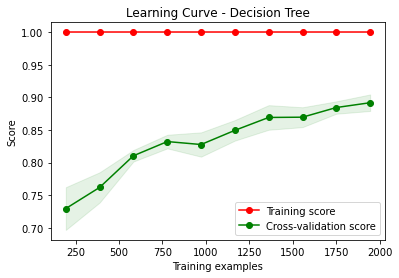
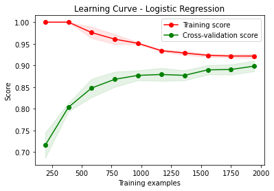
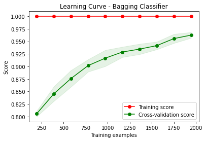
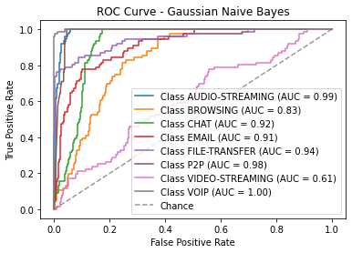
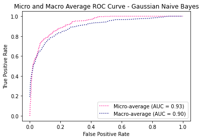

# Models-60s


```python
dataset_name = list(dataset_files)[2]
time_directory = dataset_files[dataset_name]

print("\n", '-'*120, "\n")
print(dataset_name)

# Update the dataset file path in the code
filepath = os.path.join('../../CICDataSet-TOR/CSV/Scenario-B/', dataset_name)

# Update the directory for storing trained models
time_directory_path = os.path.join(models_directory, time_directory)
if not os.path.exists(time_directory_path):
    os.makedirs(time_directory_path)

# DATASET LOADING        
df_data = load_arff_datafiles(filepath)

# SECTION-A
X_train, X_test, y_train, y_test, class_labels, X_train_selected, X_test_selected = secA(df_data, filter_warnings=True)
```

    
     ------------------------------------------------------------------------------------------------------------------------ 
    
    TimeBasedFeatures-60s-Layer2.arff
    
    
    Data Distribution: ORIGINAL:
    VOIP               381
    VIDEO-STREAMING    177
    FILE-TRANSFER      125
    CHAT                84
    BROWSING            73
    EMAIL               54
    AUDIO-STREAMING     22
    P2P                 20
    Name: class1, dtype: int64
    Total: 936
    
    
    Number of Negative Values in Independent Variables: 2014
    Number of Inf Values: 0
    NaN Value Counts: 2014
    Missing Value Counts: 2014
    
    AFTER IMPUTATION:
    NaN Value Counts: 0
    Missing Value Counts: 0
    
    
    Data Distribution: AFTER Outlier Removal:
    VOIP               380
    VIDEO-STREAMING    152
    FILE-TRANSFER      115
    CHAT                57
    BROWSING            57
    EMAIL               53
    P2P                 18
    AUDIO-STREAMING     10
    Name: class1, dtype: int64
    Total: 842
    
    
    Data Distribution: AFTER OVERSAMPLING:
    VOIP               380
    VIDEO-STREAMING    380
    P2P                380
    CHAT               380
    FILE-TRANSFER      380
    AUDIO-STREAMING    380
    EMAIL              380
    BROWSING           380
    Name: class1, dtype: int64
    Total: 3040
    
    
    Data Distribution: AFTER ENCODING:
    Value: 0, Count: 380
    Value: 1, Count: 380
    Value: 2, Count: 380
    Value: 3, Count: 380
    Value: 4, Count: 380
    Value: 5, Count: 380
    Value: 6, Count: 380
    Value: 7, Count: 380
    Total: 3040
    
    
    
    


    

    


    
    No. of Total Features: 23
    No. of Reduced Features: 23
    


```python
# SECTION-B
secB(X_train, y_train, y_test, class_labels, X_train_selected, X_test_selected, time_directory_path, filter_warnings=True)
```

    
    
    
    Classifier: Random Forest
    
    Best parameters for Random Forest: {'n_estimators': 100, 'min_samples_split': 2, 'min_samples_leaf': 1, 'max_depth': 20, 'bootstrap': False}
    Best cross-validation score for Random Forest: 0.9601101900440254
    
    Cross-validation results for Random Forest:
    [0.96714579 0.9650924  0.97325103 0.94032922 0.94650206]
    Mean accuracy: 0.9584640995090459
    
    Random Forest Evaluation:
    Accuracy: 0.9523026315789473
    Precision: 0.9535109469319994
    Recall: 0.9523026315789473
    F1 Score: 0.9523569510393374
    Confusion Matrix:
     [[76  0  0  0  0  0  0  0]
     [ 0 71  3  0  0  0  2  0]
     [ 1  1 72  0  0  0  2  0]
     [ 0  0  0 75  0  0  1  0]
     [ 0  0  2  2 68  0  3  1]
     [ 0  0  0  0  0 76  0  0]
     [ 1  2  4  1  0  0 68  0]
     [ 0  3  0  0  0  0  0 73]]
    


    

    


    
    
    
    Classifier: Decision Tree
    
    Best parameters for Decision Tree: {'splitter': 'best', 'min_samples_split': 2, 'min_samples_leaf': 1, 'max_features': 'sqrt', 'max_depth': 40, 'criterion': 'entropy'}
    Best cross-validation score for Decision Tree: 0.898443481126575
    
    Cross-validation results for Decision Tree:
    [0.87268994 0.88295688 0.89506173 0.88477366 0.89711934]
    Mean accuracy: 0.8865203099517496
    
    Decision Tree Evaluation:
    Accuracy: 0.8799342105263158
    Precision: 0.8830741434257824
    Recall: 0.8799342105263158
    F1 Score: 0.8803610079041931
    Confusion Matrix:
     [[72  0  1  3  0  0  0  0]
     [ 0 65  2  1  2  0  5  1]
     [ 1  4 59  3  1  0  7  1]
     [ 0  5  0 67  1  0  3  0]
     [ 1  0  4  3 62  0  6  0]
     [ 0  0  0  0  0 75  1  0]
     [ 2  7  3  3  0  1 60  0]
     [ 0  1  0  0  0  0  0 75]]
    


    

    


    
    
    
    Classifier: SVM
    No hyperparameters specified for SVM. Using default settings.
    
    Cross-validation results for SVM:
    [0.71457906 0.74948665 0.75720165 0.76131687 0.75720165]
    Mean accuracy: 0.747957174605589
    
    SVM Evaluation:
    Accuracy: 0.7532894736842105
    Precision: 0.7688577690593049
    Recall: 0.7532894736842105
    F1 Score: 0.7420010775874893
    Confusion Matrix:
     [[74  0  0  2  0  0  0  0]
     [ 0 32 28  9  0  4  3  0]
     [ 3 13 56  2  0  0  2  0]
     [ 2  4  0 61  0  9  0  0]
     [ 0  2  3  2 61  6  2  0]
     [ 0  0  0  0  0 76  0  0]
     [ 4  5 14 16  0 11 26  0]
     [ 0  3  1  0  0  0  0 72]]
    


    

    


    
    
    
    Classifier: KNN
    
    Best parameters for KNN: {'weights': 'distance', 'n_neighbors': 3, 'algorithm': 'auto'}
    Best cross-validation score for KNN: 0.9321570715136765
    
    Cross-validation results for KNN:
    [0.91991786 0.93839836 0.93415638 0.91563786 0.9382716 ]
    Mean accuracy: 0.9292764130774624
    
    KNN Evaluation:
    Accuracy: 0.9358552631578947
    Precision: 0.9382656692415302
    Recall: 0.9358552631578947
    F1 Score: 0.9360289458107908
    Confusion Matrix:
     [[76  0  0  0  0  0  0  0]
     [ 0 68  5  0  0  1  2  0]
     [ 0  1 73  1  0  0  1  0]
     [ 0  1  2 70  0  1  1  1]
     [ 0  1  2  1 69  1  1  1]
     [ 0  0  0  0  0 76  0  0]
     [ 1  5  3  2  0  0 65  0]
     [ 0  3  1  0  0  0  0 72]]
    


    

    


    
    
    
    Classifier: XGBoost
    
    Best parameters for XGBoost: {'subsample': 0.6, 'reg_lambda': 10.0, 'reg_alpha': 0.1, 'n_estimators': 300, 'min_child_weight': 1, 'max_depth': 5, 'learning_rate': 0.1, 'gamma': 0.0, 'colsample_bytree': 0.6}
    Best cross-validation score for XGBoost: 0.9522971751125983
    
    Cross-validation results for XGBoost:
    [0.95277207 0.95482546 0.95679012 0.94238683 0.95061728]
    Mean accuracy: 0.9514783549234839
    
    XGBoost Evaluation:
    Accuracy: 0.9506578947368421
    Precision: 0.9517158420210102
    Recall: 0.9506578947368421
    F1 Score: 0.9506807262391441
    Confusion Matrix:
     [[76  0  0  0  0  0  0  0]
     [ 0 69  4  0  0  0  3  0]
     [ 0  1 74  0  0  0  1  0]
     [ 0  0  0 75  0  0  1  0]
     [ 1  0  1  1 69  0  4  0]
     [ 0  0  0  0  0 76  0  0]
     [ 0  4  4  2  0  0 66  0]
     [ 0  2  0  0  1  0  0 73]]
    


    

    


    
    
    
    Classifier: Logistic Regression
    
    Best parameters for Logistic Regression: {'solver': 'newton-cg', 'penalty': 'none', 'max_iter': 10000, 'C': 1}
    Best cross-validation score for Logistic Regression: 0.8955493024395602
    
    Cross-validation results for Logistic Regression:
    [0.8973306  0.89527721 0.91563786 0.88477366 0.89506173]
    Mean accuracy: 0.8976162107807101
    
    Logistic Regression Evaluation:
    Accuracy: 0.9046052631578947
    Precision: 0.9039909390871826
    Recall: 0.9046052631578947
    F1 Score: 0.9035250493578115
    Confusion Matrix:
     [[76  0  0  0  0  0  0  0]
     [ 0 57 10  3  0  0  3  3]
     [ 2  3 65  0  1  0  3  2]
     [ 0  2  0 69  0  1  4  0]
     [ 0  1  1  3 71  0  0  0]
     [ 0  0  0  0  0 76  0  0]
     [ 0  5  3  6  0  0 61  1]
     [ 0  0  0  0  1  0  0 75]]
    


    

    


    
    
    
    Classifier: Gradient Boosting
    
    Best parameters for Gradient Boosting: {'subsample': 0.8, 'n_estimators': 300, 'min_samples_split': 10, 'min_samples_leaf': 2, 'max_features': 'log2', 'max_depth': 7, 'learning_rate': 0.3}
    Best cross-validation score for Gradient Boosting: 0.9617579706103548
    
    Cross-validation results for Gradient Boosting:
    [0.95482546 0.95071869 0.97119342 0.9691358  0.96296296]
    Mean accuracy: 0.9617672657827804
    
    Gradient Boosting Evaluation:
    Accuracy: 0.9654605263157895
    Precision: 0.9665884362883606
    Recall: 0.9654605263157895
    F1 Score: 0.9654104230531594
    Confusion Matrix:
     [[76  0  0  0  0  0  0  0]
     [ 0 73  2  0  0  0  1  0]
     [ 0  0 75  0  1  0  0  0]
     [ 0  0  0 76  0  0  0  0]
     [ 0  0  2  0 71  0  3  0]
     [ 0  0  0  0  0 76  0  0]
     [ 0  2  4  3  0  0 67  0]
     [ 0  2  1  0  0  0  0 73]]
    


    

    


    
    
    
    Classifier: Gaussian Naive Bayes
    No hyperparameters specified for Gaussian Naive Bayes. Using default settings.
    
    Cross-validation results for Gaussian Naive Bayes:
    [0.67556468 0.62833676 0.64609053 0.64403292 0.67283951]
    Mean accuracy: 0.6533728800669252
    
    Gaussian Naive Bayes Evaluation:
    Accuracy: 0.6365131578947368
    Precision: 0.5944848224793219
    Recall: 0.6365131578947368
    F1 Score: 0.598135991682984
    Confusion Matrix:
     [[65  4  0  7  0  0  0  0]
     [ 1 21 26 25  1  2  0  0]
     [ 4 29 37  0  4  0  2  0]
     [ 2  0  0 57  0 17  0  0]
     [ 1  4  0  5 58  5  3  0]
     [ 0  0  0  0  0 76  0  0]
     [ 4  4 22 12  2 31  1  0]
     [ 0  1  0  2  0  0  1 72]]
    


    

    


    
    
    
    Classifier: AdaBoost
    
    Best parameters for AdaBoost: {'n_estimators': 50, 'learning_rate': 0.01, 'algorithm': 'SAMME.R'}
    Best cross-validation score for AdaBoost: 0.6496666413161964
    
    Cross-validation results for AdaBoost:
    [0.66735113 0.66119097 0.63580247 0.61934156 0.65843621]
    Mean accuracy: 0.6484244682738866
    
    AdaBoost Evaluation:
    Accuracy: 0.631578947368421
    Precision: 0.5596502629199582
    Recall: 0.631578947368421
    F1 Score: 0.5769995460228902
    Confusion Matrix:
     [[65  0  2  9  0  0  0  0]
     [ 1  0 40 26  0  0  9  0]
     [ 5  0 64  1  0  0  6  0]
     [ 5  0  0 57  1 12  1  0]
     [ 1  0  3  3 56  6  7  0]
     [ 0  0  0  0  0 75  1  0]
     [ 1  0 23 23  2 19  8  0]
     [ 1  0  1  1 11  0  3 59]]
    


    

    


    
    
    
    Classifier: Bagging Classifier
    
    Best parameters for Bagging Classifier: {'n_estimators': 50, 'max_samples': 1.0, 'max_features': 0.5, 'bootstrap_features': True, 'bootstrap': False}
    Best cross-validation score for Bagging Classifier: 0.9613439129295849
    
    Cross-validation results for Bagging Classifier:
    [0.94455852 0.9486653  0.96296296 0.94238683 0.96707819]
    Mean accuracy: 0.9531303605681885
    
    Bagging Classifier Evaluation:
    Accuracy: 0.9506578947368421
    Precision: 0.9520545728960632
    Recall: 0.9506578947368421
    F1 Score: 0.9505679483854473
    Confusion Matrix:
     [[76  0  0  0  0  0  0  0]
     [ 0 69  3  1  0  0  3  0]
     [ 1  2 73  0  0  0  0  0]
     [ 0  0  0 75  0  0  1  0]
     [ 0  0  2  2 70  0  2  0]
     [ 0  0  0  0  0 76  0  0]
     [ 1  1  5  4  0  0 65  0]
     [ 0  2  0  0  0  0  0 74]]
    


    

    


    
    
    
    Classifier: Extra Trees
    
    Best parameters for Extra Trees: {'n_estimators': 50, 'min_samples_split': 2, 'min_samples_leaf': 1, 'max_features': 'log2', 'max_depth': None, 'bootstrap': False}
    Best cross-validation score for Extra Trees: 0.9588781571898158
    
    Cross-validation results for Extra Trees:
    [0.96714579 0.95071869 0.95679012 0.96296296 0.97119342]
    Mean accuracy: 0.9617621956887301
    
    Extra Trees Evaluation:
    Accuracy: 0.9638157894736842
    Precision: 0.965058004474998
    Recall: 0.9638157894736842
    F1 Score: 0.9635420429188774
    Confusion Matrix:
     [[76  0  0  0  0  0  0  0]
     [ 0 74  1  0  0  0  1  0]
     [ 0  0 75  1  0  0  0  0]
     [ 0  0  0 75  0  0  1  0]
     [ 0  0  2  1 71  0  2  0]
     [ 0  0  0  0  0 76  0  0]
     [ 0  3  3  6  0  0 64  0]
     [ 0  0  1  0  0  0  0 75]]
    


    

    


    
    
    
    
    


    

    


    Statistics for Learning Curve - Random Forest:
    Mean training score: 1.0
    Mean validation score: 0.9104921371291436
    Training scores std deviation: 0.0
    Validation scores std deviation: 0.011047460519381349
    
    
    
    
    


    

    


    Statistics for Learning Curve - Decision Tree:
    Mean training score: 1.0
    Mean validation score: 0.8326440540472027
    Training scores std deviation: 0.0
    Validation scores std deviation: 0.016595118341814475
    
    
    
    
    


    

    


    Statistics for Learning Curve - SVM:
    Mean training score: 0.7271747434337146
    Mean validation score: 0.6948554600687842
    Training scores std deviation: 0.010527154154554378
    Validation scores std deviation: 0.019585941471354926
    
    
    
    
    


    

    


    Statistics for Learning Curve - KNN:
    Mean training score: 1.0
    Mean validation score: 0.8733678099728751
    Training scores std deviation: 0.0
    Validation scores std deviation: 0.019683920595985623
    
    
    
    
    


    

    


    Statistics for Learning Curve - XGBoost:
    Mean training score: 0.9991015372961094
    Mean validation score: 0.9019010317641392
    Training scores std deviation: 0.0007315716728426257
    Validation scores std deviation: 0.012220006066418359
    
    
    
    
    


    

    


    Statistics for Learning Curve - Logistic Regression:
    Mean training score: 0.9517311295226826
    Mean validation score: 0.854682062852266
    Training scores std deviation: 0.0045091815109662104
    Validation scores std deviation: 0.015080975598001572
    
    
    
    
    


    

    


    Statistics for Learning Curve - Gradient Boosting:
    Mean training score: 1.0
    Mean validation score: 0.9105296558251157
    Training scores std deviation: 0.0
    Validation scores std deviation: 0.014183271792325983
    
    
    
    
    


    

    


    Statistics for Learning Curve - Gaussian Naive Bayes:
    Mean training score: 0.6741177901249993
    Mean validation score: 0.6555394157561623
    Training scores std deviation: 0.008481612589393476
    Validation scores std deviation: 0.015552295036241521
    
    
    
    
    


    

    


    Statistics for Learning Curve - AdaBoost:
    Mean training score: 0.642034680553017
    Mean validation score: 0.6137809381364024
    Training scores std deviation: 0.0398766697077514
    Validation scores std deviation: 0.039968584334087356
    
    
    
    
    


    

    


    Statistics for Learning Curve - Bagging Classifier:
    Mean training score: 1.0
    Mean validation score: 0.906819107494444
    Training scores std deviation: 0.0
    Validation scores std deviation: 0.01084479654709166
    
    
    
    
    


    

    


    Statistics for Learning Curve - Extra Trees:
    Mean training score: 1.0
    Mean validation score: 0.9116303732434237
    Training scores std deviation: 0.0
    Validation scores std deviation: 0.012408701273747836
    
    
    
    
    


    

    


    
    
    


    

    


    
    Statistics for Normalized Total Feature Importance:
    Mean Normalized Total Importance: 0.3400691836512299
    Standard Deviation of Normalized Total Importance: 0.2778523662535436
    
    
    
    
    
    
    
    


    

    


    

    


    Statistics for ROC Curve - Random Forest:
    Micro-average AUC: 0.9989355198234071
    Macro-average AUC: 0.9985809507320933
    
    
    
    
    


    

    


    

    


    Statistics for ROC Curve - Decision Tree:
    Micro-average AUC: 0.9313909774436091
    Macro-average AUC: 0.931390977443609
    
    
    
    
    


    

    


    

    


    Statistics for ROC Curve - SVM:
    Micro-average AUC: 0.9701041254451919
    Macro-average AUC: 0.9572924910961613
    
    
    
    
    


    

    


    

    


    Statistics for ROC Curve - KNN:
    Micro-average AUC: 0.9876065059853582
    Macro-average AUC: 0.9875732711713494
    
    
    
    
    


    

    


    

    


    Statistics for ROC Curve - XGBoost:
    Micro-average AUC: 0.9985059791749109
    Macro-average AUC: 0.9981496710526314
    
    
    
    
    


    

    


    

    


    Statistics for ROC Curve - Logistic Regression:
    Micro-average AUC: 0.9907833291081322
    Macro-average AUC: 0.9887279877324893
    
    
    
    
    


    

    


    

    


    Statistics for ROC Curve - Gradient Boosting:
    Micro-average AUC: 0.9988190047487139
    Macro-average AUC: 0.9985345765730114
    
    
    
    
    


    

    


    

    


    Statistics for ROC Curve - Gaussian Naive Bayes:
    Micro-average AUC: 0.9291775774757618
    Macro-average AUC: 0.8987976726355362
    
    
    
    
    


    

    


    

    


    Statistics for ROC Curve - AdaBoost:
    Micro-average AUC: 0.9033867821280175
    Macro-average AUC: 0.8687626756034824
    
    
    
    
    


    

    


    

    


    Statistics for ROC Curve - Bagging Classifier:
    Micro-average AUC: 0.9986914758112386
    Macro-average AUC: 0.9983738128215274
    
    
    
    
    


    

    


    

    


    Statistics for ROC Curve - Extra Trees:
    Micro-average AUC: 0.9992079680080135
    Macro-average AUC: 0.9989473065888406
    


```python
# SECTION-C
secC(X_train, y_train, y_test, class_labels, X_train_selected, X_test_selected, time_directory_path)
```

    Fitting 5 folds for each of 5 candidates, totalling 25 fits
    [CV] END ...........batch_size=16, epochs=10, optimizer=adam; total time=   3.9s
    [CV] END ...........batch_size=16, epochs=10, optimizer=adam; total time=   3.7s
    [CV] END ...........batch_size=16, epochs=10, optimizer=adam; total time=   3.5s
    [CV] END ...........batch_size=16, epochs=10, optimizer=adam; total time=   3.6s
    [CV] END ...........batch_size=16, epochs=10, optimizer=adam; total time=   3.8s
    [CV] END ........batch_size=16, epochs=10, optimizer=rmsprop; total time=   3.0s
    [CV] END ........batch_size=16, epochs=10, optimizer=rmsprop; total time=   3.0s
    [CV] END ........batch_size=16, epochs=10, optimizer=rmsprop; total time=   3.1s
    [CV] END ........batch_size=16, epochs=10, optimizer=rmsprop; total time=   3.2s
    [CV] END ........batch_size=16, epochs=10, optimizer=rmsprop; total time=   3.0s
    [CV] END ...........batch_size=32, epochs=20, optimizer=adam; total time=   3.6s
    [CV] END ...........batch_size=32, epochs=20, optimizer=adam; total time=   3.6s
    [CV] END ...........batch_size=32, epochs=20, optimizer=adam; total time=   3.8s
    [CV] END ...........batch_size=32, epochs=20, optimizer=adam; total time=   3.8s
    [CV] END ...........batch_size=32, epochs=20, optimizer=adam; total time=   3.6s
    [CV] END ........batch_size=16, epochs=30, optimizer=rmsprop; total time=   8.6s
    [CV] END ........batch_size=16, epochs=30, optimizer=rmsprop; total time=   8.3s
    [CV] END ........batch_size=16, epochs=30, optimizer=rmsprop; total time=   8.4s
    [CV] END ........batch_size=16, epochs=30, optimizer=rmsprop; total time=   8.6s
    [CV] END ........batch_size=16, epochs=30, optimizer=rmsprop; total time=   8.7s
    [CV] END ........batch_size=16, epochs=20, optimizer=rmsprop; total time=   5.6s
    [CV] END ........batch_size=16, epochs=20, optimizer=rmsprop; total time=   5.9s
    [CV] END ........batch_size=16, epochs=20, optimizer=rmsprop; total time=   5.6s
    [CV] END ........batch_size=16, epochs=20, optimizer=rmsprop; total time=   5.6s
    [CV] END ........batch_size=16, epochs=20, optimizer=rmsprop; total time=   5.9s
    
    Best parameters for Deep Neural Network: {'optimizer': 'rmsprop', 'epochs': 30, 'batch_size': 16}
    Best cross-validation score for Deep Neural Network: 0.7619176785729375
    
    Fold 1 of 5:
    Accuracy: 0.7330595482546202
    Precision: 0.7240017756858363
    Recall: 0.7316939890710383
    F1 Score: 0.6977527676047475
    Confusion Matrix:
     [[58  0  0  3  0  0  0  0]
     [ 1 29 15  8  1  6  1  0]
     [ 1  4 56  0  0  0  0  0]
     [ 1  1  2 52  1  4  0  0]
     [ 0  1  2  3 45  9  1  0]
     [ 0  0  0  4  1 52  4  0]
     [ 1  0 13 20  7 14  4  1]
     [ 0  0  0  0  0  0  0 61]]
    
    Fold 2 of 5:
    Accuracy: 0.6981519507186859
    Precision: 0.6883782203823594
    Recall: 0.6984289617486339
    F1 Score: 0.682120514805935
    Confusion Matrix:
     [[50  0  6  3  0  0  1  0]
     [ 2 32  6 13  0  5  3  0]
     [ 5 28 28  0  0  0  0  0]
     [ 3  2  1 51  2  1  1  0]
     [ 0  1  1  3 51  1  2  2]
     [ 0  0  0  0  1 54  6  0]
     [ 3  5  3 11 17  7 15  0]
     [ 2  0  0  0  0  0  0 59]]
    
    Fold 3 of 5:
    Accuracy: 0.6851851851851852
    Precision: 0.6689360395166639
    Recall: 0.6856215846994536
    F1 Score: 0.6410840405065948
    Confusion Matrix:
     [[54  0  2  5  0  0  0  0]
     [ 1  8 31 15  1  0  5  0]
     [ 2  4 51  0  0  0  3  0]
     [ 3  1  0 55  0  2  0  0]
     [ 2  2  6  0 44  4  1  1]
     [ 0  0  0  3  3 55  0  0]
     [ 5  0  9 17 12 10  8  0]
     [ 0  1  2  0  0  0  0 58]]
    
    Fold 4 of 5:
    Accuracy: 0.6893004115226338
    Precision: 0.667606177887594
    Recall: 0.6898565573770492
    F1 Score: 0.6548481560884447
    Confusion Matrix:
     [[58  0  2  1  0  0  0  0]
     [ 5 14 32  5  0  4  1  0]
     [ 7  9 45  0  0  0  0  0]
     [ 2  2  0 43  1  4  6  2]
     [ 1  1  1  1 51  4  2  0]
     [ 0  0  0  2  0 59  0  0]
     [ 4  2 10  6 18 12  9  0]
     [ 1  1  1  0  0  0  1 56]]
    
    Fold 5 of 5:
    Accuracy: 0.7098765432098766
    Precision: 0.6957488180850444
    Recall: 0.7094945355191257
    F1 Score: 0.6820060660758136
    Confusion Matrix:
     [[56  0  0  2  0  0  3  0]
     [ 3 20 19 10  0  3  3  2]
     [ 8  7 46  0  0  0  0  0]
     [ 7  0  0 50  0  2  1  1]
     [ 2  2  1  1 49  3  0  3]
     [ 0  0  0  0  1 54  5  0]
     [ 6  0  8 16 10  9 12  0]
     [ 1  1  0  0  1  0  0 58]]
    
    Average Evaluation Metrics Across Folds:
    Average Accuracy: 0.7031147277782003
    Average Precision: 0.6889342063114997
    Average Recall: 0.7030191256830601
    Average F1 Score: 0.6715623090163072
    Average Confusion Matrix:
     [[55.2  0.   2.   2.8  0.   0.   0.8  0. ]
     [ 2.4 20.6 20.6 10.2  0.4  3.6  2.6  0.4]
     [ 4.6 10.4 45.2  0.   0.   0.   0.6  0. ]
     [ 3.2  1.2  0.6 50.2  0.8  2.6  1.6  0.6]
     [ 1.   1.4  2.2  1.6 48.   4.2  1.2  1.2]
     [ 0.   0.   0.   1.8  1.2 54.8  3.   0. ]
     [ 3.8  1.4  8.6 14.  12.8 10.4  9.6  0.2]
     [ 0.8  0.6  0.6  0.   0.2  0.   0.2 58.4]]
    
    
    Deep Neural Network Training Results:
    Epoch	Accuracy
    1	0.3502570688724518
    2	0.48650386929512024
    3	0.5064267516136169
    4	0.5295630097389221
    5	0.5526992082595825
    6	0.5739074349403381
    7	0.5796915292739868
    8	0.5957583785057068
    9	0.5919023156166077
    10	0.5996143817901611
    11	0.6073265075683594
    12	0.6156812310218811
    13	0.6169666051864624
    14	0.6311054229736328
    15	0.6349614262580872
    16	0.6497429013252258
    17	0.6529563069343567
    18	0.6677377820014954
    19	0.6645244359970093
    20	0.6870179772377014
    21	0.6606683731079102
    22	0.6915166974067688
    23	0.6934447288513184
    24	0.688946008682251
    25	0.6992287635803223
    26	0.7037274837493896
    27	0.7062981724739075
    28	0.7133675813674927
    29	0.7107968926429749
    30	0.714652955532074
    
    
    Deep Neural Network Evaluation:
    Accuracy: 0.6973684210526315
    Precision: 0.6840543790764477
    Recall: 0.6973684210526315
    F1 Score: 0.6699200116371522
    Confusion Matrix:
     [[63  0  0  8  0  0  5  0]
     [ 0 25 26 13  0  3  5  4]
     [ 7  5 62  0  0  0  2  0]
     [ 5  4  0 54  3  9  1  0]
     [ 1  2  4  2 61  4  1  1]
     [ 0  0  0  0  0 73  3  0]
     [ 4  1 17 13 12 15 13  1]
     [ 1  0  1  1  0  0  0 73]]
    


    

    


    
    
    
    
    


    

    


    Statistical Information for Training and Validation Loss:
    -------------------------------------------------------
    Mean Training Loss: 1.1032415374436744
    Mean Validation Loss: 1.1111633250040884
    Minimum Training Loss: 0.8320834189270333
    Minimum Validation Loss: 0.85820276034184
    Maximum Training Loss: 1.9277362425100528
    Maximum Validation Loss: 1.8367177504759569
    Standard Deviation of Training Loss: 0.28437107227586395
    Standard Deviation of Validation Loss: 0.25991274347114374
    
    
    
    
    


    

    


    
    Statistics for Normalized Feature Importance:
    Mean Normalized Importance of All Features: 0.9301242236024846
    Standard Deviation of Normalized Importance of All Features: 0.20380102038100023
    Mean Normalized Importance of Selected Features: 0.9301242236024845
    Standard Deviation of Normalized Importance of Selected Features: 0.20380102038100023
    
    
    
    
    


    

    


    

    


    Statistics for ROC Curve - DNN:
    Micro-average AUC: 0.8270676691729322
    Macro-average AUC: 0.8270676691729324
    
